<!-- Source: :contentReference[oaicite:0]{index=0} :contentReference[oaicite:1]{index=1} -->

# 📘 **Unit 1 — Graphics Programming in Java AWT**

---

## 📑 **Syllabus**

> **Introduction – Frames, Frame Layouts, Displaying information in a frame, Graphics objects and paint() method, Text and Fonts, Colours, Drawing and filling shapes, Paint mode and images.**

---

# 🖥️ **Graphics Programming: Introduction (Java AWT)**

Java AWT (Abstract Window Toolkit) is a GUI toolkit provided by Java for creating window-based applications. It is a part of the Java Foundation Classes (JFC) and is included in the `java.awt` package. AWT provides a set of components such as buttons, labels, text fields, checkboxes, and menus that help developers build graphical user interfaces.

### **Key Points**

- Part of the `java.awt` package.
- Provides GUI components such as Button, Label, TextField, Checkbox, Choice, List, and Menu.
- Uses native operating system resources for rendering.

---

# 🧱 **Types of Containers in Java AWT**

Containers are special AWT components that can hold and organize other GUI components such as buttons, labels, text fields, and checkboxes. Java AWT provides the following main types of containers:

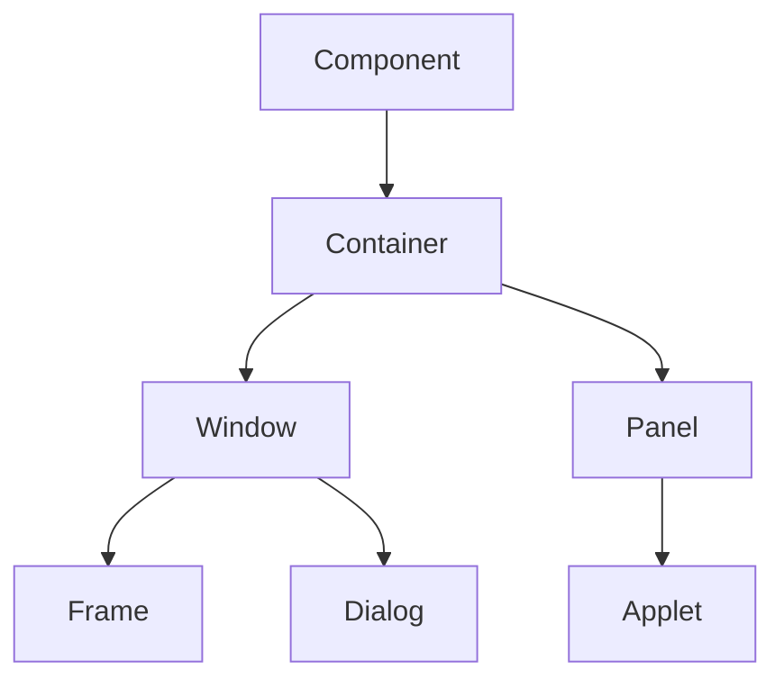

## **1. Window**

> **Definition:** A Window is a top-level container that represents a graphical window without a title bar, border, or menu bar. It serves as the base class for other top-level containers such as Frame and Dialog.

---

## **2. Panel**

> **Definition:** A Panel is a lightweight container used to group and organize related components within a window or frame. It is commonly used to divide a user interface into sections.

---

## **3. Frame**

> **Definition:** A Frame is a top-level container that includes a title bar, border, and optional menu bar. It is the most commonly used container for creating standalone AWT applications.

---

## **4. Dialog**

> **Definition:** A Dialog is a temporary pop-up window used to interact with the user, such as displaying messages, warnings, confirmations, or collecting user input. It is usually associated with a parent frame.

---

# 🧩 **Common AWT Components & Constructors**

Java AWT provides a variety of GUI components that help developers build interactive desktop applications. Some commonly used AWT components are:

| **Component** | **Purpose** |
|---|---|
| **Label** | Displays a single line of read-only text. |
| **Button** | Represents a clickable button that performs an action when pressed. |
| **TextField** | Allows users to enter and edit a single line of text. |
| **Checkbox** | Enables users to select or deselect an option. |
| **CheckboxGroup** | Groups multiple checkboxes so that only one option can be selected at a time. |
| **Choice** | Provides a drop-down list from which users can select an item. |
| **List** | Displays a list of items and allows single or multiple selections. |
| **Canvas** | Provides a blank area for custom drawing and graphics. |
| **Scrollbar** | Allows users to scroll content vertically or horizontally. |
| **MenuItem & Menu** | Used to create menus and menu items in a menu bar. |
| **PopupMenu** | Displays a context-sensitive menu when triggered by the user. |
| **Panel** | Acts as a container for organizing and grouping components. |
| **Toolkit** | Provides access to platform-specific GUI resources and utility methods. |

---

# 📐 **3. Layout Managers in Java AWT**

> **Definition:** Layout managers (FlowLayout, BorderLayout, GridLayout, CardLayout) control component arrangement in containers.

- **FlowLayout** : Arranges components in a left-to-right sequence and moves them to the next line when space runs out.
- **BorderLayout:** Divides the container into five regions: North, South, East, West, and Center.
- **GridLayout** : Arranges components in a grid of equally sized rows and columns.
- **CardLayout:** Displays one component at a time, allowing users to switch between multiple screens or views.

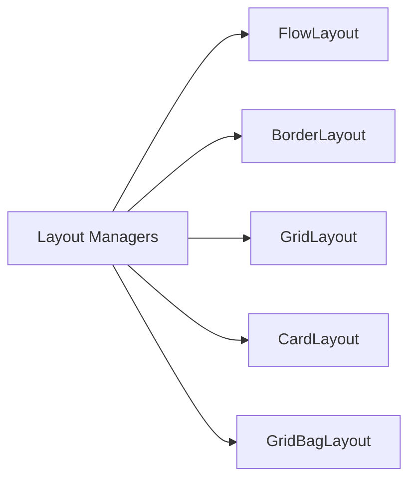

---

# 🖱️ **4. Event Handling Components in Java AWT**

Event handlers such as ActionListener, MouseListener, ItemListener, KeyListener and WindowListener are used to capture user actions and execute the corresponding response in GUI applications.

| **Listener** | **Purpose** |
|---|---|
| **ActionListener** | Handles action events such as button clicks and menu item selections. |
| **Mouse and MouseMotion Listener** | Detect mouse events such as clicks, presses, releases, movement, and dragging |
| **ItemListener** | Responds to item state changes in components like checkboxes and choice menus. |
| **KeyListener** | Captures keyboard events when keys are pressed, released, or typed |
| **WindowListener** | Handles window-related events such as opening, closing, minimizing, and activating a window. |

---

# ✅ **Advantages of Java AWT**

- Simple and easy to learn for beginners.
- Provides a rich set of basic GUI components.
- Uses native operating system controls, giving a familiar look and feel.
- Supports event handling through listener interfaces.
- Built into Java, so no additional libraries are required.
- Lightweight in terms of API complexity compared to modern GUI frameworks.

---

# 🔄 **For further Reference: AWT vs Swing**

| **Feature** | **AWT** | **Swing** |
|---|---|---|
| **Package** | `java.awt` | `javax.swing` |
| **Components** | Heavyweight | Lightweight |
| **Look and Feel** | Platform-dependent | Platform-independent |
| **Customization** | Limited | Highly customizable |
| **Performance** | Uses native controls | Pure Java implementation |
| **Modern Usage** | Limited | More widely used |

---

# 🪟 **Frames**

> **Definition:** A Frame is a top-level window with a title bar, border, and (optionally) a menu bar. It is the container in which all other components — buttons, text, shapes — are placed.

Frame is a subclass of Window, which is a subclass of Container, which is a subclass of Component.

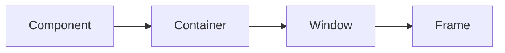

**Component → Container → Window → Frame.**

## **For creating First AWT Program**

- Creating a Frame
- `setSize()`
- `setVisible()`
- `setTitle()`
- Closing the window

---

# 🏗️ **Creating a Frame**

There are two common approaches:

## **a) Instantiate Frame directly**

```java
import java.awt.*;

class MyFrame {
    public static void main(String[] args) {
        Frame f = new Frame("My First Frame");
        f.setSize(400, 300);
        f.setVisible(true);
    }
}
```

### **Example for approach 1:**

# ☕ **Java AWT Examples**

## **1. Hello World in Java AWT**

Hello, World is was the first step in learning Java. So, let us program our first Program in Java AWT as Hello World using Labels and Frames.

Below is the implementation of the above method:

```java
import java.awt.*;
import java.awt.event.WindowAdapter;
import java.awt.event.WindowEvent;

// Driver Class
public class AWT_Example {

    // main function
    public static void main(String[] args)
    {
        // Declaring a Frame and Label
        Frame frame = new Frame("Basic Program");

        Label label = new Label("Hello World!");

        // Aligning the label to CENTER
        label.setAlignment(Label.CENTER);

        // Adding Label and Setting the Size of the Frame
        frame.add(label);
        frame.setSize(300, 300);

        // Making the Frame visible
        frame.setVisible(true);

        // Using WindowListener for closing the window
        frame.addWindowListener(new WindowAdapter() {
            @Override
            public void windowClosing(WindowEvent e)
            {
                System.exit(0);
            }
        });
    }
}
```

### **Running**

```bash
javac AWT_Example.java
java AWT_Example
```

### **Output**

```text
┌───────────────────────────────┐
│ Basic Program             □ X │
├───────────────────────────────┤
│                               │
│                               │
│         Hello World!          │
│                               │
│                               │
└───────────────────────────────┘
```

---

# 🔘 **2. Java AWT Program to create Button**

Below is the implementation of the Java AWT Program to create a Button:

```java
import java.awt.*;
import java.awt.event.WindowAdapter;
import java.awt.event.WindowEvent;

public class Button_Example {

    // main function
    public static void main(String[] args)
    {
        // Creating instance of frame with the label
        Frame frame = new Frame("Example 2");

        // Creating instance of button with label
        Button button = new Button("Click Here");

        // Setting the position for the button in frame
        button.setBounds(80, 100, 64, 30);

        // Adding button to the frame
        frame.add(button);

        // setting size, layout and visibility of frame
        frame.setSize(300, 300);
        frame.setLayout(null);
        frame.setVisible(true);

        // Using WindowListener for closing the window
        frame.addWindowListener(new WindowAdapter() {
            @Override
            public void windowClosing(WindowEvent e)
            {
                System.exit(0);
            }
        });
    }
}
```

### **Run**

```bash
javac Button_Example.java
java Button_Example
```

### **Output**

```text
┌───────────────────────────────┐
│ Example 2                 □ X │
├───────────────────────────────┤
│                               │
│        ┌───────────┐          │
│        │ Click Here│          │
│        └───────────┘          │
│                               │
└───────────────────────────────┘
```

---

# 🖼️ **b) Extend the Frame class**

> **Note:** Extend the Frame class (preferred for graphics work, since you can override `paint()`)

```java
import java.awt.*;

class MyFrame extends Frame {

    MyFrame() {
        super("My Graphics Frame");
        setSize(400, 300);
        setVisible(true);
    }

    public static void main(String[] args) {
        new MyFrame();
    }
}
```

---

# ⚠️ **Window Closing**

> **Note:** Closing such a frame (clicking the X) does nothing by default — you must handle the `windowClosing` event yourself (typically via a `WindowAdapter`) and call `System.exit(0)`, or the JVM will keep running.

```java
addWindowListener(new WindowAdapter() {
    public void windowClosing(WindowEvent e) {
        System.exit(0);
    }
});
```

## **Internal Working for Window Closing Event**

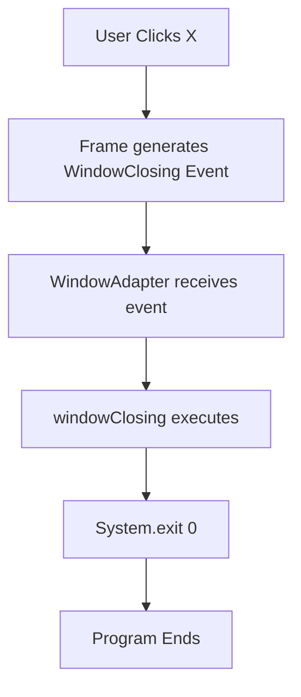

---

# 🧰 **Key Frame methods**

| **Method** | **Purpose** |
|---|---|
| `setSize(w, h)` | Set width and height in pixels |
| `setTitle(String)` | Set the title bar text |
| `setVisible(boolean)` | Show or hide the frame |
| `setLayout(LayoutManager)` | Set how child components are arranged |
| `setBackground(Color)` | Set background colour |
| `setResizable(boolean)` | Allow/disallow resizing |

---

# 🧩 **Program: AWT Frame with Panel**

```java
import java.awt.*;

public class FrameWithPanel {

    public static void main(String[] args) {

        // Create a Frame
        Frame frame = new Frame("AWT Frame with Panel");

        // Create a Panel
        Panel panel = new Panel();

        // Set background color of the panel
        panel.setBackground(Color.LIGHT_GRAY);

        // Add some components to the panel
        panel.add(new Label("Name:"));
        panel.add(new TextField(20));
        panel.add(new Button("Submit"));

        // Add the panel to the frame
        frame.add(panel);

        // Set frame properties
        frame.setSize(500, 300);
        frame.setVisible(true);
    }
}
```

**Run and see the expected Output for above program**

---

# 📐 **Frame Layouts (Layout Managers)**

> **Definition:** A layout manager controls the size and position of components added to a container. Without one, positioning would have to be done manually with `setBounds()`.

| **Layout Manager** | **Behaviour** |
|---|---|
| **FlowLayout** | Places components left-to-right, wrapping to a new line as needed. Default for Panel/Applet. |
| **BorderLayout** | Divides the container into five regions: NORTH, SOUTH, EAST, WEST, CENTER. Default for Frame. |
| **GridLayout** | Arranges components in a rectangular grid of equal-sized cells. |
| **CardLayout** | Stacks components like a deck of cards; only one is visible at a time. |
| **GridBagLayout** | Most flexible; components can span multiple rows/columns with custom constraints. |

---

# ➡️ **FlowLayout**

## **What is FlowLayout?**

It arranges components from left to right.

When one row becomes full, components automatically move to the next row.

It works like writing words in a notebook.

### **Example**

```text
Button1 Button2 Button3 Button4
Button5 Button6
```

### **Program**

```java
import java.awt.*;
import java.awt.event.*;

public class FlowLayoutDemo {

    public static void main(String[] args) {

        Frame frame = new Frame("FlowLayout Example");

        // Set FlowLayout
        frame.setLayout(new FlowLayout());

        frame.add(new Button("Button 1"));
        frame.add(new Button("Button 2"));
        frame.add(new Button("Button 3"));
        frame.add(new Button("Button 4"));
        frame.add(new Button("Button 5"));

        frame.setSize(400,300);

        frame.addWindowListener(new WindowAdapter() {
            public void windowClosing(WindowEvent e) {
                System.exit(0);
            }
        });

        frame.setVisible(true);
    }
}
```

---

# 🧭 **BorderLayout**

## **What is BorderLayout?**

BorderLayout divides a container into five regions.

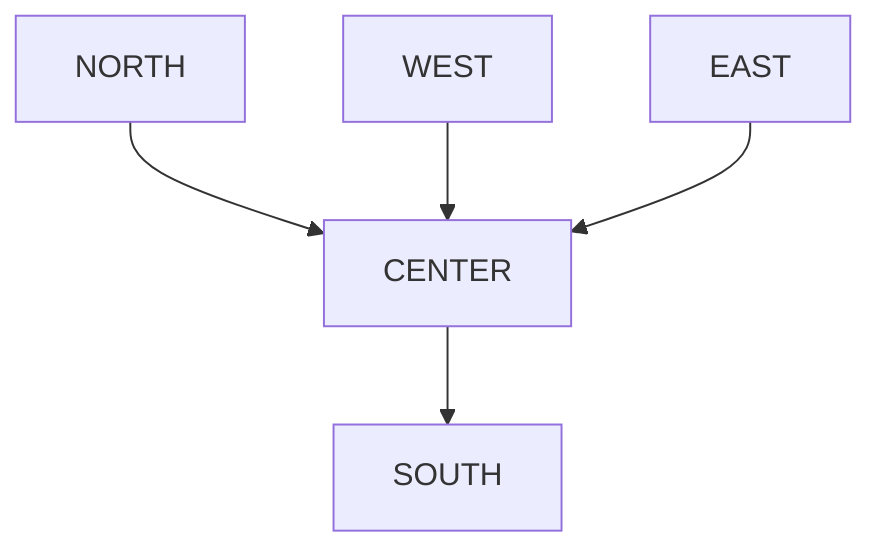

```text
+---------------------------+
|           NORTH           |
+----+-----------------+----+
|    |                 |    |
|WEST|     CENTER      |EAST|
|    |                 |    |
+----+-----------------+----+
|           SOUTH           |
+---------------------------+
```

A Frame uses BorderLayout by default.

So these two statements produce the same result:

```java
Frame frame = new Frame();
```

and

```java
Frame frame = new Frame();
frame.setLayout(new BorderLayout());
```

The second one is just more explicit.

## **Program 1 – Basic BorderLayout**

```java
import java.awt.*;
import java.awt.event.*;

public class BorderLayoutDemo {

    public static void main(String[] args) {

        Frame frame = new Frame("BorderLayout Example");

        frame.setLayout(new BorderLayout());

        frame.add(new Button("North"), BorderLayout.NORTH);
        frame.add(new Button("South"), BorderLayout.SOUTH);
        frame.add(new Button("East"), BorderLayout.EAST);
        frame.add(new Button("West"), BorderLayout.WEST);
        frame.add(new Button("Center"), BorderLayout.CENTER);

        frame.setSize(500,350);

        frame.addWindowListener(new WindowAdapter() {
            public void windowClosing(WindowEvent e) {
                System.exit(0);
            }
        });

        frame.setVisible(true);
    }
}
```

### **Output**

```text
┌──────────────────────────────────────────────────────┐
│ BorderLayout Example                             □ X │
├──────────────────────────────────────────────────────┤
│                     [ North ]                        │
│                                                      │
│ [West]             [ Center ]              [East]    │
│                                                      │
│                     [ South ]                        │
└──────────────────────────────────────────────────────┘
```

---

# 🔲 **GridLayout**

## **What is GridLayout?**

> **Definition:** GridLayout divides a container into a grid of equal-sized cells.

Each cell contains one component.

For example, a 2 × 3 grid looks like:

```text
+---------+---------+---------+
|         |         |         |
+---------+---------+---------+
|         |         |         |
+---------+---------+---------+
```

Every cell has the same width and height.

## **Program 1 – Simple GridLayout**

```java
import java.awt.*;
import java.awt.event.*;

public class GridLayoutDemo {

    public static void main(String[] args) {

        Frame frame = new Frame("GridLayout Example");

        // 2 Rows, 3 Columns
        frame.setLayout(new GridLayout(2, 3));

        frame.add(new Button("Button 1"));
        frame.add(new Button("Button 2"));
        frame.add(new Button("Button 3"));
        frame.add(new Button("Button 4"));
        frame.add(new Button("Button 5"));
        frame.add(new Button("Button 6"));

        frame.setSize(400, 300);

        frame.addWindowListener(new WindowAdapter() {
            public void windowClosing(WindowEvent e) {
                System.exit(0);
            }
        });

        frame.setVisible(true);
    }
}
```

### **Output**

```text
+--------------------------------------+
| Button1 | Button2 | Button3 |
+---------+---------+---------+
| Button4 | Button5 | Button6 |
+--------------------------------------+
```

### **Notice that:**

- There are 2 rows.
- There are 3 columns.
- Every button has the same size.

## **How GridLayout Works**

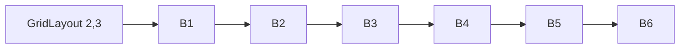

```text
GridLayout(2,3)

+-------+-------+-------+
| B1    | B2    | B3    |
+-------+-------+-------+
| B4    | B5    | B6    |
+-------+-------+-------+
```

It fills the grid from left to right, then moves to the next row.

### **Constructor**

```java
GridLayout(int rows, int cols)
```

### **Example**

```java
new GridLayout(3,2);
```

### **Output**

```text
+-------+-------+
| B1    | B2    |
+-------+-------+
| B3    | B4    |
+-------+-------+
| B5    | B6    |
+-------+-------+
```

### **Constructor with Gaps**

```java
new GridLayout(2,3,10,20);
```

Here:

- 10 → Horizontal gap (between columns)
- 20 → Vertical gap (between rows)

---

# 🧮 **Real-Life Uses**

GridLayout is commonly used for:

## **Calculator**

```text
+-----------------------+
| Display               |
+-----------------------+
| 7 | 8 | 9 | / |
| 4 | 5 | 6 | * |
| 1 | 2 | 3 | - |
| 0 | = | C | + |
+-----------------------+
```

## **Tic-Tac-Toe**

```text
+---+---+---+
| X | O | X |
+---+---+---+
| O | X | O |
+---+---+---+
| X | O | X |
+---+---+---+
```

## **Numeric Keypad**

```text
+---+---+---+
| 1 | 2 | 3 |
+---+---+---+
| 4 | 5 | 6 |
+---+---+---+
| 7 | 8 | 9 |
+---+---+---+
```

---

# 🃏 **CardLayout**

## **What is CardLayout?**

Imagine a deck of playing cards.

Only the top card is visible.

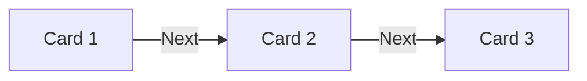

```text
+------------------+
| Card 1           |
+------------------+

Next →

+------------------+
| Card 2           |
+------------------+

Next →

+------------------+
| Card 3           |
+------------------+
```

This is exactly how CardLayout works.

Only one component is visible at a time.

## **Where is CardLayout Used?**

- Login Wizard
- Registration Form
- Quiz Applications
- Multi-page Forms
- Installation Wizard

## **Program**

```java
import java.awt.*;
import java.awt.event.*;

public class CardLayoutDemo {

    public static void main(String[] args) {

        Frame frame = new Frame("CardLayout Example");

        CardLayout card = new CardLayout();

        frame.setLayout(card);

        frame.add(new Button("Card 1"));
        frame.add(new Button("Card 2"));
        frame.add(new Button("Card 3"));

        frame.setSize(400,300);

        frame.addWindowListener(new WindowAdapter() {
            public void windowClosing(WindowEvent e) {
                System.exit(0);
            }
        });

        frame.setVisible(true);

        // Show next card every 2 seconds
        new java.util.Timer().schedule(
            new java.util.TimerTask() {
                public void run() {
                    card.next(frame);
                }
            },
            2000,
            2000
        );
    }
}
```

### **Output**

**Initially**

```text
+----------------------+
| Card 1               |
+----------------------+
```

**After 2 seconds**

```text
+----------------------+
| Card 2               |
+----------------------+
```

**After another 2 seconds**

```text
+----------------------+
| Card 3               |
+----------------------+
```

---

# 🧩 **GridBagLayout**

> **Definition:** GridBagLayout (Introduction)is the most flexible layout manager in AWT.

Unlike GridLayout, components do not have to be the same size.

### **Example**

```text
+-------------+------------+
| Name        |            |
|             | TextField  |
+-------------+------------+
| Address                  |
|                          |
+--------------------------+
| Submit Button            |
+--------------------------+
```

Some cells can be wider or taller than others.

## **Where is GridBagLayout Used?**

- Professional forms
- Data entry screens
- Registration pages
- Enterprise applications

It uses a helper class called GridBagConstraints, which lets you control the position and size of each component. It's more advanced than the other layouts and is often introduced after students are comfortable with the basics.

---

# 📊 **Summary of Layout Managers**

| **Layout** | **Arrangement** | **Best Use** |
|---|---|---|
| **FlowLayout** | Left → Right | Toolbars |
| **BorderLayout** | Five Regions | Main Window |
| **GridLayout** | Equal Grid | Calculator |
| **CardLayout** | One Component at a Time | Wizard |
| **GridBagLayout** | Flexible Grid | Professional Forms |

---

# 🎨 **Graphics class and paint()**

## **Internal Working**

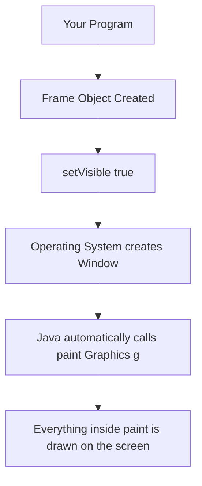

> **Important:** You do not call `paint()` yourself. Java calls it whenever the window needs to be redrawn.

---

# 🧰 **What is the Graphics class?**

> **Definition:** Think of the Graphics object as a drawing toolbox.

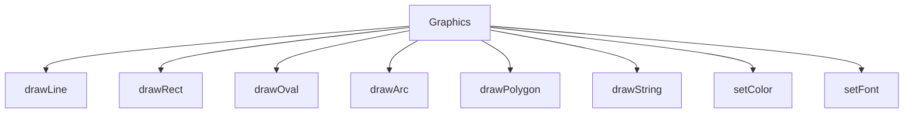

Without the Graphics object, you cannot draw anything.

---

# 🖌️ **First Graphics Program**

```java
import java.awt.*;
import java.awt.event.*;

public class GraphicsDemo extends Frame {

    public GraphicsDemo() {

        setTitle("First Graphics Program");
        setSize(500,350);

        addWindowListener(new WindowAdapter() {
            public void windowClosing(WindowEvent e) {
                System.exit(0);
            }
        });

        setVisible(true);
    }

    @Override
    public void paint(Graphics g) {

        g.drawString("Welcome to Java Graphics", 150, 150);

    }

    public static void main(String[] args) {

        new GraphicsDemo();

    }
}
```

### **Output**

```text
+--------------------------------------------------+
| First Graphics Program                       □ X |
|--------------------------------------------------|
|                                                  |
|                                                  |
|          Welcome to Java Graphics                |
|                                                  |
|                                                  |
+--------------------------------------------------+
```

---

# 📍 **Coordinate System**

> **Definition:** This is one of the most important concepts.

Java starts counting from the top-left corner.

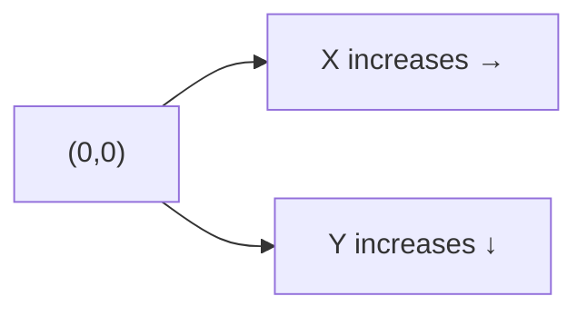

```text
(0,0)
 ●────────────────────────────► X
 │
 │
 │
 ▼
 Y
```

### **Unlike mathematics:**

**Mathematics**

```text
       Y
       ▲
       │
       │
-------●------► X
```

**Java**

```text
(0,0)
 ●────────────────────► X
 │
 │
 │
 ▼
 Y
```

Java's origin is at the top-left, and the Y-coordinate increases as you move downward.

## **Example Coordinates**

```text
+------------------------------------------+
|(0,0)                                     |
|                                          |
|     (100,50)                             |
|                                          |
|              (200,150)                   |
|                                          |
|                              (400,250)   |
+------------------------------------------+
```

---

# ❓ **Why don't we call paint() directly?**

Suppose you write:

```java
paint(g);
```

This won't work because you don't have a valid Graphics object. Java creates and supplies it when it is ready to paint the window.

Instead, Java calls:

```java
paint(Graphics g);
```

automatically.

---

# ✏️ **Drawing and Filling Shapes**

# 📏 **Drawing Lines using drawLine()**

### **Aim**

To draw horizontal, vertical, and diagonal lines using the `drawLine()` method.

### **Syntax**

```java
g.drawLine(x1, y1, x2, y2);
```

### **where:**

- x1 = Starting X-coordinate
- y1 = Starting Y-coordinate
- x2 = Ending X-coordinate
- y2 = Ending Y-coordinate

---

## **How does drawLine() work?**

Suppose you write:

```java
g.drawLine(50, 50, 250, 50);
```

Java interprets it as:

Start at point (50,50) and draw a line up to (250,50).

### **Visual Representation**

```text
(50,50) ●────────────────────────────● (250,50)
```

---

# ➖ **Program 1 – Horizontal Line**

```java
import java.awt.*;
import java.awt.event.*;

public class DrawLineDemo extends Frame {

    public DrawLineDemo() {

        setTitle("Horizontal Line");
        setSize(400,300);

        addWindowListener(new WindowAdapter() {
            public void windowClosing(WindowEvent e) {
                System.exit(0);
            }
        });

        setVisible(true);
    }

    @Override
    public void paint(Graphics g) {

        g.drawLine(50,100,300,100);

    }

    public static void main(String args[]) {

        new DrawLineDemo();

    }
}
```

### **Output**

```text
+----------------------------------------+
|                                        |
| -------------------------------        |
|                                        |
|                                        |
+----------------------------------------+
```

### **Why is it horizontal?**

Because

```text
y1 = 100
y2 = 100
```

The Y-coordinate is the same, so the line stays at the same vertical level.

---

# │ **Program 2 – Vertical Line**

```java
g.drawLine(100,50,100,250);
```

### **Output**

```text
+--------------------------+
|          |               |
|          |               |
|          |               |
|          |               |
|          |               |
+--------------------------+
```

### **Why is it vertical?**

Because

```text
x1 = 100
x2 = 100
```

The X-coordinate is the same, so the line goes straight down.

---

# 📐 **Program 3 – Diagonal Line**

```java
g.drawLine(50,50,250,200);
```

### **Output**

```text
+--------------------------------+
| \                              |
|  \                             |
|   \                            |
|    \                           |
|     \                          |
+--------------------------------+
```

### **Coordinate Diagram**

```text
(0,0)
 ●──────────────────────────────► X
 |
 |
 |
 ▼
 Y
```

If we mark the points:

```text
(50,50) ●
         \
          \
           \
            \
             ● (250,200)
```

Java joins these two points with a straight line.

---

# 🟦 **Program 4 – Draw Four Lines**

```java
@Override
public void paint(Graphics g) {

    g.drawLine(50,50,250,50);   // Top
    g.drawLine(50,50,50,200);   // Left
    g.drawLine(250,50,250,200); // Right
    g.drawLine(50,200,250,200); // Bottom
}
```

### **Output**

```text
+--------------------------------+
|                                |
| +--------------------+         |
| |                    |         |
| |                    |         |
| |                    |         |
| +--------------------+         |
|                                |
+--------------------------------+
```

### **Question: What shape did we create?**

> **Answer:** A rectangle, made by drawing four separate lines.

---

# 📍 **Understanding the Coordinates**

Let's examine the first line:

```java
g.drawLine(50,50,250,50);
```

| **Parameter** | **Value** | **Meaning** |
|---|---:|---|
| x1 | 50 | Starting X |
| y1 | 50 | Starting Y |
| x2 | 250 | Ending X |
| y2 | 50 | Ending Y |

Notice that only the X-coordinate changes while Y stays the same, so the line is horizontal.

---

# ▭ **drawRect() and fillRect()**

### **Aim**

To draw rectangles and filled rectangles using the Graphics class.

## **Why use drawRect()?**

Previously, we drew a rectangle using 4 lines:

```java
g.drawLine(50,50,250,50);
g.drawLine(50,50,50,200);
g.drawLine(250,50,250,200);
g.drawLine(50,200,250,200);
```

Java provides a shortcut:

```java
g.drawRect(x, y, width, height);
```

**Much easier!**

### **Syntax**

```java
g.drawRect(x, y, width, height);
```

| **Parameter** | **Meaning** |
|---|---|
| x | Starting X coordinate |
| y | Starting Y coordinate |
| width | Rectangle width |
| height | Rectangle height |

### **Coordinate Understanding**

```text
(50,50)
 ●─────────────── Width = 200 ──────────────►
 │
 │
 │ Height = 100
 │
 ▼
```

### **Example**

```java
g.drawRect(50,50,200,100);
```

means:

- Start at (50,50)
- Width = 200
- Height = 100

---

# ▫️ **Program 1 – Draw Rectangle**

```java
import java.awt.*;
import java.awt.event.*;

public class RectangleDemo extends Frame {

    public RectangleDemo() {

        setTitle("Rectangle Example");
        setSize(500,350);

        addWindowListener(new WindowAdapter() {
            public void windowClosing(WindowEvent e) {
                System.exit(0);
            }
        });

        setVisible(true);
    }

    public void paint(Graphics g) {

        g.drawRect(100,80,250,120);

    }

    public static void main(String[] args) {

        new RectangleDemo();

    }
}
```

### **Output**

```text
+--------------------------------------+
|                                      |
|   +----------------------+           |
|   |                      |           |
|   |                      |           |
|   |                      |           |
|   +----------------------+           |
|                                      |
+--------------------------------------+
```

---

# 🖤 **What is fillRect()?**

> **Definition:** `drawRect()` draws only the border.

```java
g.drawRect(...)
```

### **Output**

```text
+-------------+
|             |
|             |
+-------------+
```

> **Definition:** `fillRect()` fills the entire rectangle.

```java
g.fillRect(...)
```

### **Output**

```text
###############
###############
###############
###############
```

---

# 🟫 **Program 2 – Filled Rectangle**

```java
public void paint(Graphics g) {

    g.fillRect(100,80,250,120);

}
```

### **Output**

```text
+--------------------------------------+
|                                      |
| ######################               |
| ######################               |
| ######################               |
| ######################               |
|                                      |
+--------------------------------------+
```

---

# 🌓 **Program 3 – Draw and Fill Together**

```java
public void paint(Graphics g) {

    g.drawRect(50,50,150,100);
    g.fillRect(250,50,150,100);

}
```

### **Output**

```text
+------------------------------------------------+
|                                                |
| +-------------+  ################               |
| |             |  ################               |
| |             |  ################               |
| +-------------+  ################               |
|                                                |
+------------------------------------------------+
```

**Left → Outline rectangle**

**Right → Filled rectangle**

---

# 🎨 **Colors with Rectangle**

```java
public void paint(Graphics g) {

    g.setColor(Color.RED);
    g.fillRect(100,100,200,100);

}
```

### **Output**

```text
+--------------------------------------+
|                                      |
|          RED RECTANGLE               |
|                                      |
+--------------------------------------+
```

---

# 🔺 **drawPolygon()**

## **What is a Polygon?**

> **Definition:** A polygon is a closed shape formed by joining multiple straight lines.

### **Syntax**

```java
g.drawPolygon(xPoints, yPoints, numberOfPoints);
```

### **Parameters**

| **Parameter** | **Description** |
|---|---|
| xPoints | Array of X coordinates |
| yPoints | Array of Y coordinates |
| numberOfPoints | Total number of vertices |

---

# 🔺 **Understanding the Arrays**

Suppose we want to draw a triangle.

```text
        (150,50)
           ●
          / \
         /   \
        /     \
       /       \
      ●---------●
  (50,200)   (250,200)
```

Coordinates:

```java
int x[] = {150, 50, 250};
int y[] = {50, 200, 200};
```

Java joins the points in this order:

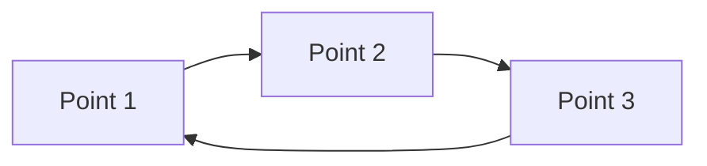

- Point 1 → Point 2
- Point 2 → Point 3
- Point 3 → Point 1

forming a closed triangle.

---

# 🔺 **Program 1 – Triangle**

```java
import java.awt.*;
import java.awt.event.*;

public class PolygonDemo extends Frame {

    public PolygonDemo() {

        setTitle("Draw Polygon");
        setSize(400,300);

        addWindowListener(new WindowAdapter() {
            public void windowClosing(WindowEvent e) {
                System.exit(0);
            }
        });

        setVisible(true);
    }

    @Override
    public void paint(Graphics g) {

        int x[] = {150, 50, 250};
        int y[] = {50, 200, 200};

        g.drawPolygon(x, y, 3);

    }

    public static void main(String args[]) {

        new PolygonDemo();

    }
}
```

### **Output**

```text
+------------------------------------+
|                                    |
|              /\                    |
|             /  \                   |
|            /    \                  |
|           /______\                 |
|                                    |
+------------------------------------+
```

---

# ⬟ **Program 2 – Pentagon**

```java
int x[] = {150,220,190,110,80};
int y[] = {50,120,220,220,120};

g.drawPolygon(x,y,5);
```

### **Output**

```text
     /\
    /  \
   /    \
   |    |
   |____|
```

---

# ⬢ **Program 3 – Hexagon**

```java
int x[] = {120,200,250,200,120,70};
int y[] = {50,50,120,190,190,120};

g.drawPolygon(x,y,6);
```

---

# 🟩 **fillPolygon()**

To fill the polygon:

```java
g.fillPolygon(x, y, 6);
```

### **Output**

```text
  #########
  #############
  ###############
  #############
  #########
```

### **Difference**

| **Method** | **Result** |
|---|---|
| `drawPolygon()` | Draws only the boundary |
| `fillPolygon()` | Fills the entire polygon |

---

# 🥚 **drawOval() and drawCircle()**

It actually draws an ellipse inside an imaginary rectangle.

Think of it like this:

### **Bounding Rectangle**

```text
+---------------------------+
|                           |
|     ***************       |
|   ***             ***     |
|  **                 **    |
| ***                 ***   |
|   ***             ***     |
|     ***************       |
|                           |
+---------------------------+
```

The oval always fits inside the rectangle.

### **Syntax**

```java
g.drawOval(x, y, width, height);
```

### **Parameters**

| **Parameter** | **Meaning** |
|---|---|
| x | X-coordinate of bounding rectangle |
| y | Y-coordinate of bounding rectangle |
| width | Width of bounding rectangle |
| height | Height of bounding rectangle |

---

# ⚙️ **Internal Working**

Suppose you write:

```java
g.drawOval(100,80,200,100);
```

Java first imagines a rectangle:

```text
+----------------------+
|                      |
|     ************     |
|   **            **   |
|  *                *  |
|   **            **   |
|     ************     |
|                      |
+----------------------+
```

It does not draw the rectangle.

It only draws the largest possible oval inside it.

---

# 🥚 **Program**

```java
import java.awt.*;
import java.awt.event.*;

public class DrawOvalDemo extends Frame {

    public DrawOvalDemo() {

        setTitle("Draw Oval");
        setSize(500,350);

        addWindowListener(new WindowAdapter() {
            public void windowClosing(WindowEvent e) {
                dispose();
            }
        });

        setVisible(true);
    }

    @Override
    public void paint(Graphics g) {

        g.drawOval(100,80,250,150);

    }

    public static void main(String args[]) {

        new DrawOvalDemo();

    }
}
```

### **Expected Output**

```text
+------------------------------------------+
|                                          |
|       ***************                    |
|     ***             ***                  |
|    **                 **                 |
|     ***             ***                  |
|       ***************                    |
|                                          |
+------------------------------------------+
```

---

# ⭕ **How to Draw a Circle**

A circle is simply a special case of an oval.

If

```text
Width = Height
```

then

```java
g.drawOval(100,100,150,150);
```

### **Output**

```text
   *********
 ***       ***
**           **
**           **
 ***       ***
   *********
```

Because

```text
Width = 150
Height = 150
```

the oval becomes a perfect circle.

---

# ⚖️ **Oval vs Circle**

| **Oval** | **Circle** |
|---|---|
| Width ≠ Height | Width = Height |
| Ellipse | Perfect Circle |

### **Example**

```java
Oval -- g.drawOval(50,50,200,100);
Circle -- g.drawOval(50,50,150,150);
```

---

# 🔵 **Filled Oval and Circle**

### **Syntax**

```java
g.fillOval(x, y, width, height);
```

### **Parameters**

| **Parameter** | **Meaning** |
|---|---|
| x | X-coordinate of bounding rectangle |
| y | Y-coordinate of bounding rectangle |
| width | Width of oval |
| height | Height of oval |

---

# 🔵 **Program 1 – Filled Oval**

```java
import java.awt.*;
import java.awt.event.*;

public class FillOvalDemo extends Frame {

    public FillOvalDemo() {

        setTitle("Fill Oval Demo");
        setSize(500,350);

        addWindowListener(new WindowAdapter() {
            public void windowClosing(WindowEvent e) {
                dispose();
            }
        });

        setVisible(true);
    }

    @Override
    public void paint(Graphics g) {

        g.setColor(Color.BLUE);
        g.fillOval(120,80,220,120);

    }

    public static void main(String args[]) {

        new FillOvalDemo();

    }
}
```

### **Expected Output :Filled Oval.**

---

# 🔴 **Filled Circle**

Since

```text
Width = Height
```

we get a circle.

```java
public void paint(Graphics g) {

    g.setColor(Color.RED);
    g.fillOval(120,80,150,150);

}
```

---

# 🌙 **drawArc()**

## **Concept**

> **Definition:** An arc is a portion of an oval.

Imagine an oval is a complete 360° shape.

```text
360° Oval

   ***********
 ***         ***
**             **
**             **
 ***         ***
   ***********
```

If Java draws only a part of it, you get an arc.

### **Syntax**

```java
g.drawArc(x, y, width, height, startAngle, arcAngle);
```

### **Parameters**

- x, y → Bounding rectangle
- width, height → Size of oval
- startAngle → Starting position
- arcAngle → How many degrees to draw

### **Example**

```java
g.drawArc(100,100,150,150,0,180);
```

### **Output**

```text
   _________
  /         \
 /           \
```

Only the upper half of the circle is drawn.

### **Common Uses**

- Smiley face 😊
- Rainbow 🌈
- Clock
- Speedometer

---

# 🍕 **fillArc()**

## **Concept**

> **Definition:** `fillArc()` fills the selected arc.

Instead of only drawing the boundary, Java fills the area enclosed by the arc and the center, producing a sector (like a pizza slice).

### **Syntax**

```java
g.fillArc(x,y,width,height,startAngle,arcAngle);
```

### **Example**

```java
g.fillArc(100,100,150,150,0,90);
```

### **Output**

```text
  #####
 ########
 ########
```

Looks like a pizza slice.

### **Applications**

- Pie Charts
- Pac-Man
- Clock Sectors

---

# 🔘 **drawRoundRect()**

## **Concept**

> **Definition:** A rectangle with rounded corners.

### **Normal rectangle**

```text
+-----------+
|           |
+-----------+
```

### **Rounded rectangle**

```text
 /---------\
|           |
 \---------/
```

### **Syntax**

```java
g.drawRoundRect(x,y,width,height,arcWidth,arcHeight);
```

### **Extra Parameters**

- arcWidth
- arcHeight

These control how round the corners are.

### **Example**

```java
g.drawRoundRect(100,100,200,100,30,30);
```

### **Applications**

- Modern buttons
- Dialog boxes
- Login panels

---

# 🟦 **fillRoundRect()**

## **Concept**

> **Definition:** Filled version of `drawRoundRect()`.

### **Example**

```java
g.fillRoundRect(100,100,200,100,40,40);
```

### **Output**

```text
######################
########################
########################
######################
```

### **Applications**

- Dashboard cards
- Mobile UI
- Buttons

---

# 🧊 **draw3DRect()**

## **Concept**

> **Definition:** Draws a rectangle with a 3D raised or lowered appearance by adding light and shadow effects.

### **Syntax**

```java
g.draw3DRect(x,y,width,height,true);
```

```text
true  → Raised
false → Sunken
```

### **Example**

```java
g.draw3DRect(100,100,150,80,true);
```

### **Output**

```text
+-----------+
|           | (Looks Raised)
+-----------+
```

### **Applications**

- Old Windows Buttons
- Toolbars
- Panels

---

# 🟫 **fill3DRect()**

## **Concept**

> **Definition:** Filled version of the 3D rectangle.

### **Example**

```java
g.fill3DRect(100,100,150,80,true);
```

### **Output**

```text
██████████████
██████████████
██████████████
```

Looks like a raised button.

---

# ↕️ **Difference between Raised and Sunken**

### **Raised**

```text
 _________
|         |
|_________|
```

Looks like it is coming out.

### **Sunken**

```text
 _________
|         |
|_________|
```

Looks like it is pressed inside.

> (The effect comes from the light and shadow drawn around the edges.)

---

# 🧾 **Complete Graphics API (Basic)**

| **Method** | **Purpose** |
|---|---|
| `drawLine()` | Draw a line |
| `drawRect()` | Rectangle outline |
| `fillRect()` | Filled rectangle |
| `drawOval()` | Oval/Circle outline |
| `fillOval()` | Filled oval/circle |
| `drawPolygon()` | Polygon outline |
| `fillPolygon()` | Filled polygon |
| `drawArc()` | Arc outline |
| `fillArc()` | Filled arc (sector) |
| `drawRoundRect()` | Rounded rectangle |
| `fillRoundRect()` | Filled rounded rectangle |
| `draw3DRect()` | 3D rectangle outline |
| `fill3DRect()` | Filled 3D rectangle |

---

# 🎨 **Colors**

# **setColor()**

### **Aim**

To change the drawing color using the `setColor()` method.

## **What is setColor()?**

> **Definition:** By default, Java draws in black.

If you want to draw in another color, use:

```java
g.setColor(Color.RED);
```

After this statement, everything drawn afterward uses the selected color until you change it again.

### **Syntax**

```java
g.setColor(Color.COLOR_NAME);
```

---

# 🌈 **Common Colors**

| **Color Constant** | **Color** |
|---|---|
| `Color.BLACK` | Black |
| `Color.WHITE` | White |
| `Color.RED` | Red |
| `Color.BLUE` | Blue |
| `Color.GREEN` | Green |
| `Color.YELLOW` | Yellow |
| `Color.ORANGE` | Orange |
| `Color.PINK` | Pink |
| `Color.GRAY` | Gray |
| `Color.CYAN` | Cyan |
| `Color.MAGENTA` | Magenta |

---

# 🖍️ **Program**

```java
import java.awt.*;
import java.awt.event.*;

public class ColorDemo extends Frame {

    public ColorDemo() {

        setTitle("Color Demo");
        setSize(500,350);

        addWindowListener(new WindowAdapter() {
            public void windowClosing(WindowEvent e) {
                System.exit(0);
            }
        });

        setVisible(true);
    }

    @Override
    public void paint(Graphics g) {

        g.setColor(Color.RED);
        g.drawRect(50,50,100,80);

        g.setColor(Color.BLUE);
        g.fillRect(200,50,100,80);

        g.setColor(Color.GREEN);
        g.drawString("Java Graphics",150,200);

    }

    public static void main(String args[]) {

        new ColorDemo();

    }
}
```

### **Output (Conceptual)**

```text
+--------------------------------------------------+
|                                                  |
| Red Rectangle   Blue Filled Rectangle            |
|                                                  |
| Green "Java Graphics"                            |
|                                                  |
+--------------------------------------------------+
```

---

# 🎯 **Custom Colors (RGB)**

Instead of predefined colors, you can create your own.

```java
g.setColor(new Color(255,0,0)); // Red
g.setColor(new Color(0,255,0)); // Green
g.setColor(new Color(0,0,255)); // Blue
```

## **RGB Range**

Each value ranges from 0 to 255.

| **RGB Color** | **Color** |
|---|---|
| `(255,0,0)` | Red |
| `(0,255,0)` | Green |
| `(0,0,255)` | Blue |
| `(255,255,0)` | Yellow |
| `(255,255,255)` | White |
| `(0,0,0)` | Black |

---

# 🔤 **Fonts**

# **setFont()**

### **Aim**

To change the font style, size, and appearance of text.

### **Syntax**

```java
Font f = new Font("Arial", Font.BOLD, 24);
g.setFont(f);
```

## **Font Styles**

| **Style** | **Constant** |
|---|---|
| Plain | `Font.PLAIN` |
| Bold | `Font.BOLD` |
| Italic | `Font.ITALIC` |
| Bold + Italic | `Font.BOLD + Font.ITALIC` |

---

# 📝 **Program**

```java
@Override
public void paint(Graphics g) {

    Font f = new Font("Arial", Font.BOLD, 24);

    g.setFont(f);

    g.drawString("Welcome to Java Graphics",50,100);

}
```

### **Output (Conceptual)**

> **Welcome to Java Graphics**

*(displayed in Arial, Bold, 24 pt)*

---

# 🖼️ **Displaying Information in a Frame**

> **Definition:** Text/graphics are not drawn using `System.out.println()` — output must go through the Graphics object supplied to the `paint()` method.

Java's painting model is event-driven: the AWT subsystem calls `paint()` whenever the frame needs to (re)drawn — at creation, on resize, when uncovered by another window, etc.

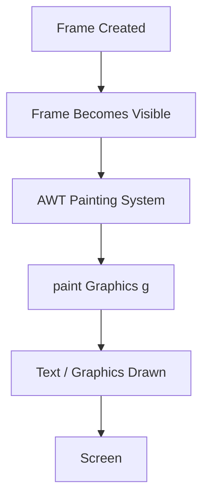

### **Program**

```java
import java.awt.*;

class InfoFrame extends Frame {

    public void paint(Graphics g) {

        g.drawString("Hello, Graphics World!", 50, 50);

    }

    public static void main(String[] args) {

        InfoFrame f = new InfoFrame();

        f.setSize(300, 200);

        f.setVisible(true);

    }
}
```

---

# ✍️ **drawString()**

You have already used `drawString()`, but now let's combine it with colors and fonts.

```java
@Override
public void paint(Graphics g) {

    g.setColor(Color.BLUE);

    Font f = new Font("Times New Roman", Font.BOLD, 28);

    g.setFont(f);

    g.drawString("JAVA GRAPHICS",100,150);

}
```

---

# 🖼️ **drawImage()**

This method displays an image in the window.

### **Syntax**

```java
Image img = Toolkit.getDefaultToolkit().getImage("flower.jpg");

g.drawImage(img,50,50,this);
```

### **Parameters**

- img → Image object
- 50,50 → X and Y position
- this → Current frame (used as the image observer)

> **Note:** The image file (`flower.jpg` in this example) should be available in the expected location, or you'll need to provide the correct path.

---

# 🎨 **Paint Mode and XOR Mode in Java Graphics**

The Graphics class provides two drawing modes:

1. Paint Mode (Default)
2. XOR Mode

These modes determine how new graphics are drawn over existing graphics.

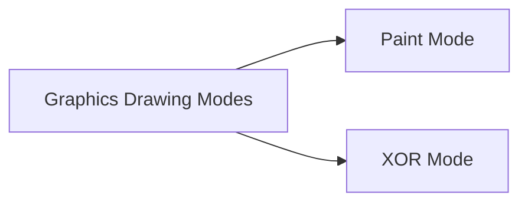

---

# 🖌️ **1. Paint Mode (Default Mode)**

## **Definition**

> **In Paint Mode, the new drawing completely replaces the pixels underneath with the current drawing color.**

It is the default drawing mode in Java.

### **Syntax**

```java
g.setPaintMode();
```

Although this method exists, you usually do not need to call it because the Graphics object starts in paint mode.

### **Example**

```java
g.setColor(Color.RED);
g.fillRect(50,50,100,100);

g.setColor(Color.BLUE);
g.fillRect(80,80,100,100);
```

### **Conceptual Output**

**First Rectangle**

```text
██████████
```

**Second Rectangle**

```text
 ██████████
 ██████████
```

The blue rectangle covers the overlapping part of the red rectangle.

---

# ⚙️ **Internal Working**

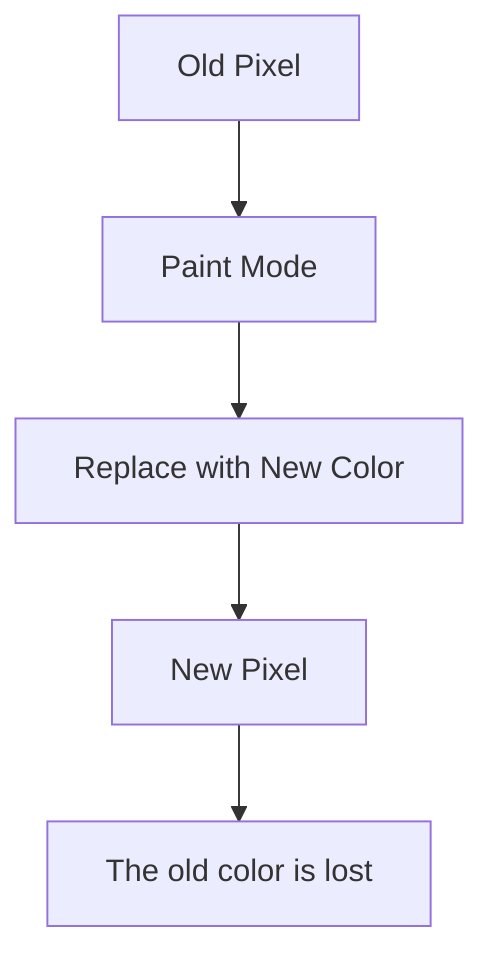

### **Characteristics of Paint Mode**

- Default drawing mode.
- New color replaces the old color.
- Used in almost all graphics applications.
- Permanent drawing.

---

# 🔄 **2. XOR Mode**

## **Definition**

> **XOR stands for Exclusive OR.**

Instead of replacing colors, Java performs a bitwise XOR operation between the existing pixel color and the drawing color.

### **Syntax**

```java
g.setXORMode(Color.WHITE);
```

The color passed is called the XOR color.

### **Example**

```java
g.setXORMode(Color.WHITE);

g.setColor(Color.RED);

g.fillRect(50,50,100,100);
```

---

# ✨ **What makes XOR special?**

Suppose you draw a rectangle.

### **Draw Rectangle**

```text
████████
```

### **Draw the same rectangle again at exactly the same position**

```text
Rectangle disappears
```

### **Why?**

Because

```text
A XOR B XOR B = A
```

Drawing twice restores the original pixels.

---

# 🔁 **Conceptual Diagram**

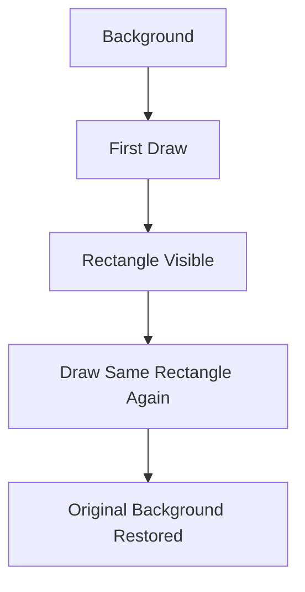

```text
First Draw

Background
□□□□□□□□
    ↓
Draw Rectangle
████████

Second Draw

████████
    ↓
Draw Again
□□□□□□□□
```

It looks like the object is erased.

---

# 🖱️ **Why is XOR Mode Useful?**

Before modern double buffering became common, XOR mode was widely used for:

- Dragging rectangles
- Rubber-band lines
- Selection boxes
- Moving objects
- CAD software

### **Example: Mouse Drag**

```text
+----------------+
|                |
|                |
+----------------+
```

As the mouse moves,

Old rectangle disappears.

New rectangle appears.

This happens without clearing the entire screen.

---

# ⚙️ **Internal Working**

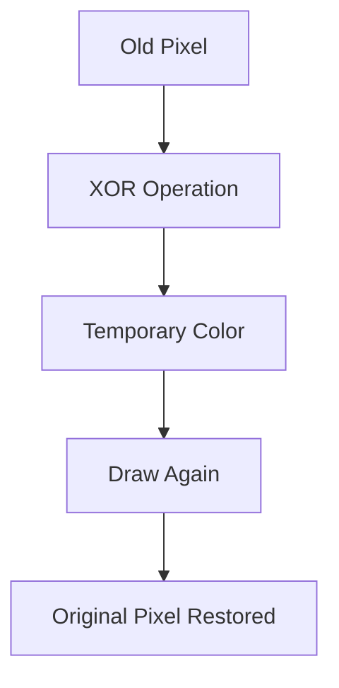

---

# ⚖️ **Comparison**

| **Paint Mode** | **XOR Mode** |
|---|---|
| Default mode | Special mode |
| Replaces old color | Performs XOR operation |
| Permanent drawing | Temporary drawing |
| Object remains visible | Drawing the same object twice removes it |
| Used for normal graphics | Used for dragging and selection effects |

---

# 💻 **Program Example**

```java
import java.awt.*;
import java.awt.event.*;

public class XORDemo extends Frame {

    public XORDemo() {

        setTitle("Paint Mode and XOR Mode");
        setSize(400,300);

        addWindowListener(new WindowAdapter() {
            public void windowClosing(WindowEvent e) {
                System.exit(0);
            }
        });

        setVisible(true);
    }

    public void paint(Graphics g) {

        // Paint Mode (Default)
        g.setColor(Color.RED);
        g.fillRect(50,50,100,100);

        // XOR Mode
        g.setXORMode(Color.WHITE);
        g.setColor(Color.BLUE);
        g.fillRect(80,80,100,100);

        // Back to Paint Mode
        g.setPaintMode();
        g.setColor(Color.BLACK);
        g.drawString("Paint Mode Restored",80,220);

    }

    public static void main(String args[]) {

        new XORDemo();

    }
}
```

---

# 🔍 **What Does setXORMode(Color c) Mean?**

```java
g.setXORMode(Color.WHITE);
```

The color passed is called the XOR Color.

Java combines:

- Current Drawing Color
- XOR Color
- Background Color

to generate the visible color.

The exact resulting color depends on the screen colors.

---

# ↩️ **Why Do We Return to Paint Mode?**

After XOR drawing:

```java
g.setPaintMode();
```

This restores normal graphics.

Otherwise all future drawings continue using XOR behavior.

---

# 📌 **Definitions**

## **Paint Mode**

> **Paint Mode is the default drawing mode of the Graphics class in which newly drawn graphics overwrite the existing graphics on the screen.**

## **XOR Mode**

> **XOR Mode is a special drawing mode of the Graphics class in which colors are drawn using the Exclusive-OR operation. Drawing the same object twice at the same position removes the object, making XOR Mode useful for temporary graphics and simple animations.**

---

# 🧠 **UNIT 1 — Quick Visual Revision**

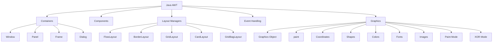

---

# 📚 **Unit 1 — Topic Map**

| **Topic** | **Important Concepts** |
|---|---|
| **Java AWT** | GUI toolkit, `java.awt`, native resources |
| **Containers** | Window, Panel, Frame, Dialog |
| **Components** | Label, Button, TextField, Checkbox, Choice, List, Canvas |
| **Event Handling** | ActionListener, MouseListener, ItemListener, KeyListener, WindowListener |
| **Frames** | `setSize()`, `setTitle()`, `setVisible()`, closing |
| **Layout Managers** | FlowLayout, BorderLayout, GridLayout, CardLayout, GridBagLayout |
| **Graphics** | Graphics object, `paint()` |
| **Coordinates** | Origin `(0,0)`, X-axis, Y-axis |
| **Lines** | `drawLine()` |
| **Rectangles** | `drawRect()`, `fillRect()` |
| **Polygons** | `drawPolygon()`, `fillPolygon()` |
| **Oval/Circle** | `drawOval()`, `fillOval()` |
| **Arc** | `drawArc()`, `fillArc()` |
| **Rounded Rectangle** | `drawRoundRect()`, `fillRoundRect()` |
| **3D Rectangle** | `draw3DRect()`, `fill3DRect()` |
| **Colors** | `setColor()`, RGB |
| **Fonts** | `setFont()`, Font styles |
| **Text** | `drawString()` |
| **Images** | `drawImage()` |
| **Paint Mode** | Default drawing mode |
| **XOR Mode** | Temporary graphics, XOR operation |

---

# ⭐ **Core Graphics Methods — One-View Revision**

```text
┌───────────────────────────────────────────────────────┐
│                 JAVA GRAPHICS API                     │
├───────────────────────────────────────────────────────┤
│ drawLine()        → Line                              │
│ drawRect()        → Rectangle outline                │
│ fillRect()        → Filled rectangle                  │
│ drawOval()        → Oval / Circle outline             │
│ fillOval()        → Filled oval / Circle              │
│ drawPolygon()     → Polygon outline                   │
│ fillPolygon()     → Filled polygon                    │
│ drawArc()         → Arc outline                       │
│ fillArc()         → Filled arc / Sector               │
│ drawRoundRect()   → Rounded rectangle                 │
│ fillRoundRect()   → Filled rounded rectangle          │
│ draw3DRect()      → 3D rectangle outline              │
│ fill3DRect()      → Filled 3D rectangle               │
│ drawString()      → Text                              │
│ drawImage()       → Image                             │
│ setColor()        → Drawing color                     │
│ setFont()         → Text font                         │
│ setPaintMode()    → Normal drawing mode               │
│ setXORMode()      → XOR drawing mode                  │
└───────────────────────────────────────────────────────┘
```

---

# 🎯 **Exam-Oriented Final Recall**

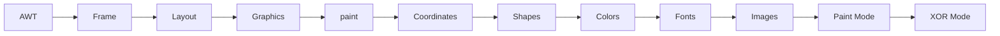

> **Remember:** The Graphics object acts as the drawing toolbox, `paint(Graphics g)` is used for displaying graphics, Java coordinates begin at the **top-left corner**, and the Graphics class provides methods for drawing shapes, text, images, colors, and fonts.

---