# 📘 **PROGRAM LECTURE ON APPLET — JAVA PRACTICAL NOTES**

> **Source:** `ProgramLectureOnApplet(1).docx`  
> **Pages:** 7  
> The content below preserves the source material while formatting it into an exam-ready Markdown structure with **definition blocks, tables, code blocks, Mermaid diagrams, visual flows, outputs, and revision sections**. :contentReference[oaicite:0]{index=0}

---

# 🟢 **1. Basic Applet Program**

The document begins with a simple Java Applet program that displays **"Hello Applet"**.

## 💻 **Program**

```java
import java.applet.*;
import java.awt.*;

/*
<applet code="FirstApplet.class"
 width="400"
 height="300">
</applet>
*/

public class FirstApplet extends Applet
{
    public void paint(Graphics g)
    {
        g.drawString("Hello Applet",100,100);
    }
}
```

---

## ⚙️ **Compile**

```bash
javac FirstApplet.java
```

## ▶️ **Run**

```bash
appletviewer FirstApplet.java
```

> **Important:** AppletViewer reads the commented `<applet>` tag and displays the applet window. :contentReference[oaicite:1]{index=1}

### 🔄 **Execution Flow**

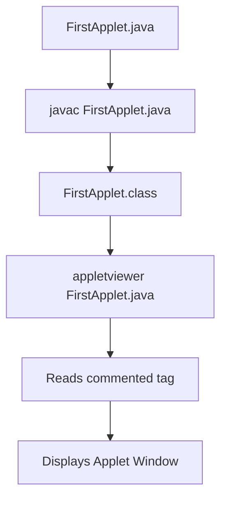

---

# 🏷️ **2. What is PARAM Tag?**

> **Definition:**  
> The `<param>` tag is used to **pass values to an applet**. :contentReference[oaicite:2]{index=2}

---

## 🧾 **Syntax**

```html
<applet code="MyApplet.class" width="400" height="300">
    <param name="msg" value="Welcome SY BCA Students">
</applet>
```

### 🧩 **PARAM Structure**

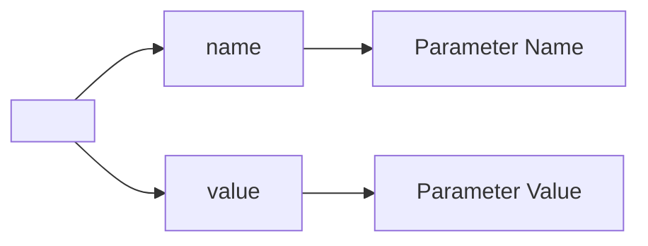

| **Attribute** | **Purpose** |
|---|---|
| `name` | Specifies the parameter name |
| `value` | Specifies the value passed to the applet |

---

# 💻 **3. Reading PARAM Inside Java**

The applet reads the value using `getParameter()`.

```java
String str = getParameter("msg");
```

> **Important:** The applet reads the value using `getParameter()`. :contentReference[oaicite:3]{index=3}

### 🔄 **PARAM Working**

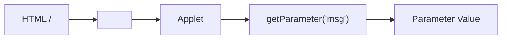

---

# 🟢 **4. Program 1 — Display Message Using PARAM Tag**

## 💻 **Program**

```java
import java.applet.*;
import java.awt.*;

/*
<applet code="ParamDemo.class" width="400" height="300">
    <param name="msg" value="Welcome to Applet Programming">
</applet>
*/

public class ParamDemo extends Applet
{
    String message;

    public void init()
    {
        message = getParameter("msg");
    }

    public void paint(Graphics g)
    {
        g.drawString(message,50,100);
    }
}
```

---

## 🔄 **Working**

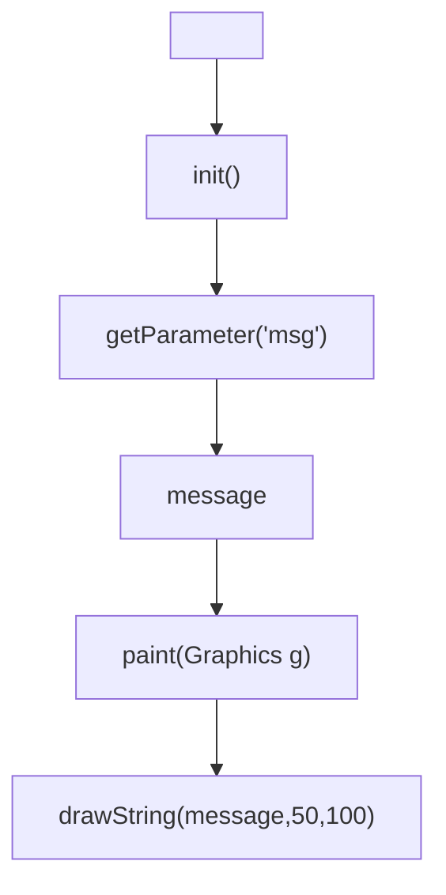

---

## 🖥️ **Output**

```text
Welcome to Applet Programming
```

:contentReference[oaicite:4]{index=4}

---

# 🎨 **5. Program 2 — Change Background Color Using PARAM**

## 💻 **Program**

```java
import java.applet.*;
import java.awt.*;

/*
<applet code="ColorApplet.class" width="400" height="300">
    <param name="bgcolor" value="yellow">
</applet>
*/

public class ColorApplet extends Applet
{
    String color;

    public void init()
    {
        color = getParameter("bgcolor");

        if(color.equals("yellow"))
            setBackground(Color.YELLOW);
    }

    public void paint(Graphics g)
    {
        g.drawString("Background Color Changed",50,100);
    }
}
```

---

## 🔄 **Working**

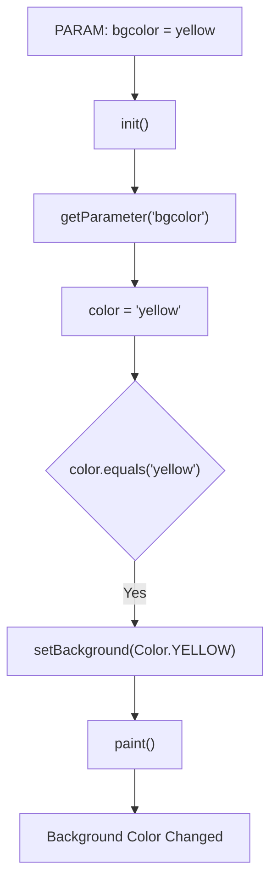

---

## 🧠 **Concept Learned**

* `getParameter()`
* `init()`
* `setBackground()`

:contentReference[oaicite:5]{index=5}

---

# 👨‍🎓 **6. Program 3 — Display Student Information**

## 💻 **Program**

```java
import java.applet.*;
import java.awt.*;

/*
<applet code="StudentApplet.class" width="400" height="300">
    <param name="name" value="Rahul">
    <param name="course" value="SY BCA">
</applet>
*/

public class StudentApplet extends Applet
{
    String name,course;

    public void init()
    {
        name=getParameter("name");
        course=getParameter("course");
    }

    public void paint(Graphics g)
    {
        g.drawString("Name : "+name,50,100);
        g.drawString("Course : "+course,50,130);
    }
}
```

---

## 🔄 **Working**

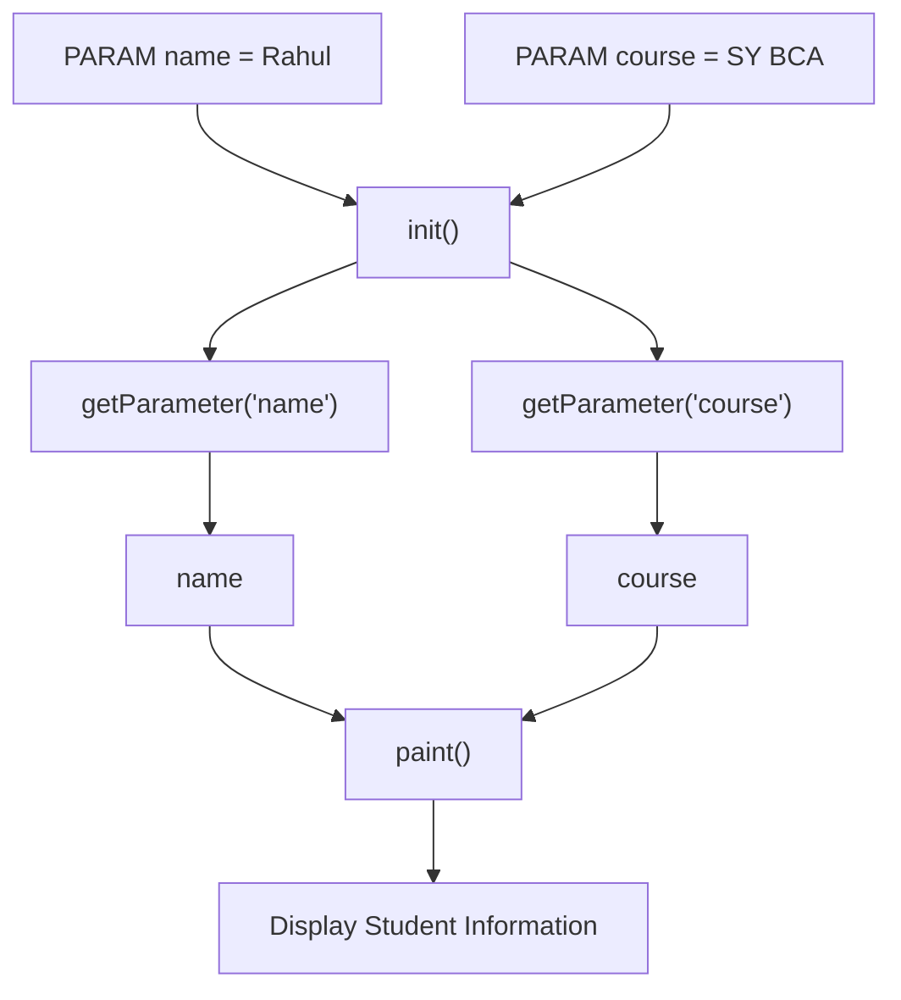

---

## 🖥️ **Output Structure**

```text
Name : Rahul
Course : SY BCA
```

:contentReference[oaicite:6]{index=6}

---

# ➕ **7. Program 4 — Addition of Two Numbers Using PARAM**

## 💻 **Program**

```java
import java.applet.*;
import java.awt.*;

/*
<applet code="AdditionApplet.class" width="400" height="300">
    <param name="num1" value="10">
    <param name="num2" value="20">
</applet>
*/

public class AdditionApplet extends Applet
{
    int a,b,sum;

    public void init()
    {
        a=Integer.parseInt(getParameter("num1"));
        b=Integer.parseInt(getParameter("num2"));
        sum=a+b;
    }

    public void paint(Graphics g)
    {
        g.drawString("Sum = "+sum,100,100);
    }
}
```

---

# 🔢 **8. New Concept — `Integer.parseInt()`**

> **Definition:**  
> `Integer.parseInt()` converts **String to integer**.

### 🔄 **Conversion Flow**

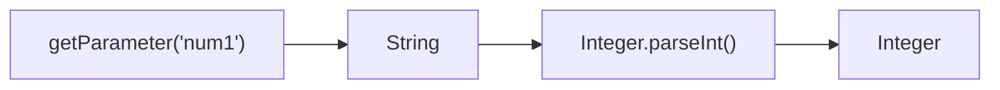

### **Example**

```java
getParameter("num1")
```

returns:

```text
"10"
```

Then:

```java
Integer.parseInt("10")
```

returns:

```text
10
```

:contentReference[oaicite:7]{index=7}

---

# 📐 **9. Program 5 — Draw Rectangle with PARAM Values**

## 💻 **Program**

```java
import java.applet.*;
import java.awt.*;

/*
<applet code="RectangleParam.class" width="500" height="400">
    <param name="width" value="200">
    <param name="height" value="100">
</applet>
*/

public class RectangleParam extends Applet
{
    int w,h;

    public void init()
    {
        w=Integer.parseInt(getParameter("width"));
        h=Integer.parseInt(getParameter("height"));
    }

    public void paint(Graphics g)
    {
        g.drawRect(50,50,w,h);
    }
}
```

---

## 🔄 **Working**

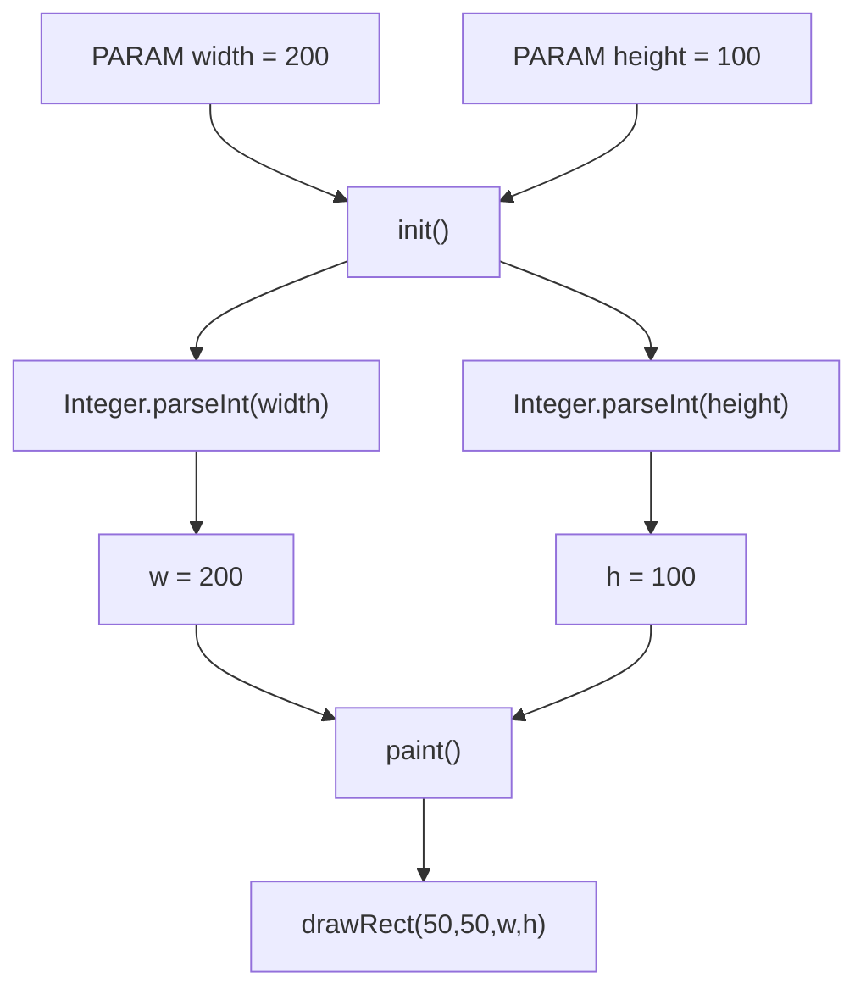

### 📐 **Conceptual Shape**

```text
        width = 200
   <──────────────────>

   ┌──────────────────────┐
   │                      │
   │                      │
   │                      │  height = 100
   │                      │
   └──────────────────────┘
```

:contentReference[oaicite:8]{index=8}

---

# 🎉 **10. Program 6 — Digital Greeting Card**

## 💻 **Program**

```java
import java.applet.*;
import java.awt.*;

/*
<applet code="GreetingApplet.class" width="500" height="300">
    <param name="wish" value="Happy Independence Day">
</applet>
*/

public class GreetingApplet extends Applet
{
    String msg;

    public void init()
    {
        msg=getParameter("wish");
    }

    public void paint(Graphics g)
    {
        g.setFont(new Font("Arial",Font.BOLD,24));
        g.drawString(msg,50,150);
    }
}
```

---

## 🖥️ **Conceptual Output**

```text
┌─────────────────────────────────────────────────┐
│                                                 │
│                                                 │
│     Happy Independence Day                      │
│                                                 │
│                                                 │
└─────────────────────────────────────────────────┘
```

### 🔄 **Working**

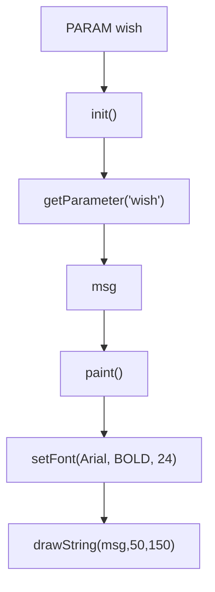

:contentReference[oaicite:9]{index=9}

---

# 🇮🇳 **11. Program 7 — National Flag (Applet)**

## 💻 **Program**

```java
import java.applet.*;
import java.awt.*;

/*
<applet code="FlagApplet.class" width="500" height="400">
</applet>
*/

public class FlagApplet extends Applet
{
    public void paint(Graphics g)
    {
        g.setColor(Color.ORANGE);
        g.fillRect(100,50,250,50);

        g.setColor(Color.WHITE);
        g.fillRect(100,100,250,50);

        g.setColor(Color.GREEN);
        g.fillRect(100,150,250,50);

        g.setColor(Color.BLUE);
        g.drawOval(210,105,30,30);

        g.setColor(Color.BLACK);
        g.drawLine(100,50,100,300);
    }
}
```

---

## 🖼️ **Conceptual Diagram**

```text
                    🇮🇳 FLAG

          ┌─────────────────────────┐
          │        ORANGE           │
          ├─────────────────────────┤
          │         WHITE           │
          │           ⭕             │
          ├─────────────────────────┤
          │         GREEN           │
          └─────────────────────────┘
                    │
                    │
                    │
                    │
                    │
```

### 🔄 **Drawing Sequence**

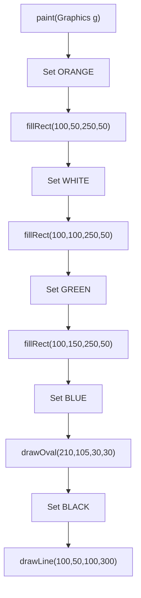

:contentReference[oaicite:10]{index=10}

---

# 🔄 **12. Program 8 — Applet Life Cycle Demonstration**

## 💻 **Program**

```java
import java.applet.*;
import java.awt.*;

/*
<applet code="LifeCycleDemo.class" width="500" height="300">
</applet>
*/

public class LifeCycleDemo extends Applet
{
    String msg="";

    public void init()
    {
        msg+="Init Called ";
    }

    public void start()
    {
        msg+="Start Called ";
    }

    public void stop()
    {
        msg+="Stop Called ";
    }

    public void destroy()
    {
        msg+="Destroy Called ";
    }

    public void paint(Graphics g)
    {
        g.drawString(msg,20,100);
    }
}
```

---

## 🧬 **Life Cycle Flow**

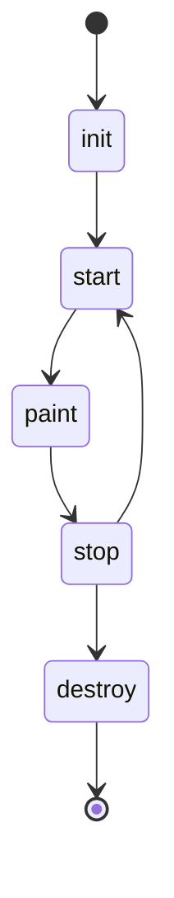

### **Methods Used**

| **Method** | **Message Added** |
|---|---|
| `init()` | `Init Called` |
| `start()` | `Start Called` |
| `stop()` | `Stop Called` |
| `destroy()` | `Destroy Called` |
| `paint()` | Displays the accumulated message |

:contentReference[oaicite:11]{index=11}

---

# 📚 **13. Best Practical Sequence for SY BCA**

The document organizes the practicals into three levels:

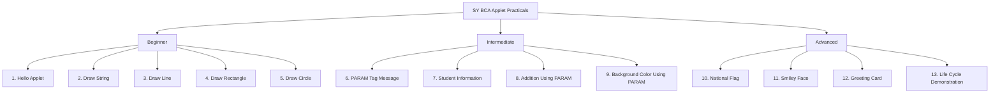

---

# 🟢 **Beginner**

1. **Hello Applet**
2. **Draw String**
3. **Draw Line**
4. **Draw Rectangle**
5. **Draw Circle**

---

# 🟡 **Intermediate**

6. **PARAM Tag Message**
7. **Student Information**
8. **Addition Using PARAM**
9. **Background Color Using PARAM**

---

# 🔴 **Advanced**

10. **National Flag**
11. **Smiley Face**
12. **Greeting Card**
13. **Life Cycle Demonstration**

:contentReference[oaicite:12]{index=12}

---

# 🎤 **14. Most Important Viva Questions on PARAM Tag**

---

## ❓ **Q1. What is PARAM Tag?**

> **Answer:**  
> Used to pass values from **HTML/Applet tag to an applet**.

---

## ❓ **Q2. Which method reads PARAM values?**

> **Answer:**

```java
getParameter()
```

---

## ❓ **Q3. What is the return type of `getParameter()`?**

> **Answer:**

```text
String
```

---

## ❓ **Q4. Where are PARAM values generally read?**

> **Answer:**

```java
init()
```

---

## ❓ **Q5. Can multiple PARAM tags be used?**

> **Answer:**  
> **Yes.**

### **Example**

```html
<param name="n1" value="10">
<param name="n2" value="20">
```

:contentReference[oaicite:13]{index=13}

---

# 🧠 **15. PARAM Tag — Complete Revision**

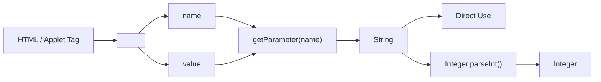

---

# 🔢 **16. PARAM + Type Conversion**

```text
<param name="num1" value="10">
                 │
                 ▼
       getParameter("num1")
                 │
                 ▼
             "10"
          String value
                 │
                 ▼
       Integer.parseInt()
                 │
                 ▼
               10
            Integer
```

### **Java**

```java
int a =
    Integer.parseInt(
        getParameter("num1")
    );
```

---

# 🎨 **17. PARAM + Graphics**

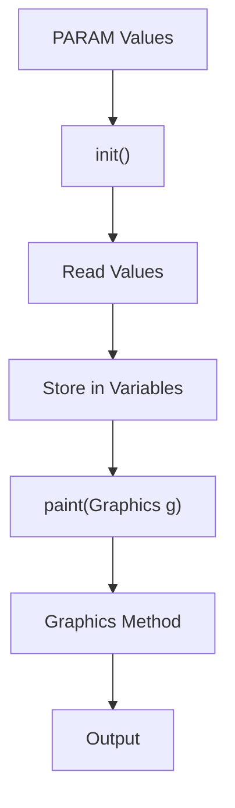

### **Examples**

```text
PARAM width + height
        ↓
drawRect()
```

```text
PARAM wish
        ↓
drawString()
```

```text
PARAM bgcolor
        ↓
setBackground()
```

---

# 🔄 **18. Applet Life Cycle — Revision**

```text
           APPLET
              │
              ▼
           init()
              │
              ▼
           start()
              │
              ▼
           paint()
              │
              ▼
            stop()
              │
              ▼
          destroy()
```

### **Life Cycle Methods**

| **Method** | **Role in This Document** |
|---|---|
| `init()` | Reads parameters / initializes values |
| `start()` | Starts the applet |
| `paint()` | Displays output / graphics |
| `stop()` | Stops the applet |
| `destroy()` | Destroys the applet |

---

# 🖌️ **19. Graphics Concepts Covered**

The practical programs demonstrate the following Graphics concepts:

| **Graphics Concept** | **Used In** |
|---|---|
| `drawString()` | Hello Applet, PARAM Message, Student Information, Greeting Card |
| `drawRect()` | Rectangle with PARAM Values |
| `fillRect()` | National Flag |
| `drawOval()` | National Flag |
| `drawLine()` | National Flag |
| `setColor()` | Background / National Flag |
| `setFont()` | Digital Greeting Card |

---

# 📊 **20. Programs Covered in the Document**

| **No.** | **Program** | **Main Concept** |
|---:|---|---|
| **1** | Display Message Using PARAM Tag | `getParameter()` |
| **2** | Change Background Color Using PARAM | `setBackground()` |
| **3** | Display Student Information | Multiple PARAM values |
| **4** | Addition of Two Numbers Using PARAM | `Integer.parseInt()` |
| **5** | Draw Rectangle with PARAM Values | PARAM + Graphics |
| **6** | Digital Greeting Card | PARAM + Font |
| **7** | National Flag | Graphics + Colors + Shapes |
| **8** | Applet Life Cycle Demonstration | Applet lifecycle |

---

# 🧩 **21. Core Concepts Covered**

The document provides hands-on coverage of:

* **Applet Structure**
* **Applet Life Cycle**
* **Graphics Class**
* **PARAM Tag**
* **Fonts**
* **Colors**
* **Drawing Shapes**
* **Type Conversion**
* **Basic GUI Concepts**

These together cover almost all Applet-related practicals typically expected in a **SY BCA Advanced Java syllabus**. :contentReference[oaicite:14]{index=14}

---

# 🗺️ **22. COMPLETE DOCUMENT CONCEPT MAP**

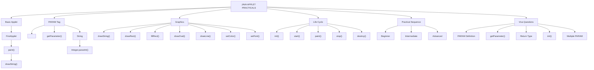

---

# 🧠 **23. LAST-MINUTE EXAM REVISION**

> ### **PARAM Tag**
>
> Used to **pass values to an applet**.

```html
<param name="msg"
       value="Welcome to Applet Programming">
```

---

> ### **Read PARAM**
>
> Use `getParameter()`.

```java
String str =
    getParameter("msg");
```

---

> ### **Convert String to Integer**
>
> Use `Integer.parseInt()`.

```java
int a =
    Integer.parseInt(
        getParameter("num1")
    );
```

---

> ### **Applet Life Cycle**

```text
init()
  ↓
start()
  ↓
paint()
  ↓
stop()
  ↓
destroy()
```

---

> ### **Important Graphics Methods**

```text
drawString()
drawRect()
fillRect()
drawOval()
drawLine()
setColor()
setFont()
```

---

# 🎯 **24. ONE-PAGE PRACTICAL MEMORY MAP**

```text
                         JAVA APPLET
                              │
             ┌────────────────┼────────────────┐
             │                │                │
          PARAM            GRAPHICS        LIFE CYCLE
             │                │                │
        <param>          drawString()        init()
             │            drawRect()            ↓
     getParameter()       fillRect()         start()
             │            drawOval()            ↓
          String          drawLine()          paint()
             │            setColor()            ↓
    Integer.parseInt()    setFont()           stop()
             │                                  ↓
         Integer                            destroy()
```

---

# 🏆 **25. FINAL EXAM RECALL TABLE**

| **Question** | **Answer** |
|---|---|
| What is PARAM Tag? | Used to pass values to an applet |
| Which method reads PARAM values? | `getParameter()` |
| Return type of `getParameter()`? | `String` |
| Where are PARAM values generally read? | `init()` |
| Can multiple PARAM tags be used? | Yes |
| Convert String to integer | `Integer.parseInt()` |
| Display text | `drawString()` |
| Draw rectangle | `drawRect()` |
| Fill rectangle | `fillRect()` |
| Draw oval | `drawOval()` |
| Draw line | `drawLine()` |
| Change color | `setColor()` |
| Change font | `setFont()` |
| Initialize Applet | `init()` |
| Start Applet | `start()` |
| Display / Draw | `paint()` |
| Stop Applet | `stop()` |
| Destroy Applet | `destroy()` |

---

# ⭐ **26. FINAL EXAM FORMULA**

```text
PARAM
  │
  ▼
<param name="..." value="...">
  │
  ▼
getParameter()
  │
  ▼
String
  │
  ├──────────────► Directly Display
  │
  └──────────────► Integer.parseInt()
                         │
                         ▼
                      Integer
```

```text
APPLET LIFE CYCLE

init()
  ↓
start()
  ↓
paint()
  ↓
stop()
  ↓
destroy()
```

```text
GRAPHICS

Graphics
   │
   ├── drawString()
   ├── drawRect()
   ├── fillRect()
   ├── drawOval()
   ├── drawLine()
   ├── setColor()
   └── setFont()
```

> ## 🏁 **FINAL RECALL**
>
> **The document focuses on practical Java Applet programming, especially the `<param>` tag, `getParameter()`, type conversion using `Integer.parseInt()`, Graphics methods, colors, fonts, shapes, and the Applet life cycle.**