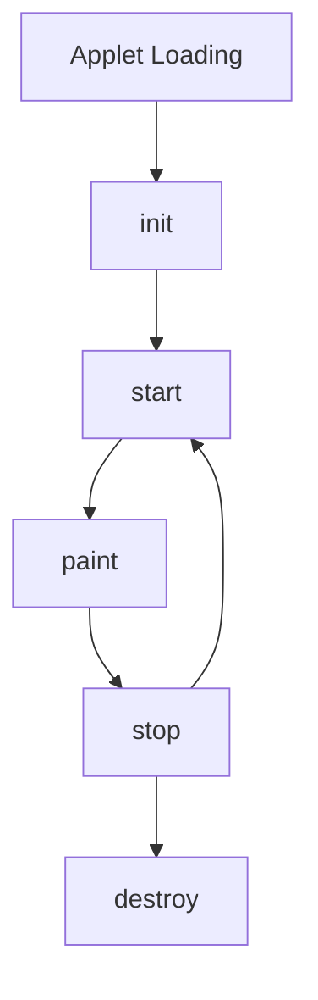
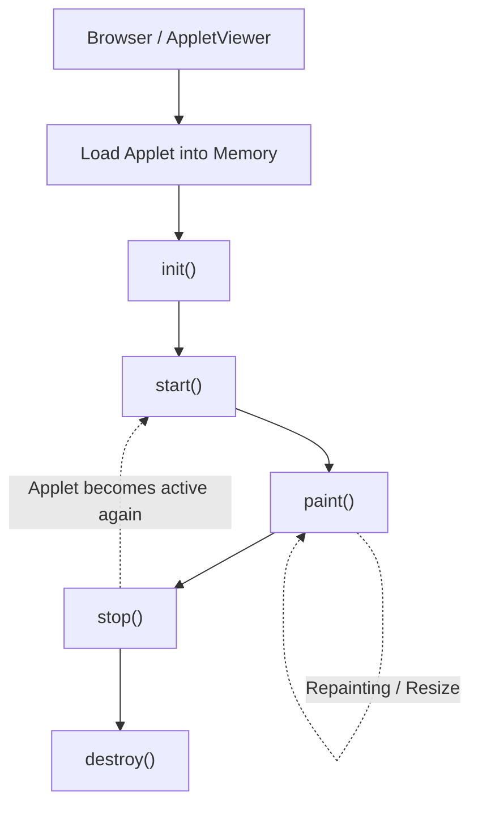
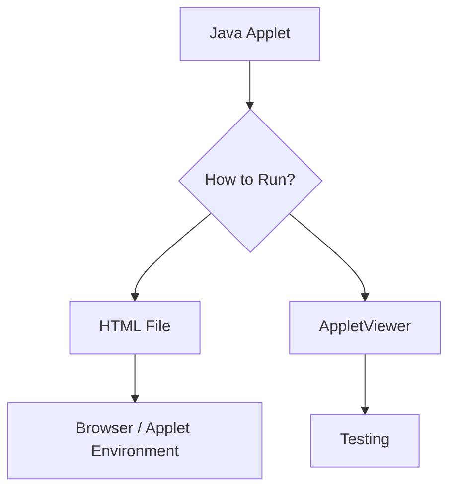
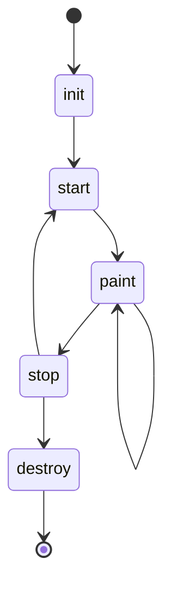
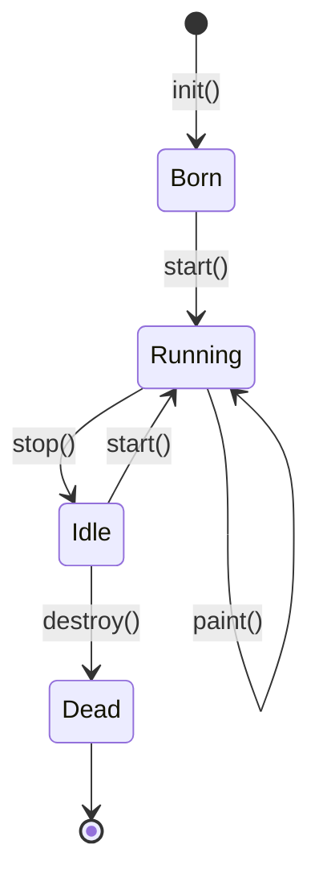
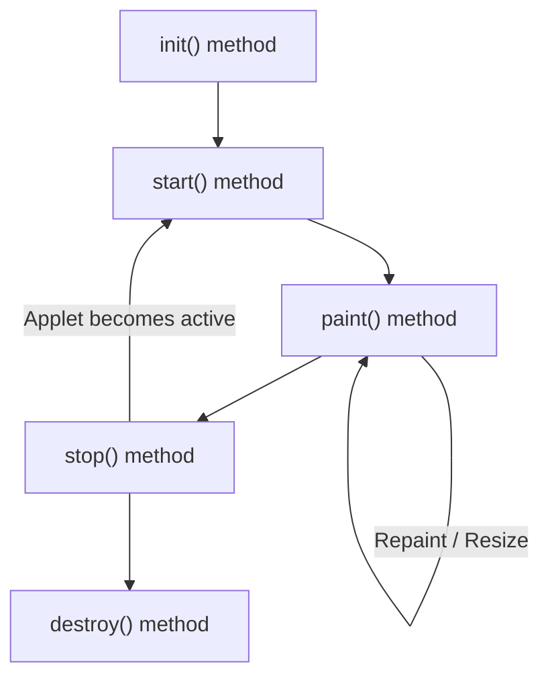
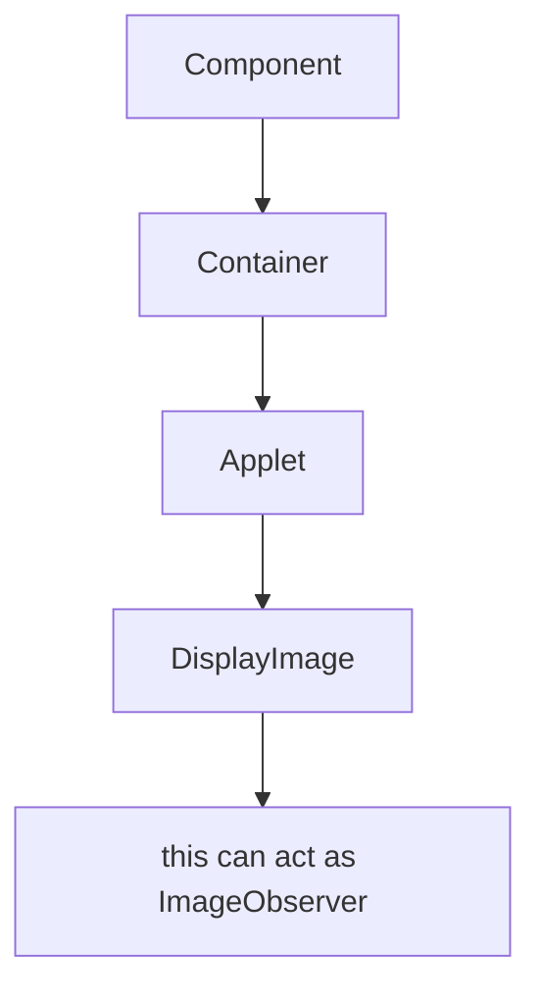
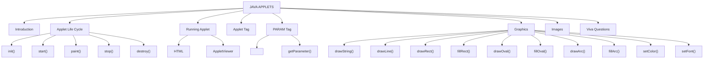
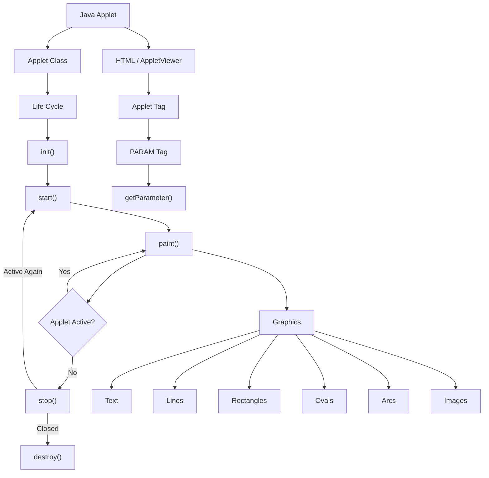

# 📘 **JAVA APPLETS — COMPLETE EXAM & PRACTICAL NOTES**

> **Source:** AllAboutApplets(1).docx — 14 pages.  
> The following notes preserve the **original content, terminology, examples, programs, lifecycle, PARAM concepts, graphics methods, and viva questions** from the document, while improving the formatting, readability, diagrams, and exam presentation. :contentReference[oaicite:0]{index=0}

---

# 📑 **SYLLABUS**

> **Applets:** Introduction to applet, Converting application to applet, Life cycle of applet, Applet tag, Param tag.

---

# 🟢 **1. Java Applet Basics**

> **Definition:**  
> **Java Applets are small Java programs that run inside a web browser or an applet viewer.**

Java Applets were widely used to create interactive and graphical web applications before modern web technologies became popular.

Although applets are deprecated in **Java 9 and later**, they remain important for understanding Java GUI programming and application life cycles. :contentReference[oaicite:1]{index=1}

### ⭐ **Important Points**

* Applets are Java programs that run inside a **browser or applet viewer**.
* They **do not contain a `main()` method** like regular Java applications.
* Applets use **AWT graphics methods** to display output and create graphical interfaces.

---

# 🔄 **2. Java Applet Life Cycle**

The life cycle of an applet represents the sequence of stages through which an applet passes during its execution.



The lifecycle diagram in the source document shows the sequence:

```text
init()
   ↓
start()
   ↓
paint()
   ↓
stop()
   ↓
destroy()
```

When the applet becomes active again:

```text
stop()
   ↓
start()
   ↓
paint()
```

---

# 🧩 **3. Java Applet Workflow**

## **Applet Loading**

> The browser or applet viewer loads the applet class into memory.

## **`init()`**

> Initializes variables, components, and resources required by the applet.

## **`start()`**

> Starts or resumes the applet's execution when it becomes active.

## **`paint()`**

> Draws and displays the applet's output on the screen.

## **`stop()`**

> Pauses the applet when the user leaves the web page.

## **`destroy()`**

> Releases resources and removes the applet from memory before termination.

:contentReference[oaicite:2]{index=2}

### 🔁 **Complete Workflow**



---

# 🏗️ **4. Applet Classes and Life Cycle Methods**

The document states that:

* The `java.applet.Applet` class provides **4 life cycle methods**.
* The `java.awt.Component` class provides **1 life cycle method** for an applet. :contentReference[oaicite:3]{index=3}

---

# 🟦 **`java.applet.Applet` Class**

> **Definition:**  
> For creating any applet, the `java.applet.Applet` class must be inherited. It provides **four life cycle methods** of an applet.

### **Methods**

| **Method** | **Purpose** |
|---|---|
| `init()` | Initializes the applet |
| `start()` | Starts the applet |
| `stop()` | Stops the applet |
| `destroy()` | Destroys the applet |

---

## 🔹 **`public void init()`**

> Used to initialize the Applet. It is invoked **only once**.

```java
public void init() {
    // Initialization code
}
```

---

## 🔹 **`public void start()`**

> Invoked after the `init()` method or when the browser is maximized. It is used to start the Applet.

```java
public void start() {
    // Start the applet
}
```

---

## 🔹 **`public void stop()`**

> Used to stop the Applet. It is invoked when the Applet is stopped or the browser is minimized.

```java
public void stop() {
    // Stop the applet
}
```

---

## 🔹 **`public void destroy()`**

> Used to destroy the Applet. It is invoked **only once**.

```java
public void destroy() {
    // Cleanup code
}
```

---

# 🟨 **`java.awt.Component` Class**

The `Component` class provides one life cycle method of an applet.

## **`public void paint(Graphics g)`**

> Used to paint the Applet. It provides a `Graphics` class object that can be used for drawing **ovals, rectangles, arcs**, etc.

```java
public void paint(Graphics g) {
    // Drawing code
}
```

---

# 👨‍💻 **Who Manages the Life Cycle of an Applet?**

> **Answer:** **Java Plug-in software** is responsible for managing the life cycle of an applet. :contentReference[oaicite:4]{index=4}

---

# ▶️ **5. How to Run an Applet?**

There are **two ways** to run an applet:

1. **By HTML file**
2. **By `appletViewer` tool** — for testing purposes.

:contentReference[oaicite:5]{index=5}



---

# 🌐 **6. Running an Applet Using HTML File**

To execute an applet by HTML file:

1. Create an applet.
2. Compile the applet.
3. Create an HTML file.
4. Place the applet code in the HTML file.
5. Run/open the HTML file.

---

## 💻 **Java Program — `First.java`**

```java
import java.applet.Applet;
import java.awt.Graphics;

public class First extends Applet {

    public void paint(Graphics g) {
        g.drawString("welcome", 150, 150);
    }

}
```

---

## 🌐 **HTML File — `myapplet.html`**

```html
<html>
<body>

<applet code="First.class" width="300" height="300">
</applet>

</body>
</html>
```

---

## ⚙️ **Compilation and Execution**

```bash
javac First.java
appletviewer myapplet.html
```

:contentReference[oaicite:6]{index=6}

### 🖥️ **Expected Output**

```text
┌─────────────────────────────────┐
│                                 │
│                                 │
│              welcome            │
│                                 │
│                                 │
└─────────────────────────────────┘
```

---

# 🏷️ **7. HTML Tags Used**

## **Basic Syntax**

```html
<applet code="First.class"
        width="300"
        height="200">
</applet>
```

---

# 🔢 **8. Using Parameters**

HTML:

```html
<applet code="Demo.class"
        width="300"
        height="200">

    <param name="msg" value="Welcome Students">

</applet>
```

Applet:

```java
public void paint(Graphics g) {

    String s = getParameter("msg");

    g.drawString(s, 50, 50);
}
```

:contentReference[oaicite:7]{index=7}

---

# ▶️ **9. Running an Applet Using AppletViewer**

To execute the applet using the `appletviewer` tool:

1. Create an applet.
2. Put the `<applet>` tag inside a comment in the Java file.
3. Compile the Java file.
4. Run it using `appletviewer`.

> **Important:** In this method, a separate HTML file is **not required**. It is mainly used for testing purposes.

---

## 💻 **`First.java`**

```java
import java.applet.Applet;
import java.awt.Graphics;

public class First extends Applet {

    public void paint(Graphics g) {
        g.drawString("welcome to applet", 150, 150);
    }

}

/*
<applet code="First.class" width="300" height="300">
</applet>
*/
```

---

## ⚙️ **Commands**

```bash
javac First.java
appletviewer First.java
```

:contentReference[oaicite:8]{index=8}

---

# 🔄 **10. Applet Life Cycle in Java**

> **Definition:**  
> The applet life cycle is the process of how an applet object is **created, started, stopped, and destroyed** during the entire execution of the application.

An applet is a special type of Java program embedded in a web page to generate dynamic content.

It basically has **five core methods**:

```text
init()
start()
paint()
stop()
destroy()
```

These methods are invoked by the browser to execute the applet.

:contentReference[oaicite:9]{index=9}

---

# 🧬 **11. Methods of Applet Life Cycle**

There are **five methods** of an applet life cycle.



---

# 🟢 **1. `init()`**

> The `init()` method is the **first method to run** and initializes the applet.

### **Important Points**

* It is invoked only once.
* It is used during initialization.
* The web browser creates the initialized objects after checking the security settings.
* The browser then runs the `init()` method inside the applet.

```java
public void init() {
    // Initialization
}
```

---

# 🔵 **2. `start()`**

> The `start()` method contains the actual code of the applet and starts the applet.

### **Important Points**

* It is invoked immediately after `init()`.
* It is invoked every time the browser is loaded or refreshed.
* It is also invoked when the applet is:
  * Maximized
  * Restored
  * Activated again
  * Moved from one tab to another

The applet remains inactive until `init()` is invoked.

---

# 🟡 **3. `stop()`**

> The `stop()` method stops the execution of the applet.

It is invoked whenever the applet is:

* Stopped
* Minimized
* Moved away from the active browser tab

When the user returns to the page:

```text
stop()
   ↓
start()
```

The `start()` method is invoked again.

---

# 🔴 **4. `destroy()`**

> The `destroy()` method destroys the applet after its work is done.

It is invoked when:

* The applet window is closed.
* The tab containing the webpage is closed.

### **Important Points**

* Removes the applet object from memory.
* Executed only once.
* The applet cannot be started again once destroyed.

---

# 🟣 **5. `paint()`**

> The `paint()` method belongs to the `Graphics` class in Java and is used to draw shapes such as circles, squares, trapeziums, etc., in the applet.

It is executed:

* After `start()`
* When the browser or applet window is resized.

:contentReference[oaicite:10]{index=10}

---

# 🔁 **12. Sequence of Method Execution**

## **Initial Execution**

```text
1. init()
      ↓
2. start()
      ↓
3. paint()
```

## **When Applet Becomes Inactive**

```text
1. stop()
      ↓
2. destroy()
```

:contentReference[oaicite:11]{index=11}

---

# 🧠 **13. Applet Life Cycle — Easy Visualization**



### **Simple Memory Trick**

> **I Start Painting, Stop, Destroy**

```text
I → init()
S → start()
P → paint()
S → stop()
D → destroy()
```

---

# ⚙️ **14. Applet Life Cycle Working**

### **Important Points**

* Java Plug-in software is responsible for managing the applet life cycle.
* An applet is a Java application executed in a web browser and works on the client side.
* It does not have the `main()` method because it runs inside the browser.
* It is created to be placed on an HTML page.
* `init()`, `start()`, `stop()` and `destroy()` belong to the `Applet` class.
* `paint()` belongs to the `awt.Component` class.
* To make a class an Applet class, we need to extend the `Applet` class.
* When we create an applet, we create an instance of the existing `Applet` class and can therefore use its methods.
* These methods are invoked automatically by the browser.
* There is no need to call them explicitly.

:contentReference[oaicite:12]{index=12}

---

# 🔄 **Flow of Applet Life Cycle**



---

# 🧱 **15. Syntax of Entire Applet Life Cycle**

```java
class TestAppletLifeCycle extends Applet {

    public void init() {
        // initialized objects
    }

    public void start() {
        // code to start the applet
    }

    public void paint(Graphics graphics) {
        // draw the shapes
    }

    public void stop() {
        // code to stop the applet
    }

    public void destroy() {
        // code to destroy the applet
    }
}
```

:contentReference[oaicite:13]{index=13}

---

# 🎨 **16. Displaying Graphics in Applet**

The `java.awt.Graphics` class provides many methods for graphics programming.

## **Commonly Used Methods**

| **Method** | **Purpose** |
|---|---|
| `drawString()` | Draws a specified string |
| `drawRect()` | Draws a rectangle |
| `fillRect()` | Fills a rectangle |
| `drawOval()` | Draws an oval |
| `fillOval()` | Fills an oval |
| `drawLine()` | Draws a line |
| `drawImage()` | Draws an image |
| `drawArc()` | Draws a circular or elliptical arc |
| `fillArc()` | Fills a circular or elliptical arc |
| `setColor()` | Sets the graphics color |
| `setFont()` | Sets the graphics font |

:contentReference[oaicite:14]{index=14}

---

# 🖌️ **17. Graphics Methods — Syntax**

## **`drawString()`**

```java
public abstract void drawString(String str, int x, int y)
```

> Used to draw the specified string.

---

## **`drawRect()`**

```java
public void drawRect(int x, int y, int width, int height)
```

> Draws a rectangle with the specified width and height.

---

## **`fillRect()`**

```java
public abstract void fillRect(
    int x,
    int y,
    int width,
    int height
)
```

> Fills a rectangle with the default color and specified width and height.

---

## **`drawOval()`**

```java
public abstract void drawOval(
    int x,
    int y,
    int width,
    int height
)
```

> Draws an oval with the specified width and height.

---

## **`fillOval()`**

```java
public abstract void fillOval(
    int x,
    int y,
    int width,
    int height
)
```

> Fills an oval with the default color and specified width and height.

---

## **`drawLine()`**

```java
public abstract void drawLine(
    int x1,
    int y1,
    int x2,
    int y2
)
```

> Draws a line between the points `(x1, y1)` and `(x2, y2)`.

---

## **`drawImage()`**

```java
public abstract boolean drawImage(
    Image img,
    int x,
    int y,
    ImageObserver observer
)
```

> Used to draw the specified image.

---

## **`drawArc()`**

```java
public abstract void drawArc(
    int x,
    int y,
    int width,
    int height,
    int startAngle,
    int arcAngle
)
```

> Used to draw a circular or elliptical arc.

---

## **`fillArc()`**

```java
public abstract void fillArc(
    int x,
    int y,
    int width,
    int height,
    int startAngle,
    int arcAngle
)
```

> Used to fill a circular or elliptical arc.

---

## **`setColor()`**

```java
public abstract void setColor(Color c)
```

> Sets the graphics current color to the specified color.

---

## **`setFont()`**

```java
public abstract void setFont(Font font)
```

> Sets the graphics current font.

---

# 💻 **18. Example of Graphics in Applet**

```java
import java.applet.Applet;
import java.awt.*;

public class GraphicsDemo extends Applet {

    public void paint(Graphics g) {

        g.setColor(Color.red);

        g.drawString("Welcome", 50, 50);

        g.drawLine(20, 30, 20, 300);

        g.drawRect(70, 100, 30, 30);

        g.fillRect(170, 100, 30, 30);

        g.drawOval(70, 200, 30, 30);

        g.setColor(Color.pink);

        g.fillOval(170, 200, 30, 30);

        g.drawArc(90, 150, 30, 30, 30, 270);

        g.fillArc(270, 150, 30, 30, 0, 180);
    }
}
```

---

# 🌐 **HTML File**

```html
<html>
<body>

<applet code="GraphicsDemo.class"
        width="300"
        height="300">
</applet>

</body>
</html>
```

:contentReference[oaicite:15]{index=15}

---

# 🖼️ **19. Displaying Image in Applet**

> **Definition:**  
> Applets were mostly used in games and animation. For this purpose, images are required to be displayed.

The `java.awt.Graphics` class provides the `drawImage()` method to display an image.

---

# 🧾 **20. `drawImage()` Method**

### **Syntax**

```java
public abstract boolean drawImage(
    Image img,
    int x,
    int y,
    ImageObserver observer
)
```

> Used to draw the specified image.

---

# 🖼️ **21. Getting the Image Object**

The `java.applet.Applet` class provides the `getImage()` method, which returns an object of `Image`.

### **Syntax**

```java
public Image getImage(URL u, String image)
```

---

# 🌐 **22. Other Required Applet Methods**

## **`getDocumentBase()`**

> Returns the URL of the document in which the applet is embedded.

```java
public URL getDocumentBase()
```

---

## **`getCodeBase()`**

> Returns the base URL.

```java
public URL getCodeBase()
```

---

# 💻 **23. Display Image Program**

```java
import java.awt.*;
import java.applet.*;

public class DisplayImage extends Applet {

    Image picture;

    public void init() {

        picture = getImage(
            getDocumentBase(),
            "sonoo.jpg"
        );
    }

    public void paint(Graphics g) {

        g.drawImage(
            picture,
            30,
            30,
            this
        );
    }
}
```

:contentReference[oaicite:16]{index=16}

---

# 🧠 **24. Understanding `ImageObserver`**

The `drawImage()` method uses four arguments:

```java
g.drawImage(
    picture,
    30,
    30,
    this
);
```

The **4th argument** is an `ImageObserver` object.

The `Component` class implements the `ImageObserver` interface.

Since the current class indirectly extends the `Component` class through the AWT hierarchy, the current class object can also be treated as an `ImageObserver`.



---

# 🌐 **25. HTML File for Displaying Image**

```html
<html>
<body>

<applet code="DisplayImage.class"
        width="300"
        height="300">
</applet>

</body>
</html>
```

:contentReference[oaicite:17]{index=17}

---

# 🎤 **26. Viva Questions and Answers on Applets**

---

## ❓ **Q1. What is an Applet?**

> **Answer:**  
> An Applet is a small Java program that runs inside a web browser or an Applet Viewer. It is used to create interactive and graphical applications on web pages.

---

## ❓ **Q2. Why doesn't an Applet contain `main()`?**

> **Answer:**  
> An Applet does not contain the `main()` method because its execution is controlled by the browser or Applet Viewer.

The browser automatically:

1. Creates the Applet object.
2. Calls `init()`.
3. Calls `start()`.
4. Calls `paint()`.

---

## ❓ **Q3. Which package contains Applet?**

> **Answer:**  
> The Applet class is available in the `java.applet` package.

```java
import java.applet.Applet;
```

---

## ❓ **Q4. Why does an Applet extend the Applet class?**

> **Answer:**  
> An Applet extends the `Applet` class to inherit all the features and methods required for Applet execution.

### **Inherited Methods**

```text
init()
start()
paint()
stop()
destroy()
```

Without extending the `Applet` class, a program cannot behave as an Applet.

---

# ⚖️ **27. Difference Between Application and Applet**

| **Java Application** | **Java Applet** |
|---|---|
| Standalone program | Runs inside browser/Applet Viewer |
| Contains `main()` method | Does not contain `main()` |
| Started by JVM | Started by browser |
| Can access local resources freely | Restricted access for security |
| Executed using `java` command | Executed using browser/Applet Viewer |

:contentReference[oaicite:18]{index=18}

---

# ❓ **Q6. Why are Applets Obsolete?**

> **Answer:**  
> Applets are obsolete because modern web browsers no longer support Java plugins.

They were replaced by technologies such as:

* HTML5
* CSS3
* JavaScript

Applets also had:

* Security issues
* Slower performance

---

# ❓ **Q7. Which Method Displays Output?**

> **Answer:**  
> The `paint(Graphics g)` method is used to display output in an Applet.

### **Example**

```java
public void paint(Graphics g) {

    g.drawString(
        "Welcome to Java Applet",
        100,
        100
    );
}
```

---

# ❓ **Q8. Which Class is Used for Drawing?**

> **Answer:**  
> The **Graphics class** is used for drawing text, lines, rectangles, circles, and other shapes in an Applet.

### **Example**

```java
Graphics g
```

### **Important Graphics Methods**

```text
drawString()
drawLine()
drawRect()
drawOval()
drawArc()
```

:contentReference[oaicite:19]{index=19}

---

# 🧠 **UNIT — QUICK REVISION MAP**



---

# 📌 **MOST IMPORTANT EXAM POINTS**

> ### ⭐ **Remember These**

* **Applet package:** `java.applet`
* **Graphics package:** `java.awt`
* **Applet does not contain:** `main()`
* **Initialization method:** `init()`
* **Start method:** `start()`
* **Drawing method:** `paint(Graphics g)`
* **Stop method:** `stop()`
* **Cleanup method:** `destroy()`
* **Drawing class:** `Graphics`
* **Parameter reading method:** `getParameter()`
* **Image loading method:** `getImage()`
* **Document URL:** `getDocumentBase()`
* **Applet location URL:** `getCodeBase()`
* **HTML execution:** Browser/Applet environment
* **Testing:** `appletviewer`

---

# 🔁 **ONE-LINE LIFE CYCLE REVISION**

```text
Browser/AppletViewer
        ↓
     init()
        ↓
     start()
        ↓
     paint()
        ↓
     stop()
        ↓
    destroy()
```

### 🧠 **Memory Trick**

> **I → S → P → S → D**

```text
I = init()
S = start()
P = paint()
S = stop()
D = destroy()
```

---

# 📝 **EXAM-READY DEFINITION**

> **Java Applet:**  
> A Java Applet is a small Java program designed to run inside a web browser or Applet Viewer. Unlike a normal Java application, it does not contain a `main()` method. Its execution is controlled by the browser or Applet Viewer through lifecycle methods such as `init()`, `start()`, `paint()`, `stop()`, and `destroy()`.

---

# 🎯 **FINAL EXAM DIAGRAM**



---

# 📚 **UNIT SUMMARY TABLE**

| **Topic** | **Key Point** |
|---|---|
| **Applet** | Small Java program executed by browser/Applet Viewer |
| **Package** | `java.applet` |
| **GUI/Graphics** | `java.awt` |
| **Main Method** | Not used |
| **Life Cycle** | `init() → start() → paint() → stop() → destroy()` |
| **Initialization** | `init()` |
| **Execution** | `start()` |
| **Output / Drawing** | `paint(Graphics g)` |
| **Pause** | `stop()` |
| **Cleanup** | `destroy()` |
| **Text Drawing** | `drawString()` |
| **Line Drawing** | `drawLine()` |
| **Rectangle** | `drawRect()` / `fillRect()` |
| **Oval** | `drawOval()` / `fillOval()` |
| **Arc** | `drawArc()` / `fillArc()` |
| **Color** | `setColor()` |
| **Font** | `setFont()` |
| **Image** | `drawImage()` |
| **Image Loading** | `getImage()` |
| **Document URL** | `getDocumentBase()` |
| **Code URL** | `getCodeBase()` |
| **HTML Parameter** | `<param>` |
| **Read Parameter** | `getParameter()` |
| **Run with HTML** | Browser/Applet environment |
| **Testing Tool** | `appletviewer` |

---

# 🏁 **FINAL OUTPUT / EXPECTED CONCEPT**

```text
                    JAVA APPLET
                         │
          ┌──────────────┴──────────────┐
          │                             │
      APPLET CLASS                 HTML / VIEWER
          │                             │
          │                        <applet>
          │                             │
          │                         <param>
          │                             │
          ▼                             ▼
     LIFE CYCLE                  getParameter()
          │
          ▼
       init()
          │
          ▼
       start()
          │
          ▼
       paint()
          │
          ├───────────────┐
          │               │
       Graphics        Image
          │               │
     ┌────┴────┐          │
     │    │    │          │
   Text Lines Shapes     Image
          │
          ▼
        stop()
          │
          ▼
       destroy()
```

> **⭐ Final Recall:**  
> **An Applet extends `Applet`, does not use `main()`, is controlled by the browser/AppletViewer, follows the lifecycle `init() → start() → paint() → stop() → destroy()`, uses `Graphics` for drawing, and can receive HTML values through the `<param>` tag using `getParameter()`.**