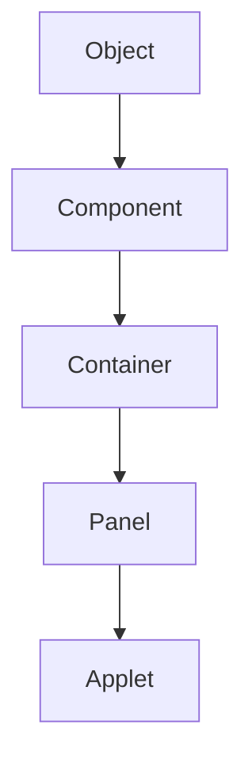
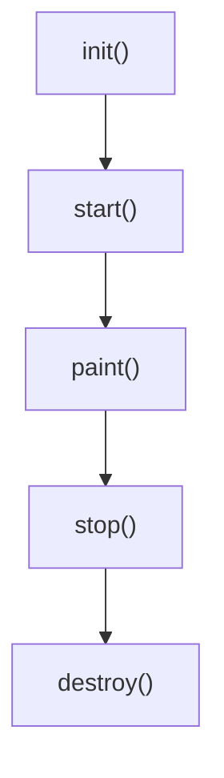
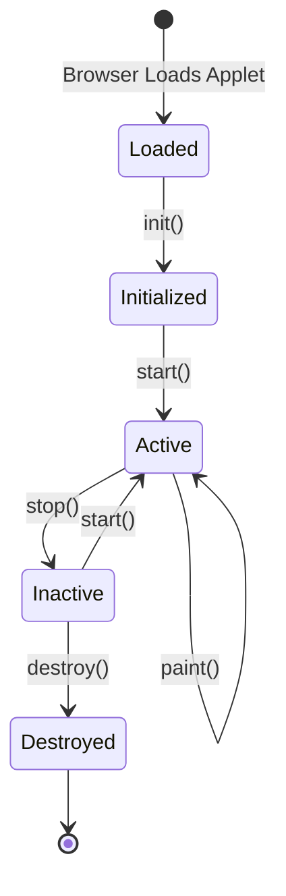
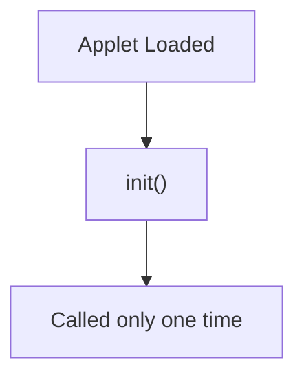
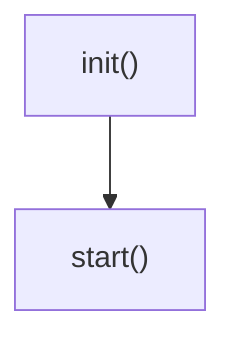
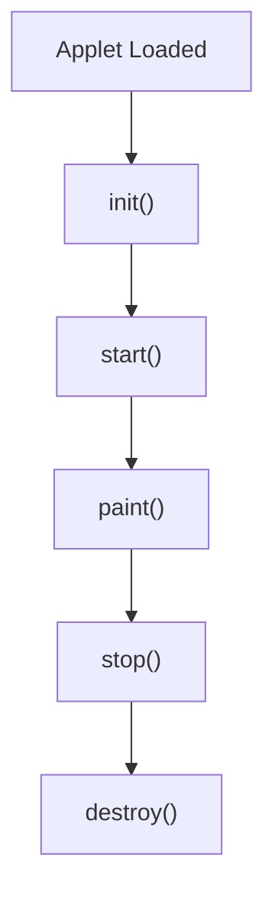
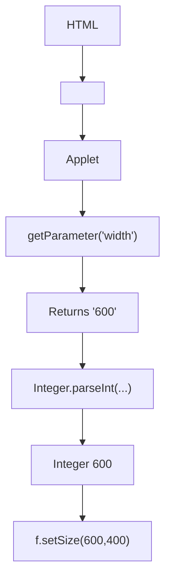
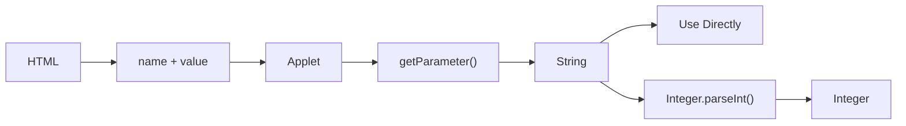
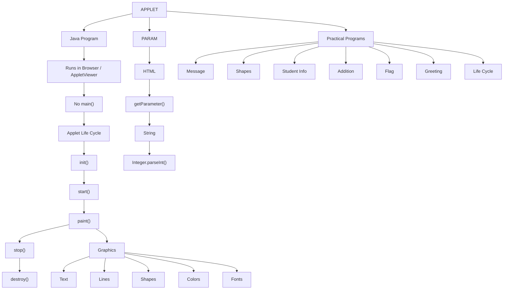

# 📘 **APPLET PROGRAMMING — COMPLETE JAVA NOTES**

> **Source:** `Applet Programming(1).docx`  
> The following is the next document converted into the same **exam-friendly, highly structured Markdown format**. The original terminology, organization, explanations, programs, outputs, syntax, and practical guidance are preserved while diagrams, tables, code blocks, visual hierarchy, and revision structures are added. :contentReference[oaicite:0]{index=0}

---

# 📑 **1. Introduction to Applets**

## 🔹 **What is an Applet?**

> **Definition:**  
> A Java Applet is a small Java program that was designed to run inside a **web browser or an Applet Viewer**.

Unlike normal Java applications, applets:

* Do **not** contain a `main()` method.
* Execute under the control of a browser or applet environment.

---

## 📌 **Definition**

> **An applet is a Java program embedded in an HTML page and executed by a browser or applet viewer.**

---

## ⚠️ **Important Note for Students**

> Java Applets are now **obsolete**. Modern browsers no longer support them, and the Applet API has been deprecated and removed from recent Java releases.

However, many university syllabi still include Applets because they help students understand:

* GUI programming
* Event-driven programming concepts

:contentReference[oaicite:1]{index=1}

---

# ⭐ **2. Features of Applets**

| **Feature** | **Description** |
|---|---|
| **Platform Independent** | Applets are Java programs |
| **GUI Based** | Used for graphical interfaces |
| **Event Driven** | Respond to events |
| **Runs inside Browser/Applet Viewer** | Execution is controlled by the environment |
| **Secure Execution Environment** | Access to local resources is restricted |
| **No explicit `main()` method** | Execution is controlled by browser/Applet Viewer |

:contentReference[oaicite:2]{index=2}

---

# ⚖️ **3. Applet vs Application**

| **Applet** | **Application** |
|---|---|
| No `main()` method | Contains `main()` method |
| Runs in Browser/Applet Viewer | Runs directly using JVM |
| Cannot access local resources freely | Can access system resources |
| Controlled by Browser | Controlled by OS/JVM |
| Used for Web Pages | Used as Standalone Programs |

:contentReference[oaicite:3]{index=3}

---

# 🧬 **4. Applet Class Hierarchy**



### 📦 **Applet Package**

> The `Applet` class belongs to the package:

```java
java.applet
```

It inherits graphical capabilities from **AWT classes**.

:contentReference[oaicite:4]{index=4}

---

# 🔄 **5. Applet Life Cycle**

> **Important:** This is one of the **most important theory topics**.



### 🧠 **Life Cycle Sequence**

```text
init()
   ↓
start()
   ↓
paint()
   ↓
stop()
   ↓
destroy()
```

---

# 🟢 **5.1 `init()`**

> The `init()` method is called **only once**.

### **Purpose**

* Initialize variables
* Create GUI components

### **Example**

```java
public void init() {
    setBackground(Color.yellow);
}
```

:contentReference[oaicite:5]{index=5}

---

# 🔵 **5.2 `start()`**

> The `start()` method is called after `init()`.

### **Purpose**

* Start animations
* Start threads

### **Example**

```java
public void start() {
    System.out.println("Applet Started");
}
```

:contentReference[oaicite:6]{index=6}

---

# 🟡 **5.3 `paint(Graphics g)`**

> Used for **drawing**.

### **Example**

```java
public void paint(Graphics g) {
    g.drawString("Hello Applet", 100, 100);
}
```

:contentReference[oaicite:7]{index=7}

---

# 🟠 **5.4 `stop()`**

> Called when the applet becomes **inactive**.

### **Example**

```java
public void stop() {
    System.out.println("Applet Stopped");
}
```

:contentReference[oaicite:8]{index=8}

---

# 🔴 **5.5 `destroy()`**

> Called before the applet is removed.

### **Example**

```java
public void destroy() {
    System.out.println("Applet Destroyed");
}
```

:contentReference[oaicite:9]{index=9}

---

# 🔁 **6. Applet Life Cycle Diagram**



### **Original Life Cycle Flow**

```text
Browser Loads Applet
        ↓
      init()
        ↓
      start()
        ↓
      paint()
        ↓
   ┌─────────────┐
   │             │
 Active      Inactive
   │             │
 paint()       stop()
                 │
                 ↓
              start()
                 │
                 ↓
               Active
                 
Inactive
   ↓
destroy()
```

:contentReference[oaicite:10]{index=10}

---

# 💻 **7. Basic Structure of Applet**

```java
import java.applet.*;
import java.awt.*;

public class FirstApplet extends Applet {

    public void paint(Graphics g) {
        g.drawString(
            "Welcome to Java Applet",
            100,
            100
        );
    }
}
```

---

# 🌐 **8. HTML File for Applet**

```html
<html>
<body>

<applet code="FirstApplet.class"
        width="400"
        height="300">
</applet>

</body>
</html>
```

:contentReference[oaicite:11]{index=11}

---

# 💻 **9. Program 1 — Display Message**

```java
import java.applet.*;
import java.awt.*;

public class MessageApplet extends Applet {

    public void paint(Graphics g) {
        g.drawString(
            "Hello SY BCA Students",
            100,
            100
        );
    }
}
```

### 🖥️ **Output**

```text
Hello SY BCA Students
```

:contentReference[oaicite:12]{index=12}

---

# 📏 **10. Program 2 — Draw Line**

```java
import java.applet.*;
import java.awt.*;

public class LineApplet extends Applet {

    public void paint(Graphics g) {
        g.drawLine(
            50,
            50,
            200,
            50
        );
    }
}
```

---

# ▭ **11. Program 3 — Draw Rectangle**

```java
import java.applet.*;
import java.awt.*;

public class RectangleApplet extends Applet {

    public void paint(Graphics g) {
        g.drawRect(
            50,
            50,
            150,
            100
        );
    }
}
```

---

# ⭕ **12. Program 4 — Draw Oval**

```java
import java.applet.*;
import java.awt.*;

public class OvalApplet extends Applet {

    public void paint(Graphics g) {
        g.drawOval(
            50,
            50,
            150,
            100
        );
    }
}
```

---

# 🔵 **13. Program 5 — Draw Circle**

```java
import java.applet.*;
import java.awt.*;

public class CircleApplet extends Applet {

    public void paint(Graphics g) {
        g.drawOval(
            100,
            50,
            100,
            100
        );
    }
}
```

:contentReference[oaicite:13]{index=13}

---

# 🙂 **14. Program 6 — Draw Smiley Face**

```java
import java.applet.*;
import java.awt.*;

public class SmileyApplet extends Applet {

    public void paint(Graphics g) {

        g.drawOval(
            50,
            50,
            200,
            200
        );

        g.fillOval(
            100,
            100,
            20,
            20
        );

        g.fillOval(
            180,
            100,
            20,
            20
        );

        g.drawArc(
            100,
            140,
            100,
            50,
            180,
            180
        );
    }
}
```

### 🖼️ **Conceptual Output**

```text
          _____________
       .-'             '-.
     .'                   '.
    /                       \
   |       ●         ●       |
   |                         |
   |        __________       |
   |       /          \      |
    \                       /
     '.                   .'
       '-._____________.-'
```

---

# 📚 **15. Applet Methods Frequently Asked in Exams**

| **Method** | **Purpose** |
|---|---|
| `init()` | Initialization |
| `start()` | Start execution |
| `paint()` | Draw graphics |
| `stop()` | Stop execution |
| `destroy()` | Release resources |

:contentReference[oaicite:14]{index=14}

---

# 🖥️ **16. Menu Program**

The Menu Program contains an Applet and a Frame window.

```java
import java.applet.*;

/*
<applet code="MenuDemo"
        width=250
        height=250>
</applet>
*/

// Create frame window.

public class MenuDemo extends Applet {

    Frame f;

    public void init() {

        f = new MenuFrame("Menu Demo");

        int width =
            Integer.parseInt(
                getParameter("width")
            );

        int height =
            Integer.parseInt(
                getParameter("height")
            );

        setSize(
            new Dimension(width, height)
        );

        f.setSize(width, height);

        f.setVisible(true);
    }

    public void start() {
        f.setVisible(true);
    }

    public void stop() {
        f.setVisible(false);
    }
}
```

:contentReference[oaicite:15]{index=15}

---

# 🧱 **17. Basic Applet Structure**

```java
import java.applet.*;
import java.awt.*;

public class MyApplet extends Applet {

    public void paint(Graphics g) {
        g.drawString(
            "Hello Applet",
            50,
            50
        );
    }
}
```

> This is a valid Applet.

---

# ❓ **18. Why Does the Above Applet Work Without All Life Cycle Methods?**

The following methods are not written:

```text
init()
start()
stop()
destroy()
```

### **Why?**

Because these methods already exist in the parent class:

```text
Applet
```

Your program inherits them.

> **You override only those methods you need.**

:contentReference[oaicite:16]{index=16}

---

# 🔄 **19. Applet Lifecycle Methods**

The main Applet methods are:

```text
init()
start()
paint()
stop()
destroy()
```

---

# 🟢 **19.1 `init()`**

## **Purpose**

> Initialization.

Runs only once when the Applet loads.

### **Use Cases**

* Create Components
* Set Layout
* Initialize Variables
* Read Parameters

### **Example**

```java
public void init() {

    setBackground(Color.yellow);

    Button b =
        new Button("Click");

    add(b);
}
```

### **Execution**



:contentReference[oaicite:17]{index=17}

---

# 🔵 **19.2 `start()`**

## **Purpose**

> Start or restart execution.

Runs after `init()`.

Runs again whenever the Applet becomes active.

### **Use Cases**

* Animation
* Thread Start
* Resume Activity

### **Example**

```java
public void start() {
    System.out.println(
        "Applet Started"
    );
}
```

### **Execution**



:contentReference[oaicite:18]{index=18}

---

# 🟡 **19.3 `paint(Graphics g)`**

## **Purpose**

> Display output.

### **Use Cases**

* Drawing
* Text Output
* Graphics
* Shapes

### **Example**

```java
public void paint(Graphics g) {

    g.drawString(
        "Welcome",
        50,
        50
    );
}
```

### ⚠️ **Important**

> For graphics programs, `paint()` is almost always required.

Without it:

```text
Nothing Drawn
```

:contentReference[oaicite:19]{index=19}

---

# 🟠 **19.4 `stop()`**

## **Purpose**

> Pause activity.

Runs when the Applet becomes inactive.

### **Use Cases**

* Stop Animation
* Pause Thread
* Pause Timer

### **Example**

```java
public void stop() {

    System.out.println(
        "Applet Stopped"
    );
}
```

:contentReference[oaicite:20]{index=20}

---

# 🔴 **19.5 `destroy()`**

## **Purpose**

> Cleanup before Applet is removed.

### **Use Cases**

* Close Files
* Release Memory
* Stop Threads

### **Example**

```java
public void destroy() {

    System.out.println(
        "Applet Destroyed"
    );
}
```

:contentReference[oaicite:21]{index=21}

---

# 🔄 **20. Lifecycle Sequence**



### **Sequence**

```text
Applet Loaded
     ↓
   init()
     ↓
   start()
     ↓
   paint()
     ↓
   stop()
     ↓
  destroy()
```

:contentReference[oaicite:22]{index=22}

---

# 🎯 **21. Which Methods Are Commonly Used?**

---

## 🟢 **Simple Output Applet**

```java
public class Test extends Applet {

    public void paint(Graphics g) {
        g.drawString(
            "Hello",
            50,
            50
        );
    }
}
```

### **Only**

```text
paint()
```

is needed.

---

## 🟡 **Parameter Applet**

```java
public void init() {

    String name =
        getParameter("name");
}
```

### **Need**

```text
init()
paint()
```

---

## 🔵 **Animation Applet**

### **Need**

```text
init()
start()
stop()
paint()
```

---

## 🔴 **Resource-Based Applet**

### **Need**

```text
init()
start()
stop()
destroy()
paint()
```

:contentReference[oaicite:23]{index=23}

---

# 📌 **22. What Methods Must Be Remembered for Exams?**

> Most syllabus questions focus on the following:

| **Method** | **Purpose** |
|---|---|
| `init()` | Initialization |
| `start()` | Start / Resume |
| `paint()` | Display Output |
| `stop()` | Pause |
| `destroy()` | Cleanup |

:contentReference[oaicite:24]{index=24}

---

# 🧰 **23. Common Methods of Applet Class**

Besides lifecycle methods, the Applet provides useful methods.

---

## **`resize()`**

```java
resize(300, 200);
```

> Changes applet size.

---

## **`showStatus()`**

```java
showStatus("Loading...");
```

> Displays a message in the Applet status area.

---

## **`getParameter()`**

```java
String name =
    getParameter("name");
```

> Reads values from HTML `<param>` tags.

---

## **`getCodeBase()`**

```java
getCodeBase();
```

> Returns the URL of the applet location.

---

## **`getDocumentBase()`**

```java
getDocumentBase();
```

> Returns the URL of the HTML page.

---

## **`getImage()`**

```java
Image img =
    getImage(
        getCodeBase(),
        "pic.jpg"
    );
```

> Loads an image.

---

## **`getAudioClip()`**

```java
AudioClip a =
    getAudioClip(
        getCodeBase(),
        "sound.wav"
    );
```

> Loads audio.

:contentReference[oaicite:25]{index=25}

---

# 🧑‍💻 **24. Minimum Applet Program**

> **For exams:**

```java
import java.applet.*;
import java.awt.*;

public class Demo extends Applet {

    public void paint(Graphics g) {

        g.drawString(
            "Hello Applet",
            50,
            50
        );
    }
}
```

### ⭐ **Remember**

> Only `paint()` is necessary for this simple output Applet.

:contentReference[oaicite:26]{index=26}

---

# 📊 **25. Practical Rule for Students**

| **Situation** | **Methods Needed** |
|---|---|
| **Simple Output** | `paint()` |
| **Reading Parameters** | `init(), paint()` |
| **Graphics Program** | `paint()` |
| **Animation** | `init(), start(), stop(), paint()` |
| **Resources / Threads** | `init(), start(), stop(), destroy(), paint()` |

> It is not necessary to create all Applet methods every time. Override only the methods required by the application's functionality.

For many beginner Applet programs, `paint()` alone is enough.

:contentReference[oaicite:27]{index=27}

---

# 🏷️ **26. PARAM Tag in Menu Program**

In the original textbook-style `MenuDemo` Applet, the `<param>` tag was used to pass the **width and height** of the Frame from HTML/AppletViewer to the Applet.

---

# 🌐 **Step 1 — HTML File**

Create:

```text
MenuDemo.html
```

### **HTML**

```html
<html>
<body>

<applet code="MenuDemo.class"
        width="300"
        height="300">

    <param name="width" value="600">
    <param name="height" value="400">

</applet>

</body>
</html>
```

---

# 💻 **Step 2 — Read Parameters in Applet**

Inside Applet's `init()`:

```java
public void init() {

    int width =
        Integer.parseInt(
            getParameter("width")
        );

    int height =
        Integer.parseInt(
            getParameter("height")
        );

    f = new MenuFrame("Menu Demo");

    f.setSize(width, height);

    f.setVisible(true);
}
```

:contentReference[oaicite:28]{index=28}

---

# 🔄 **27. How PARAM Works**



### **Step-by-Step**

```text
HTML:
<param name="width" value="600">
        ↓
Applet:
getParameter("width")
        ↓
Returns:
"600"
        ↓
Convert to integer:
Integer.parseInt(...)
        ↓
Use:
f.setSize(600,400);
```

:contentReference[oaicite:29]{index=29}

---

# 🧩 **28. Complete Applet Portion**

Suppose your integrated menu program already contains:

```text
class MenuFrame extends Frame
```

Then add:

```java
import java.applet.*;
import java.awt.*;

public class MenuDemo extends Applet {

    Frame f;

    public void init() {

        int width =
            Integer.parseInt(
                getParameter("width")
            );

        int height =
            Integer.parseInt(
                getParameter("height")
            );

        f = new MenuFrame("Menu Demo");

        f.setSize(width, height);

        f.setVisible(true);
    }

    public void start() {
        f.setVisible(true);
    }

    public void stop() {
        f.setVisible(false);
    }
}
```

> This is almost exactly how many AWT/Applet examples in older Java books were written.

:contentReference[oaicite:30]{index=30}

---

# ❓ **29. Why Use `<param>`?**

## ❌ **Without Parameters**

```java
f.setSize(700,400);
```

> Size is fixed in source code.

---

## ✅ **With Parameters**

```html
<param name="width" value="700">
<param name="height" value="400">
```

> You can change the size without recompiling Java.

:contentReference[oaicite:31]{index=31}

---

# ⚙️ **30. Other Useful Parameters in Your Menu Program**

Instead of only width and height, other parameters can be passed.

---

## 📝 **Title**

### **HTML**

```html
<param name="title"
       value="SY BCA Menu Demo">
```

### **Java**

```java
String title =
    getParameter("title");

f = new MenuFrame(title);
```

---

# 🎨 **Background Color**

### **HTML**

```html
<param name="bgcolor"
       value="yellow">
```

### **Java**

```java
String bg =
    getParameter("bgcolor");

if(bg.equals("yellow"))
    f.setBackground(Color.yellow);
```

---

# 🐞 **Enable Debug Initially**

### **HTML**

```html
<param name="debug"
       value="true">
```

### **Java**

```java
String dbg =
    getParameter("debug");

if(dbg.equals("true"))
    menuFrame.debug.setState(true);
```

:contentReference[oaicite:32]{index=32}

---

# 🧩 **31. Example with Multiple Parameters**

## **HTML**

```html
<applet code="MenuDemo.class"
        width="300"
        height="300">

    <param name="framewidth"
           value="700">

    <param name="frameheight"
           value="400">

    <param name="title"
           value="Menu Practical">

</applet>
```

---

## **Java**

```java
public void init() {

    int w =
        Integer.parseInt(
            getParameter("framewidth")
        );

    int h =
        Integer.parseInt(
            getParameter("frameheight")
        );

    String title =
        getParameter("title");

    f = new MenuFrame(title);

    f.setSize(w, h);

    f.setVisible(true);
}
```

---

# 🖥️ **Output**

```text
AppletViewer
     │
     ▼
┌───────────────────────────────┐
│ Frame Window                  │
│                               │
│ Title: Menu Practical         │
│ Width : 700                   │
│ Height: 400                   │
│                               │
└───────────────────────────────┘
```

:contentReference[oaicite:33]{index=33}

---

# 🎤 **32. PARAM Tag — Viva Questions**

## ❓ **What is a `<param>` tag?**

> A `<param>` tag is used inside an `<applet>` tag to pass values from HTML to an Applet.

### **Example**

```html
<param name="width" value="600">
```

---

## ❓ **Which method reads parameters?**

> `getParameter()`

### **Example**

```java
String w =
    getParameter("width");
```

---

## ❓ **Why is `Integer.parseInt()` used?**

> Because `getParameter()` returns a **String**.

```java
String w =
    getParameter("width");
```

To use it as a number:

```java
int width =
    Integer.parseInt(w);
```

---

## ❓ **Can the Menu program run without `<param>` tags?**

> **Yes.**

You can directly write:

```java
f.setSize(700,400);
```

and skip parameter passing entirely.

The `<param>` tag is useful when you want to change settings such as:

* Size
* Title
* Colors
* Initial options

from the HTML/AppletViewer side without changing the Java source code.

:contentReference[oaicite:34]{index=34}

---

# ⚠️ **33. Can `<param>` Be Used Purely Inside Java Code?**

> **Short Answer:**  
> You cannot truly use a `<param>` tag only inside Java code.

`<param>` is an **HTML/AppletViewer tag**, not a Java statement.

The method:

```java
getParameter("width");
```

works only when AppletViewer or an old browser reads parameters supplied from an HTML page.

:contentReference[oaicite:35]{index=35}

---

# 💡 **34. PARAM Tag Inside Java Comment**

Many textbook examples show the following inside the Java file:

```java
/*
<applet code="MenuDemo"
        width=300
        height=300>

    <param name="width"
           value="600">

    <param name="height"
           value="400">

</applet>
*/
```

---

# 💻 **35. Example — PARAM in Java Comment**

```java
import java.applet.*;
import java.awt.*;

/*
<applet code="MenuDemo"
        width=300
        height=300>

    <param name="width"
           value="600">

    <param name="height"
           value="400">

</applet>
*/

public class MenuDemo extends Applet {

    public void init() {

        String w =
            getParameter("width");

        String h =
            getParameter("height");

        System.out.println(w);
        System.out.println(h);
    }
}
```

---

# 🤔 **36. Why Does This Work?**

When you run:

```bash
appletviewer MenuDemo.java
```

AppletViewer scans the Java source file and looks for:

```html
<applet>
...
</applet>
```

inside comments.

It treats that comment as an HTML page.

Therefore:

```java
getParameter("width")
```

receives:

```text
600
```

:contentReference[oaicite:36]{index=36}

---

# 🧑‍💻 **37. Example for Your Menu Program**

```java
import java.applet.*;
import java.awt.*;

/*
<applet code="MenuDemo"
        width=300
        height=300>

    <param name="framewidth"
           value="700">

    <param name="frameheight"
           value="400">

</applet>
*/

public class MenuDemo extends Applet {

    Frame f;

    public void init() {

        int w =
            Integer.parseInt(
                getParameter("framewidth")
            );

        int h =
            Integer.parseInt(
                getParameter("frameheight")
            );

        f = new Frame("Menu Demo");

        f.setSize(w, h);

        f.setVisible(true);
    }
}
```

---

# ▶️ **38. Run**

```bash
appletviewer MenuDemo.java
```

### **Output**

```text
Frame Size = 700 × 400
```

> Even though no separate HTML file exists.

:contentReference[oaicite:37]{index=37}

---

# ⚠️ **39. Case 2 — No `<param>` Tag At All**

Suppose:

```java
import java.applet.*;
import java.awt.*;

public class MenuDemo extends Applet {

    public void init() {

        String w =
            getParameter("width");

        System.out.println(w);
    }
}
```

Run:

```bash
appletviewer MenuDemo.java
```

### **Result**

```text
null
```

### **Reason**

> Because no parameter was supplied.

:contentReference[oaicite:38]{index=38}

---

# 🛡️ **40. Safe Way to Read Parameters**

Always check whether the parameter exists.

### **Method 1**

```java
String w =
    getParameter("width");

if(w == null)
    w = "600";
```

### **Method 2**

```java
int width = 600;

String w =
    getParameter("width");

if(w != null)
    width =
        Integer.parseInt(w);
```

> This prevents errors when parameters are missing.

:contentReference[oaicite:39]{index=39}

---

# ❌ **41. Can We Create Parameters Purely in Java?**

> **No.**

There is no Java statement like:

```java
param("width","600");
```

or:

```java
<param name="width" value="600">
```

inside executable Java code.

Parameters come from:

1. HTML page
2. `<applet>` comment block read by AppletViewer

---

# 📦 **42. PARAM Using Comment Block**

```java
/*
<applet code="ParamDemo"
        width=300
        height=300>

    <param name="msg"
           value="Welcome Students">

</applet>
*/
```

Run:

```bash
appletviewer ParamDemo.java
```

> No separate HTML file is created.

AppletViewer extracts the parameters directly from the comment block.

:contentReference[oaicite:40]{index=40}

---

# 🧩 **43. For Your Menu Program**

You could place at the top:

```java
/*
<applet code="MenuDemo"
        width=300
        height=300>

    <param name="framewidth"
           value="700">

    <param name="frameheight"
           value="400">

    <param name="title"
           value="Menu Practical">

</applet>
*/
```

Then read:

```java
int w =
    Integer.parseInt(
        getParameter("framewidth")
    );

int h =
    Integer.parseInt(
        getParameter("frameheight")
    );

String title =
    getParameter("title");
```

inside `init()`.

Then run:

```bash
appletviewer MenuDemo.java
```

without creating a separate HTML file.

---

# ⚠️ **44. Important Note**

> This works with **AppletViewer from older JDKs such as JDK 8** because it understands the `<applet>` block embedded in Java comments.

> Modern JDKs such as **Java 11 and later** no longer include Applet support, so this technique is mainly useful for learning legacy Applet programming.

:contentReference[oaicite:41]{index=41}

---

# 🏷️ **45. PARAM Tag in Java Applet**

## **What is a PARAM Tag?**

> The `<PARAM>` tag is used inside the `<APPLET>` tag to pass information (**parameters**) from the HTML page to the Applet.

Instead of hard-coding values in the Java program, we can provide values dynamically through HTML.

---

# ❓ **46. Why Do We Need PARAM Tag?**

Suppose you write an Applet to display a message.

## ❌ **Without PARAM Tag**

```java
String msg =
    "Welcome to SY BCA";
```

If you want to change the message, you must modify and recompile the Java program.

---

## ✅ **With PARAM Tag**

```html
<param name="message"
       value="Welcome to SY BCA">
```

The same Applet can display different messages without changing the Java code.

:contentReference[oaicite:42]{index=42}

---

# 🧾 **47. Syntax of PARAM Tag**

```html
<applet code="ParamDemo.class"
        width="300"
        height="200">

    <param name="message"
           value="Welcome to Java">

</applet>
```

---

# 🧩 **48. Components of PARAM Tag**

| **Attribute** | **Purpose** |
|---|---|
| `name` | Name of parameter |
| `value` | Value of parameter |

:contentReference[oaicite:43]{index=43}

---

# 🔄 **49. How Applet Reads Parameters**

Applet uses:

```java
getParameter("parameter_name");
```

### **Example**

```java
String msg =
    getParameter("message");
```

Here:

```html
<param name="message"
       value="Welcome to Java">
```

`message` is the parameter name.

:contentReference[oaicite:44]{index=44}

---

# 💻 **50. Example Program — PARAM Tag**

## **Java Program**

```java
import java.applet.*;
import java.awt.*;

/*
<applet code="ParamDemo.class"
        width="400"
        height="200">

    <param name="message"
           value="Welcome to SY BCA Students">

</applet>
*/

public class ParamDemo extends Applet {

    String msg;

    public void init() {

        msg =
            getParameter("message");
    }

    public void paint(Graphics g) {

        g.drawString(
            msg,
            50,
            100
        );
    }
}
```

:contentReference[oaicite:45]{index=45}

---

# 🧠 **51. Explanation**

## **Step 1**

```java
String msg;
```

> Variable to store parameter value.

---

## **Step 2**

```java
msg =
    getParameter("message");
```

> Reads the value from PARAM tag.

---

## **Step 3**

```java
g.drawString(
    msg,
    50,
    100
);
```

> Displays the parameter value.

---

# ⚙️ **52. Compilation**

```bash
javac ParamDemo.java
```

---

# ▶️ **53. Execution**

```bash
appletviewer ParamDemo.java
```

---

# 🖥️ **Output**

```text
Welcome to SY BCA Students
```

:contentReference[oaicite:46]{index=46}

---

# 🧩 **54. Multiple Parameters Example**

## **Applet Tag**

```html
<applet code="StudentInfo.class"
        width="400"
        height="200">

    <param name="name"
           value="Smita">

    <param name="course"
           value="SY BCA">

</applet>
```

---

## **Java Code**

```java
import java.applet.*;
import java.awt.*;

public class StudentInfo extends Applet {

    String name;
    String course;

    public void init() {

        name =
            getParameter("name");

        course =
            getParameter("course");
    }

    public void paint(Graphics g) {

        g.drawString(
            "Name : " + name,
            50,
            80
        );

        g.drawString(
            "Course : " + course,
            50,
            110
        );
    }
}
```

---

# 🖥️ **Output**

```text
Name : Smita
Course : SY BCA
```

:contentReference[oaicite:47]{index=47}

---

# ⭐ **55. Advantages of PARAM Tag**

1. **Dynamic input to Applet.**
2. **No need to modify Java source code.**
3. **Same Applet can be reused.**
4. **Easy customization.**
5. **Data can be passed from HTML to Applet.**

:contentReference[oaicite:48]{index=48}

---

# 🎤 **56. Viva Questions on PARAM Tag**

## ❓ **Q1. What is PARAM Tag?**

> **Answer:**  
> PARAM Tag is used to pass parameters from an HTML page to an Applet.

---

## ❓ **Q2. Where is PARAM Tag written?**

> **Answer:**  
> Inside the `<APPLET>` tag.

---

## ❓ **Q3. Which method reads a parameter?**

> **Answer:**

```java
getParameter()
```

---

## ❓ **Q4. What is the return type of `getParameter()`?**

> **Answer:**

```text
String
```

---

## ❓ **Q5. Can multiple PARAM tags be used?**

> **Answer:**  
> Yes, multiple parameters can be passed to an Applet.

### **Example**

```html
<param name="n1" value="10">
<param name="n2" value="20">
```

:contentReference[oaicite:49]{index=49}

---

# 🧪 **57. Complete Practical Coverage**

These programs and concepts provide hands-on coverage of:

```text
Applet Structure
       ↓
Applet Life Cycle
       ↓
Graphics Class
       ↓
PARAM Tag
       ↓
Fonts
       ↓
Colors
       ↓
Drawing Shapes
       ↓
Type Conversion
       ↓
Basic GUI Concepts
```

Together, they cover almost all Applet-related practicals typically expected in a **SY BCA Advanced Java syllabus**.

:contentReference[oaicite:50]{index=50}

---

# 🗺️ **58. COMPLETE APPLET PROGRAMMING MAP**

```mermaid
flowchart TD
    A["APPLET PROGRAMMING"] --> B["Introduction"]
    A --> C["Features"]
    A --> D["Applet vs Application"]
    A --> E["Class Hierarchy"]
    A --> F["Life Cycle"]
    A --> G["Basic Structure"]
    A --> H["Graphics"]
    A --> I["PARAM Tag"]
    A --> J["Practical Programs"]
    A --> K["Viva Questions"]

    F --> F1["init()"]
    F --> F2["start()"]
    F --> F3["paint()"]
    F --> F4["stop()"]
    F --> F5["destroy()"]

    G --> G1["Applet Class"]
    G --> G2["paint()"]

    H --> H1["drawString()"]
    H --> H2["drawLine()"]
    H --> H3["drawRect()"]
    H --> H4["drawOval()"]
    H --> H5["drawArc()"]
    H --> H6["Colors"]
    H --> H7["Fonts"]

    I --> I1["<param>"]
    I --> I2["getParameter()"]
    I --> I3["String"]
    I --> I4["Integer.parseInt()"]

    J --> J1["Hello Applet"]
    J --> J2["Line"]
    J --> J3["Rectangle"]
    J --> J4["Circle"]
    J --> J5["Smiley"]
    J --> J6["Student Information"]
    J --> J7["Addition"]
    J --> J8["Greeting Card"]
    J --> J9["National Flag"]
    J --> J10["Life Cycle"]
```



---

# 📊 **59. MOST IMPORTANT METHODS — QUICK TABLE**

| **Method** | **Main Purpose** | **Remember As** |
|---|---|---|
| `init()` | Initialization | **Initialize** |
| `start()` | Start / Resume | **Start** |
| `paint()` | Display / Draw | **Paint** |
| `stop()` | Pause | **Stop** |
| `destroy()` | Cleanup | **Destroy** |
| `resize()` | Change size | **Resize** |
| `showStatus()` | Display status message | **Status** |
| `getParameter()` | Read PARAM value | **Parameter** |
| `getCodeBase()` | Return applet URL | **Code URL** |
| `getDocumentBase()` | Return HTML URL | **Document URL** |
| `getImage()` | Load image | **Image** |
| `getAudioClip()` | Load audio | **Audio** |

---

# 🎨 **60. GRAPHICS METHODS — QUICK TABLE**

| **Method** | **Used For** |
|---|---|
| `drawString()` | Text |
| `drawLine()` | Line |
| `drawRect()` | Rectangle outline |
| `fillRect()` | Filled rectangle |
| `drawOval()` | Oval / Circle |
| `fillOval()` | Filled oval / circle |
| `drawArc()` | Arc |
| `fillArc()` | Filled arc |
| `setColor()` | Change color |
| `setFont()` | Change font |
| `drawImage()` | Display image |

---

# 🏷️ **61. PARAM TAG — COMPLETE FLOW**



### **Example**

```html
<param name="num1" value="10">
```

```java
String n =
    getParameter("num1");
```

If numeric:

```java
int n =
    Integer.parseInt(
        getParameter("num1")
    );
```

---

# 🧠 **62. LIFE CYCLE — LAST-MINUTE REVISION**

```text
              APPLET LOADED
                    │
                    ▼
                 init()
                    │
                    ▼
                 start()
                    │
                    ▼
                 paint()
                    │
             ┌──────┴──────┐
             │             │
          ACTIVE        INACTIVE
             │             │
           paint()       stop()
                           │
                 ┌─────────┴─────────┐
                 │                   │
            Active Again           Closed
                 │                   │
                 ▼                   ▼
              start()             destroy()
```

---

# 🧠 **63. PARAM — LAST-MINUTE REVISION**

```text
HTML
 │
 ├── <param name="msg" value="Hello">
 │
 ▼
Applet
 │
 ├── getParameter("msg")
 │
 ▼
String
 │
 ├── Direct use
 │
 └── Integer.parseInt()
          │
          ▼
       Integer
```

---

# 🎯 **64. EXAM MEMORY SHEET**

> ### **Applet = Small Java Program**
>
> ### **Package = `java.applet`**
>
> ### **Graphics = `java.awt`**
>
> ### **No `main()`**
>
> ### **Life Cycle = `init() → start() → paint() → stop() → destroy()`**
>
> ### **Drawing = `paint(Graphics g)`**
>
> ### **Parameters = `<param>`**
>
> ### **Read Parameters = `getParameter()`**
>
> ### **String → Integer = `Integer.parseInt()`**
>
> ### **Testing = `appletviewer`**

---

# 📝 **65. PRACTICAL PROGRAM SEQUENCE FOR SY BCA**

## 🟢 **Beginner**

1. Hello Applet
2. Draw String
3. Draw Line
4. Draw Rectangle
5. Draw Circle

---

## 🟡 **Intermediate**

6. PARAM Tag Message
7. Student Information
8. Addition Using PARAM
9. Background Color Using PARAM

---

## 🔴 **Advanced**

10. National Flag
11. Smiley Face
12. Greeting Card
13. Life Cycle Demonstration

:contentReference[oaicite:51]{index=51}

---

# 🏁 **66. FINAL UNIT SUMMARY**



---

# 🏆 **67. ONE-PAGE EXAM REVISION**

| **Question Area** | **Answer to Remember** |
|---|---|
| What is Applet? | Small Java program executed inside Browser/AppletViewer |
| Applet package | `java.applet` |
| Graphics package | `java.awt` |
| Does Applet have `main()`? | No |
| Parent class | `Applet` |
| Initialization method | `init()` |
| Start method | `start()` |
| Drawing method | `paint(Graphics g)` |
| Stop method | `stop()` |
| Cleanup method | `destroy()` |
| Parameter tag | `<param>` |
| Read parameter | `getParameter()` |
| Return type of `getParameter()` | `String` |
| String to integer | `Integer.parseInt()` |
| Draw text | `drawString()` |
| Draw line | `drawLine()` |
| Draw rectangle | `drawRect()` |
| Draw oval | `drawOval()` |
| Draw arc | `drawArc()` |
| Fill rectangle | `fillRect()` |
| Fill oval | `fillOval()` |
| Change color | `setColor()` |
| Change font | `setFont()` |
| Display image | `drawImage()` |
| Load image | `getImage()` |
| Applet URL | `getCodeBase()` |
| HTML page URL | `getDocumentBase()` |
| Test Applet | `appletviewer` |

---

# 🔥 **68. FINAL REMEMBERING FORMULA**

```text
                 APPLET
                    │
        ┌───────────┴───────────┐
        │                       │
     LIFE CYCLE              PARAM
        │                       │
  I → S → P → S → D        HTML → Java
        │                       │
        │                  <param>
        │                       │
        │                getParameter()
        │                       │
        │                    String
        │                       │
        │              Integer.parseInt()
        │
        ▼
     Graphics
        │
 ┌──────┼────────┐
 │      │        │
Text  Lines    Shapes
 │      │        │
drawString() drawLine() drawRect()
                  │
             drawOval()
             drawArc()
```

> ## ⭐ **ULTIMATE EXAM LINE**
>
> **A Java Applet is a small Java program that runs inside a browser or AppletViewer without a `main()` method. It extends the `Applet` class, follows the life cycle `init() → start() → paint() → stop() → destroy()`, uses the `Graphics` class for drawing, and uses the `<param>` tag with `getParameter()` to receive values from HTML.**
