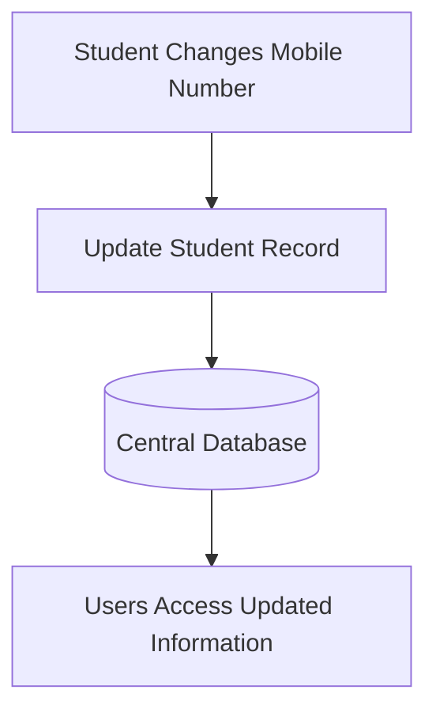
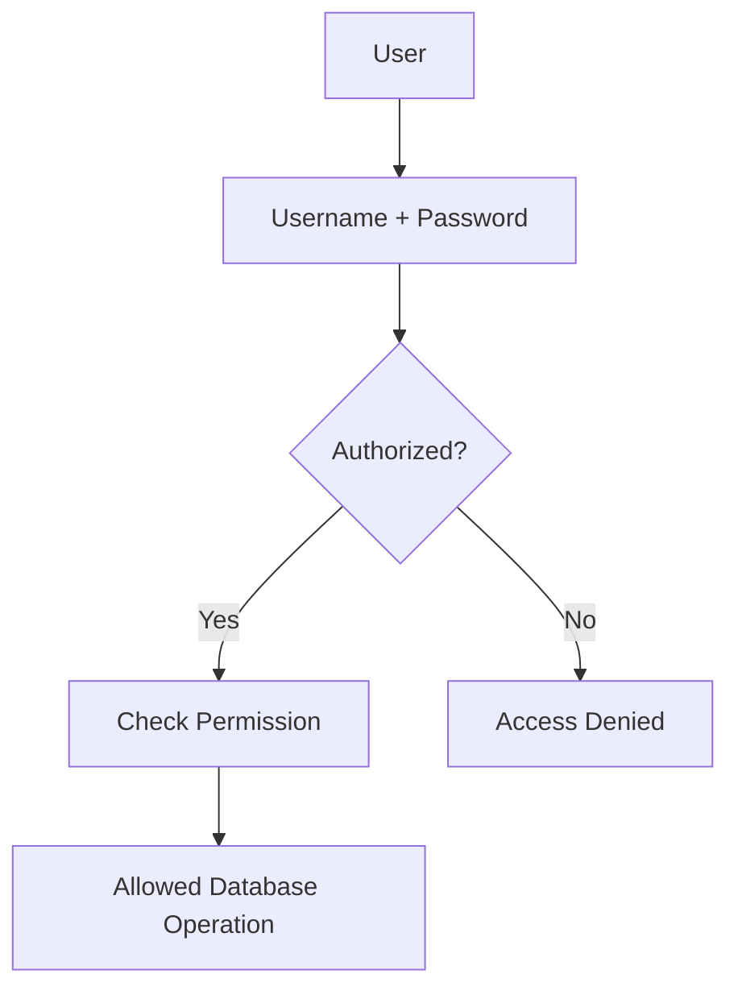
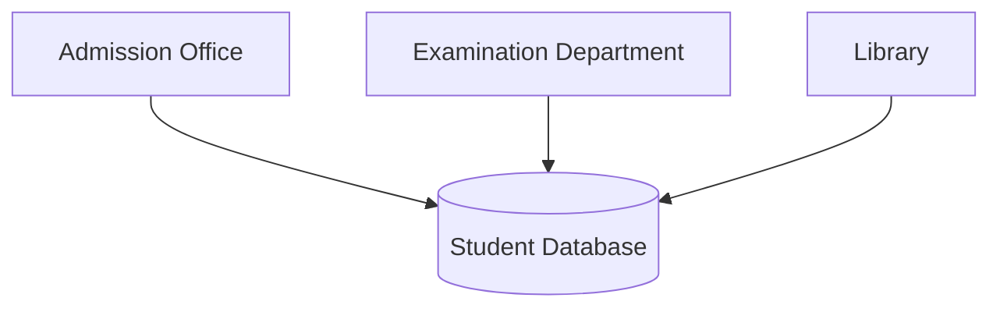
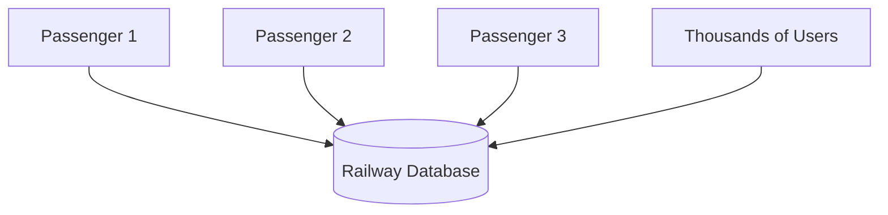
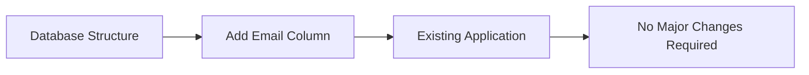
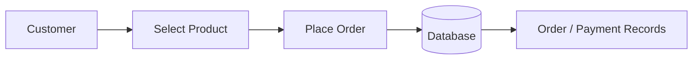

# Chapter 1 – Introduction to Database Systems

# Topic 6: Advantages and Applications of DBMS

> **Exam Weightage:** ⭐⭐⭐⭐⭐  
> **Important Question:** *Explain the advantages and applications of Database Management System (DBMS).*  
> **Exam Tip:** Remember the **10 major advantages** with one example each.

---

# 1. Introduction

A **Database Management System (DBMS)** provides an efficient way to store, organize, retrieve, update, secure, and manage data.

Compared with the traditional File System, a DBMS provides major benefits such as:

```text
Reduced Redundancy
        ↓
Data Consistency
        ↓
Data Security
        ↓
Data Sharing
        ↓
Backup & Recovery
        ↓
Data Integrity
        ↓
Faster Retrieval
        ↓
Concurrent Access
        ↓
Data Independence
        ↓
Better Decision Making
```

The chapter identifies these advantages as key reasons why DBMS is preferred over traditional file-based data management. :contentReference[oaicite:0]{index=0}

---

# 2. Advantages of DBMS

The **10 major advantages** explained in the chapter are:

| No. | Advantage |
|---:|---|
| 1 | Reduces Data Redundancy |
| 2 | Ensures Data Consistency |
| 3 | Provides Data Security |
| 4 | Supports Data Sharing |
| 5 | Backup and Recovery |
| 6 | Data Integrity |
| 7 | Faster Data Retrieval |
| 8 | Supports Concurrent Access |
| 9 | Data Independence |
| 10 | Better Decision Making |

---

# 3. Reduces Data Redundancy

## Meaning

> **Data Redundancy means unnecessary duplication of the same data.**

A DBMS minimizes duplicate copies of data by storing information efficiently instead of repeatedly storing the same details in different files.

### File System Example

```text
Admission File
101 | Alka | BCA | Dhule

Library File
101 | Alka | BCA | Dhule

Examination File
101 | Alka | BCA | Dhule
```

The same student information is repeated.

This creates:

```text
Duplicate Data
      ↓
More Storage
      ↓
Difficult Maintenance
```

### DBMS Approach

```text
Student Table

101 | Alka | BCA | Dhule
        │
        │ Student_ID = 101
    ┌───┴────────┐
    ▼            ▼
Library      Examination
Records        Records
```

The student's main details can be stored once and accessed by different departments.

### Example from the Chapter

> A student's details are stored only once and can be accessed by the **Examination, Library, and Accounts departments**.

### Benefit

- Saves storage space
- Avoids unnecessary repetition
- Makes updating easier
- Reduces duplicate records

The chapter explains reduction of redundancy as storing information only once so that multiple departments can access it. :contentReference[oaicite:1]{index=1}

---

# 4. Ensures Data Consistency

## Definition

> **Data Consistency means maintaining the same correct and updated value of data throughout the database.**

Since data is stored in a database, an update can be reflected consistently so that users access the correct information.

### Example

Suppose a student changes their mobile number.

```text
Old Mobile Number
9876543210

       ↓ UPDATE

New Mobile Number
9999999999
```

In a traditional File System, the number might need to be changed in several files.

In a DBMS, the relevant student record can be updated once.



### Result

```text
Single Correct Value
        ↓
Consistent Information
```

The chapter specifically gives the example of updating a student's mobile number only once in the database. :contentReference[oaicite:2]{index=2}

---

# 5. Provides Data Security

## Meaning

DBMS protects data from **unauthorized access or modification**.

According to the chapter, DBMS provides security using:

```text
Username
   +
Password
   +
Access Permissions
   ↓
Authorized Access
```

Different users can be given different permissions.

### Example

```text
Student
   ↓
View Fee Status ✓
Modify Fee Record ✗

Faculty
   ↓
View Student Details ✓
Update Marks ✓

Accounts Department
   ↓
View Fee Records ✓
Update Fee Records ✓
```

The chapter gives the example:

> **Only the Accounts Department can update students' fee records.**

### Security Flow



### Benefit

- Prevents unauthorized access
- Protects confidential information
- Controls modification of records

The chapter describes DBMS security through usernames, passwords, and access permissions. :contentReference[oaicite:3]{index=3}

---

# 6. Supports Data Sharing

## Meaning

A DBMS allows **multiple users to access the same database**.

Different departments can use common information without maintaining separate copies.

### College Example



According to the chapter:

> The **Admission Office, Examination Department, and Library** can use the student database at the same time.

### Benefits

```text
Central Database
      ↓
Shared Access
      ↓
Better Coordination
      ↓
Less Duplicate Data
```

The chapter states that multiple users can access the same database simultaneously without affecting each other's work. :contentReference[oaicite:4]{index=4}

---

# 7. Backup and Recovery

## Definition

> **Backup** means creating a copy of database data for protection.

> **Recovery** means restoring the database after data loss or system failure.

DBMS provides mechanisms to protect data from:

- Hardware failures
- Software crashes
- Accidental deletion

### Working

```text
Database
    ↓
Create Backup
    ↓
Backup Stored
    ↓
System Failure 💥
    ↓
Recovery Process
    ↓
Database Restored ✓
```

### Example

Suppose the database server fails.

```text
Database Server
      ↓
   FAILURE 💥
      ↓
Latest Backup
      ↓
   Restore
      ↓
Data Available Again ✓
```

The chapter gives the example:

> If the database server fails, data can be restored from the latest backup.

:contentReference[oaicite:5]{index=5}

---

# 8. Data Integrity

## Definition

> **Data Integrity means maintaining the accuracy and validity of data stored in the database.**

DBMS can use rules and constraints to ensure valid information.

### Example from the Chapter

A student should not have a duplicate Student ID.

```text
Student_ID | Name

101        | Alka   ✓
102        | Rahul  ✓
101        | Amit   ✗ Duplicate
```

The DBMS can enforce a rule such as:

```text
Student_ID = UNIQUE
```

or define it as a:

```text
PRIMARY KEY
```

### Concept

```text
Rules + Constraints
        ↓
Prevent Invalid Data
        ↓
Accurate Database
        ↓
Data Integrity
```

The chapter specifically explains integrity using the example that a student cannot be assigned a duplicate Student ID. :contentReference[oaicite:6]{index=6}

---

# 9. Faster Data Retrieval

## Meaning

A DBMS can quickly retrieve required information using queries such as **SQL**.

Instead of manually searching thousands of records:

```text
Search Requirement
        ↓
SQL Query
        ↓
DBMS
        ↓
Database
        ↓
Required Result
```

### Example from the Chapter

> Finding the marks of all BCA students can take only a few seconds.

An illustrative SQL query could be:

```sql
SELECT Student.Student_ID,
       Student.Name,
       Examination.Subject,
       Examination.Marks
FROM Student
JOIN Examination
ON Student.Student_ID = Examination.Student_ID
WHERE Student.Course = 'BCA';
```

### Benefit

- Quick searching
- Easy filtering
- Faster reporting
- Efficient retrieval

The chapter identifies SQL-based querying as the reason DBMS can retrieve required information quickly. :contentReference[oaicite:7]{index=7}

---

# 10. Supports Concurrent Access

## Definition

> **Concurrent Access means multiple users can access or update the database at the same time.**

DBMS supports many users simultaneously while managing their database operations.

### Real-Life Example from the Chapter

> Thousands of passengers can book railway tickets at the same time.



### Benefit

```text
Many Users
    ↓
Same Database
    ↓
Simultaneous Operations
    ↓
Concurrent Access
```

This advantage is particularly important in systems such as:

- Railway reservation
- Banking
- E-commerce
- College ERP

The railway-booking example is explicitly given in the chapter. :contentReference[oaicite:8]{index=8}

---

# 11. Data Independence

## Definition

> **Data Independence means changes to the database structure do not necessarily require major changes to application programs.**

This reduces the dependency between data structure and application software.

### Example from the Chapter

Initially:

```text
Student Table

Student_ID
Name
Course
```

Later:

```text
Student Table

Student_ID
Name
Course
Email ← NEW COLUMN
```

Adding the `Email` column does not necessarily require major changes to existing applications.

### Concept



### Benefit

- Easier modification
- Lower maintenance effort
- Greater flexibility

The chapter explains Data Independence using the example of adding an `Email` column to the Student table. :contentReference[oaicite:9]{index=9}

---

# 12. Better Decision Making

## Meaning

A DBMS provides **accurate and up-to-date information**, which helps organizations make informed decisions.

### College Example

Management can generate reports about:

```text
Student Attendance
        +
Examination Results
        +
Fee Collection
        ↓
Management Reports
        ↓
Better Decision Making
```

For example:

```text
Attendance Report
      ↓
Students Below 75%
      ↓
Management Action
```

or:

```text
Fee Report
      ↓
Pending Fees
      ↓
Collection Planning
```

The chapter states that college management can generate reports on **attendance, results, and fee collection** for decision-making. :contentReference[oaicite:10]{index=10}

---

# 13. Complete Summary of Advantages

| No. | Advantage | Main Benefit | Example |
|---:|---|---|---|
| 1 | **Reduces Data Redundancy** | Avoids duplicate data | Student details stored once |
| 2 | **Data Consistency** | Maintains same updated data | Mobile number updated once |
| 3 | **Data Security** | Prevents unauthorized access | Only Accounts updates fees |
| 4 | **Data Sharing** | Multiple users share database | Admission, Exam and Library |
| 5 | **Backup & Recovery** | Protects against data loss | Restore latest backup |
| 6 | **Data Integrity** | Maintains valid data | No duplicate Student ID |
| 7 | **Faster Retrieval** | Quickly finds information | SQL retrieves BCA marks |
| 8 | **Concurrent Access** | Many users work simultaneously | Railway ticket booking |
| 9 | **Data Independence** | Easier structural changes | Add Email column |
| 10 | **Better Decision Making** | Provides accurate reports | Attendance and fee reports |

---

# 14. Applications of DBMS

The chapter lists the following major applications:

```text
1. College and University Management Systems
2. Railway Reservation Systems
3. Banking Systems
4. Hospital Management Systems
5. Library Management Systems
6. E-commerce Websites
```

:contentReference[oaicite:11]{index=11}

---

# 15. College and University Management Systems

DBMS can be used to manage:

```text
College Database
│
├── Students
├── Faculty
├── Attendance
├── Examination
├── Fees
└── Courses
```

### Example

A college can retrieve:

- Student information
- Examination marks
- Attendance
- Fee status
- Course details

---

# 16. Railway Reservation Systems

A DBMS can store and manage information related to:

```text
Passengers
Trains
Reservations
Tickets
Routes
Payments
```

Typical operations include:

```text
Search Train
     ↓
Check Availability
     ↓
Book Ticket
     ↓
Store Reservation
```

---

# 17. Banking Systems

A database can manage:

```text
Customers
Accounts
Transactions
Loans
Payments
```

Example:

```text
Customer
   ↓
Bank Account
   ↓
Deposit / Withdrawal / Transfer
   ↓
Transaction Record
```

---

# 18. Hospital Management Systems

A DBMS can be used for managing:

```text
Patients
Doctors
Appointments
Medical Records
Billing
```

This allows related hospital information to be stored and managed systematically.

---

# 19. Library Management Systems

A library database can maintain:

```text
Books
Students / Members
Issue Records
Return Records
```

Typical operations include:

```text
Search Book
     ↓
Issue Book
     ↓
Store Issue Record
     ↓
Return Book
     ↓
Update Record
```

---

# 20. E-Commerce Websites

A database can manage information such as:

```text
Customers
Products
Orders
Payments
```

Typical flow:



---

# 21. Applications Summary

| Application | Typical Data Managed |
|---|---|
| **College / University** | Students, faculty, attendance, examination, fees |
| **Railway Reservation** | Passengers, trains, reservations, tickets |
| **Banking** | Customers, accounts, transactions |
| **Hospital** | Patients, doctors, appointments |
| **Library** | Books, members, issue/return records |
| **E-Commerce** | Customers, products, orders, payments |

> The **application names** above come from the chapter. The examples of typical data managed are explanatory context based on those application categories; the source itself lists the six applications without expanding each one in this section. :contentReference[oaicite:12]{index=12}

---

# 22. Exam-Ready Answer

## Q. Explain the advantages and applications of DBMS.

### Answer

A **Database Management System (DBMS)** provides an efficient method for storing, managing, retrieving, updating and protecting data. It offers several advantages over the traditional File System.

## Advantages of DBMS

### 1. Reduces Data Redundancy

DBMS minimizes duplicate copies of data by storing information efficiently.

**Example:** A student's details are stored once and can be accessed by the Examination, Library and Accounts departments.

### 2. Ensures Data Consistency

Updates are maintained consistently so users can access correct information.

**Example:** If a student changes their mobile number, it needs to be updated in the appropriate database record.

### 3. Provides Data Security

DBMS controls access using usernames, passwords and permissions.

**Example:** Only the Accounts Department can update students' fee records.

### 4. Supports Data Sharing

Multiple users can access the same database.

**Example:** Admission, Examination and Library departments can use the student database.

### 5. Backup and Recovery

DBMS protects data from hardware failure, software crashes and accidental deletion.

**Example:** Data can be restored from the latest backup after server failure.

### 6. Data Integrity

DBMS maintains the accuracy and validity of data using rules and constraints.

**Example:** Duplicate Student IDs can be prevented.

### 7. Faster Data Retrieval

Required information can be retrieved quickly using queries such as SQL.

**Example:** Marks of BCA students can be retrieved quickly.

### 8. Supports Concurrent Access

Many users can access and update the database simultaneously.

**Example:** Thousands of passengers can book railway tickets at the same time.

### 9. Data Independence

Changes to database structure do not necessarily require major application changes.

**Example:** Adding an `Email` column to the Student table does not necessarily affect existing applications.

### 10. Better Decision Making

Accurate and up-to-date information helps management make informed decisions.

**Example:** College management can generate reports on attendance, examination results and fee collection.

These ten advantages are explained in the chapter. :contentReference[oaicite:13]{index=13}

## Applications of DBMS

DBMS is used in:

1. College and University Management Systems
2. Railway Reservation Systems
3. Banking Systems
4. Hospital Management Systems
5. Library Management Systems
6. E-commerce Websites

:contentReference[oaicite:14]{index=14}

### Conclusion

DBMS provides important advantages such as **reduced redundancy, consistency, security, data sharing, backup and recovery, integrity, faster retrieval, concurrent access, data independence and better decision-making**.

Because of these benefits, DBMS is widely applicable to systems such as **colleges, railways, banks, hospitals, libraries and e-commerce platforms**.

---

# 23. Memory Trick 🧠

Remember the 10 advantages using:

> **R – C – S – S – B – I – F – C – I – D**

```text
R → Redundancy Reduced
C → Consistency
S → Security
S → Sharing
B → Backup & Recovery
I → Integrity
F → Faster Retrieval
C → Concurrent Access
I → Independence
D → Decision Making
```

### Ultra-Short Revision

```text
REDUCE
  ↓
Redundancy

PROTECT
  ↓
Security + Integrity + Backup

SHARE
  ↓
Multi-user + Concurrent Access

ACCESS
  ↓
Fast SQL Retrieval

IMPROVE
  ↓
Independence + Decision Making
```

---

# 24. SQL Queries and Outputs

> **Note:** The following SQL queries are illustrative examples based on the Student, Fees, and Examination tables provided earlier in the chapter. The exact queries below are not written in this section of the source document.

---

## Query 1 – Retrieve All Students

```sql
SELECT *
FROM Student;
```

### SQL Output

| Student_ID | Name | Course | Mobile |
|---:|---|---|---|
| 101 | Alka | BCA | 9876543210 |
| 102 | Rahul | B.Com | 9876501234 |

---

## Query 2 – Retrieve BCA Students

```sql
SELECT *
FROM Student
WHERE Course = 'BCA';
```

### SQL Output

| Student_ID | Name | Course | Mobile |
|---:|---|---|---|
| 101 | Alka | BCA | 9876543210 |

---

## Query 3 – Find Pending Fees

```sql
SELECT *
FROM Fees
WHERE Fee_Status = 'Pending';
```

### SQL Output

| Student_ID | Fee_Status |
|---:|---|
| 102 | Pending |

---

## Query 4 – Retrieve Examination Marks

```sql
SELECT *
FROM Examination
WHERE Student_ID = 101;
```

### SQL Output

| Student_ID | Subject | Marks |
|---:|---|---:|
| 101 | DBMS | 85 |

---

## Query 5 – Retrieve Student Name with Marks

```sql
SELECT Student.Student_ID,
       Student.Name,
       Examination.Subject,
       Examination.Marks
FROM Student
JOIN Examination
ON Student.Student_ID = Examination.Student_ID;
```

### SQL Output

| Student_ID | Name | Subject | Marks |
|---:|---|---|---:|
| 101 | Alka | DBMS | 85 |
| 102 | Rahul | DBMS | 78 |

The data used in these SQL output tables comes from the Student, Fees, and Examination tables in the chapter. :contentReference[oaicite:15]{index=15}

---

# 25. Final 30-Second Revision

```text
                    DBMS ADVANTAGES
                           │
          ┌────────────────┼────────────────┐
          │                │                │
          ▼                ▼                ▼
     DATA QUALITY       PROTECTION        ACCESS
          │                │                │
   Redundancy ↓        Security        Fast Retrieval
   Consistency         Backup          Concurrent Access
   Integrity           Recovery
          │
          ▼
     FLEXIBILITY
          │
   Data Independence
          │
          ▼
   Better Decision Making


APPLICATIONS:

College / University
Railway Reservation
Banking
Hospital
Library
E-Commerce
```

> **Next Topic – Topic 7: Database System Environment**  
> Covers **Hardware, Software, Data, DBMS, Users, Procedures**, the complete **College Database System Environment example**, advantages, diagram, and exam-ready answer.