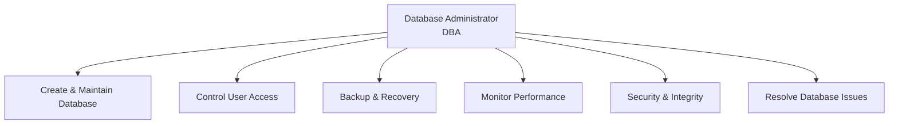
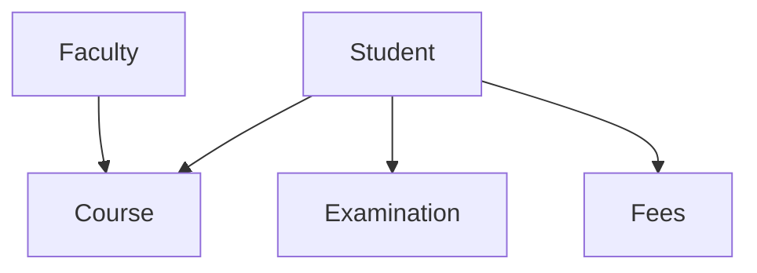
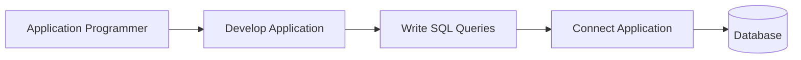
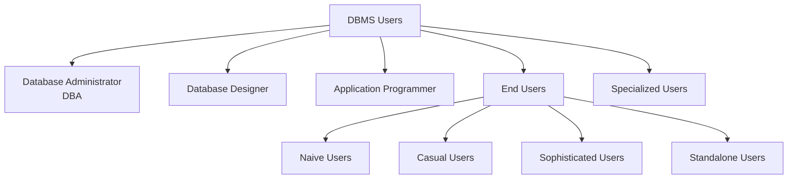
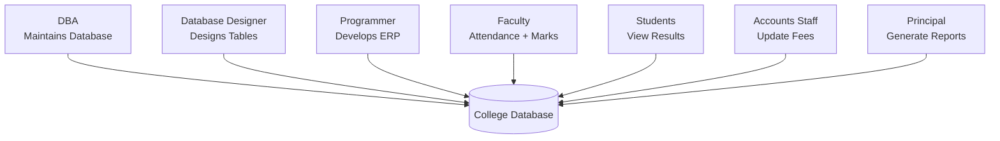

# Chapter 1 – Introduction to Database Systems

# Topic 8: DBMS Users and Roles

> **Exam Weightage:** ⭐⭐⭐⭐⭐  
> **Important Question:** *Explain the different types of DBMS users and their roles and responsibilities with suitable examples.*

---

# 1. Introduction

A **Database Management System (DBMS)** is used by different types of users.

Each user has a specific role and responsibility in the database system.

Some users:

- Design the database
- Manage and secure the database
- Develop applications
- Use database applications
- Perform advanced analysis

The chapter explains that these different users interact with the database according to their roles to ensure **efficient database management, security, and data processing**. :contentReference[oaicite:0]{index=0}

The main DBMS users are:

```text
DBMS USERS
│
├── 1. Database Administrator (DBA)
│
├── 2. Database Designer
│
├── 3. Application Programmer
│
├── 4. End Users
│      │
│      ├── Naive Users
│      ├── Casual Users
│      ├── Sophisticated Users
│      └── Standalone Users
│
└── 5. Specialized Users
```

---

# 2. Overview of DBMS Users

| DBMS User | Main Responsibility |
|---|---|
| **Database Administrator (DBA)** | Manages database, security, backup and performance |
| **Database Designer** | Designs database structure, tables and relationships |
| **Application Programmer** | Develops database applications and SQL programs |
| **End User** | Uses database applications to retrieve and update data |
| **Specialized User** | Develops advanced database applications for research and analysis |

This classification follows the summary provided in the chapter. :contentReference[oaicite:1]{index=1}

---

# 3. Database Administrator (DBA)

## Definition

> **A Database Administrator (DBA) is responsible for the overall management, security, maintenance, and performance of the database.**

The DBA is one of the most important users of a database system because they are responsible for keeping the database **secure, available, maintained, and efficient**. :contentReference[oaicite:2]{index=2}

---

# 4. Roles and Responsibilities of DBA

According to the chapter, the DBA performs the following responsibilities:

1. Creates and maintains databases.
2. Controls user access and permissions.
3. Performs database backup and recovery.
4. Monitors database performance.
5. Ensures data security and integrity.
6. Resolves database-related issues.

:contentReference[oaicite:3]{index=3}

---

## DBA Role Diagram



---

## College Example

In a college:

```text
DBA
 │
 ├── Creates Student Database
 │
 ├── Assigns Login Credentials
 │
 ├── Controls Faculty & Staff Access
 │
 └── Performs Regular Backups
```

The chapter states:

> In a college, the DBA creates the Student Database, assigns login credentials to faculty and staff, and performs regular backups. :contentReference[oaicite:4]{index=4}

---

## Simple Memory

```text
DBA = DATABASE BOSS

Manage
  +
Secure
  +
Backup
  +
Monitor
```

---

# 5. Database Designer

## Definition

> **A Database Designer designs the database structure according to the organization's requirements.**

The Database Designer decides **how the database should be structured and how different data should be related**. :contentReference[oaicite:5]{index=5}

---

# 6. Roles and Responsibilities of Database Designer

According to the chapter, a Database Designer:

1. Identifies entities and attributes.
2. Designs database tables.
3. Defines relationships among tables.
4. Normalizes the database.
5. Creates the database schema.

:contentReference[oaicite:6]{index=6}

---

## Database Design Process

```text
Organization Requirements
          ↓
Identify Entities & Attributes
          ↓
Design Tables
          ↓
Define Relationships
          ↓
Normalize Database
          ↓
Create Database Schema
```

---

## College Example

For a college database, the designer may create tables such as:

```text
College Database
│
├── Student
├── Faculty
├── Course
├── Examination
└── Fees
```

These are the tables specifically listed in the chapter's example. :contentReference[oaicite:7]{index=7}

---

## Relationship Example



The designer determines:

```text
WHAT tables are needed
        +
WHAT attributes they contain
        +
HOW tables are related
```

---

## Simple Memory

```text
DATABASE DESIGNER
        ↓
Designs the BLUEPRINT
        ↓
Tables + Relationships + Schema
```

---

# 7. Application Programmer (Developer)

## Definition

> **Application Programmers develop software applications that interact with the database.**

They create applications through which users can access and work with database information. :contentReference[oaicite:8]{index=8}

---

# 8. Roles and Responsibilities of Application Programmer

According to the chapter, Application Programmers:

1. Develop database applications.
2. Write SQL queries.
3. Create forms and reports.
4. Test and maintain applications.
5. Connect applications with the database.

:contentReference[oaicite:9]{index=9}

---

## Working of Application Programmer



---

## College Example

A programmer may develop a:

```text
College ERP System
       │
       ├── Students → View Results
       │
       └── Faculty → Upload Marks
```

The chapter gives exactly this example:

> A programmer develops a College ERP System where students can view results and faculty can upload marks. :contentReference[oaicite:10]{index=10}

---

## Simple Memory

```text
PROGRAMMER
    ↓
Builds Application
    ↓
Writes SQL
    ↓
Connects Application
    ↓
Database
```

---

# 9. End Users

## Definition

> **End Users are people who use the application to access the database but do not directly manage it.**

They normally interact with the database through an application or predefined interface. :contentReference[oaicite:11]{index=11}

Examples include:

```text
Students
Faculty
Accounts Staff
Department Heads
Data Analysts
```

---

# 10. Types of End Users

The chapter classifies End Users into four types:

```text
END USERS
│
├── 1. Naive Users
├── 2. Casual Users
├── 3. Sophisticated Users
└── 4. Standalone Users
```

:contentReference[oaicite:12]{index=12}

---

# 11. Naive Users

## Meaning

> **Naive Users perform simple tasks using predefined forms.**

They do not need deep knowledge of databases or SQL.

### Example from the Chapter

```text
Student
   ↓
Opens Application
   ↓
Enters Details / Uses Form
   ↓
Checks Result
```

Example:

> **Students checking results**

---

## Railway Example

In the railway example, the chapter identifies:

```text
Reservation Clerk
        /
Ticket Booking Staff
```

as Naive or Parametric Users.

They perform repetitive tasks using predefined forms such as:

- Booking tickets
- Cancelling tickets
- Updating passenger details
- Checking seat availability

:contentReference[oaicite:13]{index=13}

---

## Simple Memory

```text
NAIVE USER
    ↓
Predefined Forms
    ↓
Simple Repetitive Tasks
```

---

# 12. Casual Users

## Meaning

> **Casual Users access the database occasionally.**

They do not use the database continuously.

### Example from the Chapter

```text
Department Head
       ↓
Occasionally Accesses Database
       ↓
Checks Information / Reports
```

The chapter gives **Department Heads** as an example of Casual Users. :contentReference[oaicite:14]{index=14}

---

## Railway Example

A:

```text
Station Manager
       /
Railway Officer
```

may occasionally access the database to:

- View reports
- Check reservation status
- Monitor train schedules
- Generate reports

:contentReference[oaicite:15]{index=15}

---

## Simple Memory

```text
CASUAL
   =
OCCASIONAL USER
```

---

# 13. Sophisticated Users

## Meaning

> **Sophisticated Users write complex queries and use the database for advanced analysis.**

The chapter gives:

```text
Data Analysts
```

as an example.

They may work directly with database querying and reporting tools.

---

## Railway Example

The chapter gives:

```text
Railway Data Analysts
        /
Railway Management
```

as Sophisticated Users.

They use SQL queries and reporting tools to analyze:

- Passenger traffic
- Train occupancy
- Revenue
- Booking trends

:contentReference[oaicite:16]{index=16}

---

## Simple Memory

```text
SOPHISTICATED USER
        ↓
Complex Queries
        ↓
Analysis
        ↓
Reports / Insights
```

---

# 14. Standalone Users

## Meaning

> **Standalone Users use personal database software.**

They generally work with a database system for their own individual requirements.

The chapter lists Standalone Users as one of the four types of End Users. :contentReference[oaicite:17]{index=17}

### Key Idea

```text
Standalone User
       ↓
Personal Database Software
       ↓
Individual Use
```

> The source does **not provide a detailed standalone-user example** beyond stating that they use personal database software.

---

# 15. End User Examples in College

The chapter provides these examples:

```text
Students
   ↓
View Attendance & Results

Faculty
   ↓
Update Marks

Accounts Staff
   ↓
Manage Fees
```

:contentReference[oaicite:18]{index=18}

---

# 16. End Users Summary

| Type | Main Role | Example from Chapter |
|---|---|---|
| **Naive User** | Performs simple tasks using forms | Student checking result |
| **Casual User** | Occasionally accesses database | Department Head |
| **Sophisticated User** | Writes complex queries | Data Analyst |
| **Standalone User** | Uses personal database software | Personal database software user |

---

# 17. Specialized Users

## Definition

> **Specialized Users develop advanced database applications for scientific, engineering, or research purposes.**

These users work on more specialized and complex database applications. :contentReference[oaicite:19]{index=19}

---

# 18. Roles and Responsibilities of Specialized Users

According to the chapter, Specialized Users:

1. Design specialized database systems.
2. Perform data analysis.
3. Develop AI, GIS, or data mining applications.
4. Handle complex database operations.

:contentReference[oaicite:20]{index=20}

---

## Examples of Specialized Applications

```text
Specialized Users
│
├── AI Applications
├── GIS Applications
├── Data Mining Applications
└── Research Database Systems
```

---

## Example from the Chapter

> Researchers analyze student performance data using **data mining techniques**. :contentReference[oaicite:21]{index=21}

```text
Student Performance Data
          ↓
Data Mining
          ↓
Analysis
          ↓
Research Results
```

---

# 19. Complete DBMS User Hierarchy



---

# 20. Summary Table of DBMS Users

| User | Main Role |
|---|---|
| **Database Administrator (DBA)** | Manages database, security, backup and performance |
| **Database Designer** | Designs database structure, tables and relationships |
| **Application Programmer** | Develops database applications and SQL programs |
| **End User** | Uses database applications to retrieve and update data |
| **Specialized User** | Develops advanced applications for research and analysis |

This summary is directly based on the chapter. :contentReference[oaicite:22]{index=22}

---

# 21. Real-Life Example: College Management System

The chapter explains how different users participate in a **College Management System**.

| User | Responsibility |
|---|---|
| **DBA** | Maintains the college database and performs backups |
| **Database Designer** | Designs Student, Faculty, Course and Fee tables |
| **Programmer** | Develops the College ERP software |
| **Faculty** | Enters attendance and examination marks |
| **Students** | View attendance, results and fee status |
| **Accounts Staff** | Updates fee payment records |
| **Principal / Management** | Generates reports for decision-making |

:contentReference[oaicite:23]{index=23}

---

# 22. College Management System – Complete Flow



---

# 23. Advantages of Different User Roles

The chapter lists the following advantages:

1. Clear distribution of responsibilities.
2. Better database security.
3. Efficient database management.
4. Improved data accuracy and consistency.
5. Faster application development.
6. Easy maintenance and troubleshooting.

:contentReference[oaicite:24]{index=24}

---

# 24. Railway Reservation System Example

The chapter also provides a detailed **Railway Reservation System** example showing how each DBMS user role appears in a real-world system.

---

## Database Administrator

### Example

```text
Railway Database Administrator
```

### Responsibilities

- Creates and maintains railway database
- Manages users
- Provides security
- Performs backup and recovery
- Ensures database performance

:contentReference[oaicite:25]{index=25}

---

## Database Designer

### Example

```text
Database Designer
```

Designs tables such as:

```text
Passenger
Train
Reservation
Ticket
Route
Payment
```

Also defines:

```text
Relationships
+
Constraints
```

:contentReference[oaicite:26]{index=26}

---

## Application Programmer

### Example

```text
Software Developer
```

Develops the railway reservation application for:

- Ticket booking
- Cancellation
- PNR enquiry
- Payment processing

:contentReference[oaicite:27]{index=27}

---

## Sophisticated Users

### Example

```text
Railway Data Analysts
        /
Railway Management
```

Analyze:

```text
Passenger Traffic
Train Occupancy
Revenue
Booking Trends
```

using SQL queries and reporting tools. :contentReference[oaicite:28]{index=28}

---

## Specialized Users

### Example

```text
Railway Planning
and
Scheduling Experts
```

Develop specialized applications for:

- Train scheduling
- Route optimization
- AI-based seat allocation
- Demand forecasting

:contentReference[oaicite:29]{index=29}

---

## Naive / Parametric Users

### Example

```text
Reservation Clerk
        /
Ticket Booking Staff
```

Perform repetitive tasks such as:

- Booking tickets
- Cancelling tickets
- Updating passenger details
- Checking seat availability

:contentReference[oaicite:30]{index=30}

---

## Casual Users

### Example

```text
Station Manager
       /
Railway Officer
```

Occasionally:

- View reports
- Check reservation status
- Monitor train schedules
- Generate reports

:contentReference[oaicite:31]{index=31}

---

## End Users

### Example

```text
Passengers
```

Passengers can:

- Search trains
- Check seat availability
- Book tickets
- Cancel tickets
- Check PNR status
- Download e-tickets

:contentReference[oaicite:32]{index=32}

---

# 25. Railway DBMS Users – Quick Table

| Type of User | Railway Example | Main Responsibility |
|---|---|---|
| **DBA** | Railway Database Administrator | Database management, security, backup |
| **Database Designer** | Database Designer | Designs Passenger, Train, Ticket, Route tables |
| **Application Programmer** | Software Developer | Develops booking and payment application |
| **Sophisticated User** | Data Analyst / Management | Analyzes traffic, occupancy and revenue |
| **Specialized User** | Planning & Scheduling Expert | Scheduling, optimization and forecasting |
| **Naive User** | Reservation Clerk | Performs repetitive booking tasks |
| **Casual User** | Station Manager | Occasionally checks reports |
| **End User** | Passenger | Searches and books tickets |

---

# 26. Who Does What? – Easy Revision

```text
DBA
→ MANAGES

Designer
→ DESIGNS

Programmer
→ DEVELOPS

Naive User
→ USES FORMS

Casual User
→ USES OCCASIONALLY

Sophisticated User
→ WRITES COMPLEX QUERIES

Standalone User
→ USES PERSONAL DATABASE SOFTWARE

Specialized User
→ BUILDS ADVANCED DATABASE APPLICATIONS
```

---

# 27. Exam-Ready Answer

## Q. Explain the different types of DBMS users and their roles.

### Answer

A **Database Management System (DBMS)** is used by different types of users, each having specific responsibilities. These users interact with the database according to their roles to ensure efficient database management, security and data processing. :contentReference[oaicite:33]{index=33}

The major types of DBMS users are:

### 1. Database Administrator (DBA)

A **Database Administrator** is responsible for the overall management, security, maintenance and performance of the database.

The DBA:

- Creates and maintains databases.
- Controls user access and permissions.
- Performs backup and recovery.
- Monitors database performance.
- Ensures security and integrity.
- Resolves database-related issues.

**Example:** In a college, the DBA creates the Student Database, assigns login credentials to faculty and staff, and performs regular backups. :contentReference[oaicite:34]{index=34}

### 2. Database Designer

A **Database Designer** designs the database structure according to organizational requirements.

The designer:

- Identifies entities and attributes.
- Designs tables.
- Defines relationships.
- Normalizes the database.
- Creates the database schema.

**Example:** In a college, the designer creates Student, Faculty, Course, Examination and Fees tables. :contentReference[oaicite:35]{index=35}

### 3. Application Programmer

An **Application Programmer** develops software applications that interact with the database.

The programmer:

- Develops database applications.
- Writes SQL queries.
- Creates forms and reports.
- Tests and maintains applications.
- Connects applications with databases.

**Example:** A programmer develops a College ERP where students view results and faculty upload marks. :contentReference[oaicite:36]{index=36}

### 4. End Users

End Users use applications to access the database but do not directly manage it.

The types are:

- **Naive Users:** Perform simple tasks using forms.
- **Casual Users:** Access the database occasionally.
- **Sophisticated Users:** Write complex queries.
- **Standalone Users:** Use personal database software.

Examples include students viewing results, faculty updating marks and accounts staff managing fees. :contentReference[oaicite:37]{index=37}

### 5. Specialized Users

Specialized Users develop advanced database applications for scientific, engineering or research purposes.

They:

- Design specialized systems.
- Perform data analysis.
- Develop AI, GIS or data mining applications.
- Handle complex database operations.

**Example:** Researchers analyze student performance using data mining techniques. :contentReference[oaicite:38]{index=38}

### Conclusion

Different DBMS users perform different responsibilities:

```text
DBA → Manages

Designer → Designs

Programmer → Develops

End User → Uses

Specialized User → Develops Advanced Applications
```

This division of responsibilities provides better **security, management, accuracy, consistency, development and maintenance**.

---

# 28. Memory Trick 🧠

Remember the five main users using:

> **D – D – P – E – S**

```text
D → DBA
D → Database Designer
P → Programmer
E → End User
S → Specialized User
```

### Remember Their Jobs

```text
DBA
↓
MANAGE

DESIGNER
↓
DESIGN

PROGRAMMER
↓
DEVELOP

END USER
↓
USE

SPECIALIZED USER
↓
ADVANCED WORK
```

---

# 29. SQL Query and Output

> **Note:** The DBMS Users and Roles section explains user responsibilities but does **not provide specific SQL queries or SQL output tables**. The following query is an illustrative example of the **Application Programmer / Sophisticated User** role, using the Student and Examination data provided earlier in the chapter.

## Query – Retrieve Student Examination Details

```sql
SELECT Student.Student_ID,
       Student.Name,
       Examination.Subject,
       Examination.Marks
FROM Student
JOIN Examination
ON Student.Student_ID = Examination.Student_ID;
```

### SQL Output

| Student_ID | Name | Subject | Marks |
|---:|---|---|---:|
| 101 | Alka | DBMS | 85 |
| 102 | Rahul | DBMS | 78 |

---

## Query – Find Students Who Scored More Than 80

```sql
SELECT Student.Student_ID,
       Student.Name,
       Examination.Subject,
       Examination.Marks
FROM Student
JOIN Examination
ON Student.Student_ID = Examination.Student_ID
WHERE Examination.Marks > 80;
```

### SQL Output

| Student_ID | Name | Subject | Marks |
|---:|---|---|---:|
| 101 | Alka | DBMS | 85 |

The values used in these output tables come from the Student and Examination tables earlier in the chapter. :contentReference[oaicite:39]{index=39}

---

# 30. Final 30-Second Revision

| User | Remember As | Main Work |
|---|---|---|
| **DBA** | Manager | Security, backup, performance |
| **Database Designer** | Architect | Tables, relationships, schema |
| **Application Programmer** | Developer | Applications, SQL, forms, reports |
| **Naive User** | Form User | Simple repetitive tasks |
| **Casual User** | Occasional User | Occasionally accesses data |
| **Sophisticated User** | Analyst | Complex queries and analysis |
| **Standalone User** | Personal User | Personal database software |
| **Specialized User** | Expert | AI, GIS, data mining, research |

```text
                    DBMS USERS
                        │
       ┌────────────────┼────────────────┐
       ▼                ▼                ▼
      DBA            Designer        Programmer
    MANAGES          DESIGNS          DEVELOPS
                                         
                        │
                 ┌──────┴──────┐
                 ▼             ▼
             End Users     Specialized
                USE          ADVANCED
                 │
        ┌────────┼────────┐
        ▼        ▼        ▼
      Naive    Casual  Sophisticated
                         +
                     Standalone
```

> **Next Topic – Topic 9: Schema and Instance in DBMS**  
> Covers **Schema definition, SQL `CREATE TABLE`, characteristics, house-blueprint example, Instance definition, `INSERT` query, before/after output tables, Schema vs Instance comparison**, and exam-ready answer.