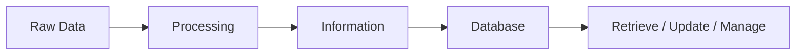

# Chapter 1 – Introduction to Database Systems

# Topic 1: Data, Information and Database

> **Exam Weightage:** ⭐⭐⭐⭐⭐ (Very Important – 12 Marks)

---

# Learning Objectives

After studying this topic, you should be able to:

- Define Data
- Define Information
- Define Database
- Explain the relationship among Data, Information and Database
- Differentiate between Data and Information
- Understand with real-life examples

---

# Introduction

Every computer system works with **Data**. However, raw data alone is not useful. It must be processed to produce **Information**, and this information is then stored systematically inside a **Database** for future retrieval and management.

The relationship can be summarized as:

```text
Raw Data
    │
    ▼
Processing
    │
    ▼
Information
    │
    ▼
Stored in Database
```

This flow is presented in the source material as:

**Data → Processing → Information → Stored in a Database**. :contentReference[oaicite:0]{index=0}

---

# 1. Data

## Definition

> **Data is a collection of raw facts, figures, symbols, or observations that have no meaning on their own. It is the basic input for processing.** :contentReference[oaicite:1]{index=1}

In simple words,

**Data is unprocessed information that has no meaningful context until it is organized or processed.**

---

## Characteristics of Data

| Characteristic | Explanation |
|---------------|-------------|
| Raw | Original facts without processing |
| Unorganized | Not arranged systematically |
| Meaningless Alone | Cannot help in decision-making directly |
| Various Forms | Numbers, text, symbols, images |
| Input for Processing | Used to generate information |

---

## Example

```text
101
Alka
85
Mumbai
```

These values are only raw facts.

---

# 2. Information

## Definition

> **Information is processed, organized and meaningful data that helps in decision-making.** :contentReference[oaicite:2]{index=2}

Information is obtained after processing raw data so that it becomes meaningful and useful.

---

## Characteristics of Information

| Characteristic | Explanation |
|---------------|-------------|
| Meaningful | Easy to understand |
| Organized | Properly arranged |
| Processed | Generated after processing data |
| Useful | Helps users |
| Supports Decision Making | Used for planning and analysis |

---

## Example

Raw Data

```text
101
Alka
85
```

After Processing

```text
Student Roll No. 101 (Alka) scored 85 marks.
```

Now the data has meaning.

Hence, it becomes **Information**.

---

# 3. Database

## Definition

> **A Database is an organized collection of related data stored electronically so that it can be easily accessed, managed, updated and retrieved using a Database Management System (DBMS).** :contentReference[oaicite:3]{index=3}

A database stores related information in an organized manner, making retrieval and management efficient.

---

## Characteristics of Database

| Characteristic | Explanation |
|---------------|-------------|
| Organized Storage | Data is stored systematically |
| Related Data | Stores logically connected data |
| Reduces Redundancy | Avoids duplicate data |
| Multi-user Support | Multiple users can access simultaneously |
| Security | Protects stored information |
| Fast Retrieval | Data can be searched quickly |
| Easy Updating | Records can be modified easily |

---

## Examples of Database

- Student Database
- Employee Database
- Hospital Database
- Banking Database
- Library Database

---

# Difference Between Data and Information

| Data | Information |
|------|-------------|
| Raw facts and figures | Processed and meaningful data |
| Unorganized | Organized |
| Used as input | Obtained after processing |
| Does not directly help in decision making | Helps in decision making |
| Example: 90, Ravi, 102 | Example: Ravi (Roll No. 102) scored 90 marks |

The source document provides the same comparison between Data and Information. :contentReference[oaicite:4]{index=4}

---

# Relationship Between Data, Information and Database



### Example

| Stage | Example |
|--------|---------|
| Data | Student ID = 101, Name = Alka, Marks = 85 |
| Processing | Organize and calculate result |
| Information | Alka (ID 101) scored 85 marks and passed |
| Database | Information stored permanently in Student Database |

This relationship is described directly in the document. :contentReference[oaicite:5]{index=5}

---

# Real-Life Example

Imagine a college examination.

### Raw Data

```text
101
Rahul
92
```

↓

### Processing

Associate Roll Number, Student Name and Marks.

↓

### Information

```text
Student Rahul (Roll No. 101) scored 92 marks.
```

↓

### Database

This record is stored inside the **College Student Database** for future retrieval.

---

# Memory Trick (Exam)

```text
DATA
↓
PROCESS
↓
INFORMATION
↓
STORE
↓
DATABASE
```

Remember the keyword:

> **D → P → I → D**

(Data → Processing → Information → Database)

---

# Key Points for Examination

- Data is the raw input.
- Information is processed data.
- Database stores organized related data.
- Information supports decision-making.
- Database enables efficient storage, retrieval and updating.
- Data becomes Information after processing.
- Information is stored permanently inside a Database.

---

# Frequently Asked University Questions

### Q1. Define Data.

**Answer:** Data is a collection of raw facts, figures, symbols, or observations that have no meaning on their own. It serves as the basic input for processing. :contentReference[oaicite:6]{index=6}

---

### Q2. Define Information.

**Answer:** Information is processed, organized, and meaningful data that helps in decision-making. :contentReference[oaicite:7]{index=7}

---

### Q3. Define Database.

**Answer:** A Database is an organized collection of related data stored electronically for easy access, management, updating, and retrieval using a DBMS. :contentReference[oaicite:8]{index=8}

---

### Q4. Explain the relationship among Data, Information and Database.

**Answer:**

```text
Data
   ↓
Processing
   ↓
Information
   ↓
Database
```

Raw data is processed into meaningful information, which is then stored in a database for future use. :contentReference[oaicite:9]{index=9}

---

# Output (Conceptual)

```text
Input (Data)

101
Alka
85

↓

Processing

↓

Output (Information)

Student Alka (Roll No. 101) scored 85 marks.

↓

Stored in

Student Database
```

---

# Query Result (Example)

### Query

```sql
SELECT StudentID, Name, Marks
FROM Student
WHERE StudentID = 101;
```

### Result

| StudentID | Name | Marks |
|-----------|------|-------|
| 101 | Alka | 85 |