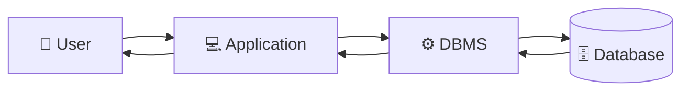
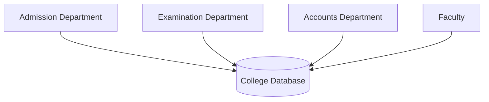
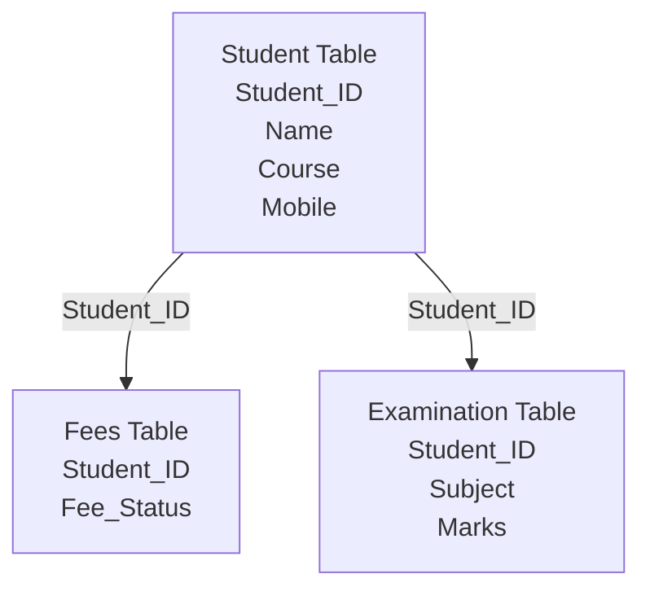

# Chapter 1 – Introduction to Database Systems

# Topic 4: Database Management System (DBMS)

> **Exam Weightage:** ⭐⭐⭐⭐⭐  
> **Important Question:** *Define DBMS. Explain its characteristics, advantages and disadvantages with a suitable example.*

---

# 1. Introduction

Traditional **File Systems** suffer from problems such as:

- Data redundancy
- Data inconsistency
- Security problems
- Difficulty in accessing data
- Poor data sharing
- Backup and recovery problems

To overcome these limitations, the **Database Management System (DBMS)** is used.

A DBMS provides a systematic way to:

```text
CREATE
   ↓
STORE
   ↓
RETRIEVE
   ↓
UPDATE
   ↓
MANAGE
   ↓
DATABASE DATA
```

---

# 2. Definition of DBMS

> **A Database Management System (DBMS) is software that allows users to create, store, retrieve, update, and manage data in a database efficiently.**

It acts as an **interface between the user and the database**, ensuring that data is:

- Organized
- Secure
- Consistent
- Easily accessible

This is how DBMS is defined in the chapter. :contentReference[oaicite:0]{index=0}

---

# 3. Simple Meaning of DBMS

A DBMS can be understood as a **middle layer between users/applications and the actual database**.



The user normally does not need to manually search individual data files.

Instead:

```text
User
  ↓
Request / Query
  ↓
DBMS
  ↓
Database
  ↓
Required Data
  ↓
User
```

### Example

Suppose a user wants to find the details of student `101`.

Instead of manually opening different files, a query can be used:

```sql
SELECT *
FROM Student
WHERE Student_ID = 101;
```

The DBMS searches the database and returns the required record.

---

# 4. Characteristics of DBMS

The chapter lists the following major characteristics of a DBMS. :contentReference[oaicite:1]{index=1}

## 1. Stores Data in Structured Format

A DBMS stores data in an organized structure, commonly using **tables**.

Example:

| Student_ID | Name | Course |
|---:|---|---|
| 101 | Alka | BCA |
| 102 | Rahul | B.Com |

This makes data easier to understand, search and manage.

---

## 2. Reduces Data Redundancy

DBMS reduces unnecessary duplication of the same data.

Instead of storing complete student details repeatedly:

```text
Student File      → 101 | Alka | BCA | Mobile
Fees File         → 101 | Alka | BCA | Mobile | Paid
Examination File  → 101 | Alka | BCA | Mobile | 85
```

A DBMS can store the main student details once:

```text
Student Table
101 | Alka | BCA | Mobile
```

Other tables can refer to that student using:

```text
Student_ID = 101
```

Thus:

```text
Less Duplicate Data
        ↓
Reduced Redundancy
```

---

## 3. Maintains Data Consistency and Integrity

### Data Consistency

The same information remains correct throughout the database.

For example, if a student's mobile number changes, it can be updated in the relevant student record.

### Data Integrity

DBMS helps maintain the **accuracy and validity** of data.

Example:

```text
Student_ID = 101 ✓

Duplicate Student_ID = 101 ✗
```

Rules and constraints can be used to prevent invalid data.

---

## 4. Provides Data Security

DBMS provides security mechanisms to control who can access or modify data.

```text
User
  ↓
Authentication
  ↓
Permission Check
  ↓
Authorized?
  │
  ├── YES → Access Granted ✓
  │
  └── NO  → Access Denied ✗
```

For example:

```text
Student → View Results

Faculty → Update Marks

Accounts Staff → Update Fees

DBA → Manage Database
```

Different users can have different permissions.

---

## 5. Supports Multiple Users

A DBMS allows multiple users to access the database.

For example, in a college:



Different departments can work with the same database.

---

## 6. Backup and Recovery

DBMS provides facilities for:

```text
Database
   ↓
Backup
   ↓
System Failure 💥
   ↓
Recovery
   ↓
Data Restored ✓
```

This helps protect important data from:

- Hardware failure
- Software crash
- Accidental deletion

---

## 7. Fast Searching and Updating

DBMS allows data to be searched and updated efficiently.

For example:

```sql
SELECT *
FROM Student
WHERE Course = 'BCA';
```

The DBMS can retrieve matching student records without manually searching separate files.

---

# 5. Characteristics at a Glance

| Characteristic | Purpose |
|---|---|
| **Structured Storage** | Stores data systematically |
| **Reduced Redundancy** | Minimizes duplicate data |
| **Consistency** | Maintains uniform data |
| **Integrity** | Maintains accurate and valid data |
| **Security** | Protects data from unauthorized access |
| **Multi-user Support** | Allows multiple users |
| **Backup & Recovery** | Protects against data loss |
| **Fast Retrieval** | Quickly searches and updates data |

---

# 6. Advantages of DBMS

The chapter gives seven basic advantages of DBMS. :contentReference[oaicite:2]{index=2}

---

## 1. Reduces Data Redundancy

DBMS minimizes unnecessary duplicate copies of data.

### Example

Student information can be stored once and referenced by other related records.

```text
Before:

Admission File → Rahul's Details
Library File   → Rahul's Details
Exam File      → Rahul's Details

After DBMS:

Student Table → Rahul's Details stored once
                    ↓
            Student_ID = 101
              ↙           ↘
        Fees Table     Exam Table
```

### Benefit

- Saves storage space
- Reduces duplication
- Makes data easier to maintain

---

## 2. Ensures Data Consistency and Accuracy

When information is updated in the appropriate database record, users can access the same current information.

### Example

```text
Old Mobile:
9876543210

       ↓ UPDATE

New Mobile:
9999999999
```

The updated student information is maintained centrally.

---

## 3. Provides Data Security

DBMS can protect data using:

- User authentication
- Passwords
- Access permissions

### Example

```text
Accounts Department
        ↓
Can Update Fee Records ✓

Student
        ↓
Can View Fee Status ✓
Can Modify Fee Records ✗
```

---

## 4. Supports Data Sharing

Multiple users can access the same database.

### Example

```text
              COLLEGE DATABASE
               /      |      \
              /       |       \
       Admission     Exam    Accounts
```

This improves coordination among departments.

---

## 5. Backup and Recovery

DBMS provides mechanisms to protect data against failure.

```text
Original Database
       ↓
     Backup
       ↓
System Failure
       ↓
    Recovery
       ↓
Restored Database
```

---

## 6. Fast Data Retrieval Using SQL

DBMS supports queries for retrieving required information quickly.

Example:

```sql
SELECT *
FROM Student
WHERE Course = 'BCA';
```

This retrieves students belonging to the BCA course.

---

## 7. Maintains Data Integrity

DBMS can use rules and constraints to maintain valid data.

Example:

```text
Student_ID must be unique.

101 → Alka ✓
102 → Rahul ✓
101 → Amit ✗ Duplicate
```

---

# 7. Disadvantages of DBMS

Although DBMS provides many benefits, it also has some disadvantages.

The chapter lists the following five limitations. :contentReference[oaicite:3]{index=3}

---

## 1. High Installation and Maintenance Cost

A DBMS may require:

- Database software
- Hardware
- Servers
- Maintenance

Therefore, implementation can be costly compared with a simple File System.

---

## 2. Requires Trained Personnel

Managing a database may require skilled professionals such as:

```text
Database Administrator (DBA)
Database Designer
Application Programmer
```

These people need technical knowledge of database systems.

---

## 3. Consumes More Memory and Storage

A DBMS requires resources for:

- Database software
- Data storage
- Indexes
- Backup
- System operations

Therefore, it may consume more memory and storage than a simple File System.

---

## 4. System Failure May Affect All Users

Because many users may depend on a common database system:

```text
Central Database
      💥
     Failure
       ↓
 ┌─────┼─────┐
 ↓     ↓     ↓
User1 User2 User3
Affected
```

A system failure may affect multiple users.

---

## 5. Complex to Design for Large Applications

Designing a large database requires careful planning.

It may involve:

```text
Requirements
     ↓
Database Design
     ↓
Tables
     ↓
Relationships
     ↓
Security
     ↓
Application Integration
```

Therefore, large database systems can be complex to design and manage.

---

# 8. Advantages vs Disadvantages

| Advantages | Disadvantages |
|---|---|
| Reduces redundancy | Higher installation and maintenance cost |
| Maintains consistency | Requires trained personnel |
| Provides security | Consumes more resources |
| Supports data sharing | Failure may affect many users |
| Provides backup & recovery | Large systems can be complex |
| Fast retrieval using SQL | — |
| Maintains integrity | — |

---

# 9. Example: DBMS in a College

The chapter explains DBMS using a **College Database**.

Instead of storing all information in separate Excel files, a college can organize data into related tables.

The example contains:

```text
College Database
│
├── Student Table
├── Fees Table
└── Examination Table
```

The chapter's example uses a common `Student_ID` to connect student, fee and examination information. :contentReference[oaicite:4]{index=4}

---

# 10. Student Table

| Student_ID | Name | Course | Mobile |
|---:|---|---|---|
| 101 | Alka | BCA | 9876543210 |
| 102 | Rahul | B.Com | 9876501234 |

This table stores the basic information of students.

---

# 11. Fees Table

| Student_ID | Fee_Status |
|---:|---|
| 101 | Paid |
| 102 | Pending |

Notice that the complete student information is not repeated.

Instead:

```text
Student_ID
```

is used to identify the student.

---

# 12. Examination Table

| Student_ID | Subject | Marks |
|---:|---|---:|
| 101 | DBMS | 85 |
| 102 | DBMS | 78 |

Again, the `Student_ID` connects the examination record to the correct student.

These table values come directly from the college DBMS example in the chapter. :contentReference[oaicite:5]{index=5}

---

# 13. Relationship Between the Tables



### Main Idea

```text
Student Table
     │
     │ Student_ID
     ├───────────────┐
     ▼               ▼
Fees Table     Examination Table
```

The common value:

```text
Student_ID
```

connects the student's related records.

---

# 14. How DBMS Reduces Redundancy in This Example

Suppose:

```text
Student_ID = 101
Name       = Alka
Course     = BCA
Mobile     = 9876543210
```

The complete student information is stored in the **Student Table**.

The other tables use only:

```text
Student_ID = 101
```

to refer to Alka.

Therefore:

```text
Student Table

101 | Alka | BCA | 9876543210
         │
         │ Student_ID = 101
         ├───────────────┐
         ▼               ▼
Fees Table          Examination Table

101 | Paid          101 | DBMS | 85
```

### Benefit

If Alka's mobile number changes:

```text
Old:
9876543210

New:
9999999999
```

It needs to be updated in the **Student Table**, rather than repeating the complete student details in every table.

The chapter explicitly explains that student information is stored once, the same `Student_ID` is used in related tables, and a changed mobile number is updated in the Student table, reducing redundancy and improving consistency. :contentReference[oaicite:6]{index=6}

---

# 15. File System Problem vs DBMS Solution


| File System Problem | DBMS Solution |
|---|---|
| Data Redundancy | Reduces duplicate data |
| Data Inconsistency | Maintains consistency |
| Limited Security | Provides access control |
| Difficult Sharing | Supports multiple users |
| Poor Backup | Provides backup and recovery |
| Difficult Retrieval | Uses queries such as SQL |
| Integrity Problems | Maintains data integrity |

---

# 16. Exam-Ready Answer

## Q. Define DBMS. Explain its characteristics, advantages and disadvantages with an example.

### Answer

A **Database Management System (DBMS)** is software that allows users to create, store, retrieve, update, and manage data in a database efficiently. It acts as an interface between the user and database and ensures that data is organized, secure, and easily accessible. :contentReference[oaicite:7]{index=7}

## Characteristics of DBMS

1. **Structured Storage:** Stores data in structured form such as tables.
2. **Reduced Redundancy:** Minimizes unnecessary duplicate data.
3. **Consistency and Integrity:** Maintains correct, consistent and valid data.
4. **Security:** Protects data from unauthorized access.
5. **Multi-user Support:** Allows multiple users to access data.
6. **Backup and Recovery:** Helps restore data after failure.
7. **Fast Searching and Updating:** Allows efficient retrieval and modification of data. :contentReference[oaicite:8]{index=8}

## Advantages of DBMS

1. Reduces data redundancy.
2. Ensures data consistency and accuracy.
3. Provides data security through user authentication.
4. Supports data sharing among multiple users.
5. Provides backup and recovery features.
6. Enables fast data retrieval using SQL.
7. Maintains data integrity. :contentReference[oaicite:9]{index=9}

## Disadvantages of DBMS

1. High installation and maintenance cost.
2. Requires trained personnel.
3. Consumes more memory and storage.
4. System failure may affect all users.
5. Complex to design for large applications. :contentReference[oaicite:10]{index=10}

## Example

Consider a college database containing three tables:

```text
Student Table
101 | Alka  | BCA   | 9876543210
102 | Rahul | B.Com | 9876501234

Fees Table
101 | Paid
102 | Pending

Examination Table
101 | DBMS | 85
102 | DBMS | 78
```

The same `Student_ID` connects related records.

If Alka's mobile number changes, it is updated in the **Student Table**. This reduces data redundancy and helps maintain consistency.

### Conclusion

A DBMS is an efficient system for managing databases. It overcomes many limitations of traditional File Systems by providing **structured storage, reduced redundancy, consistency, security, multi-user access, backup and recovery, and faster data retrieval**.

---

# 17. Memory Trick 🧠

## Remember DBMS as:

```text
D → Data Management
B → Better Security
M → Multiple Users
S → Structured Storage
```

### Remember the Main Benefits:

> **R-C-S-S-B-F-I**

```text
R → Redundancy Reduced
C → Consistency
S → Security
S → Sharing
B → Backup & Recovery
F → Fast Retrieval
I → Integrity
```

---

# 18. SQL Query Example

Using the college tables from the chapter:

### Query 1 – Display All Students

```sql
SELECT * FROM Student;
```

---

# 19. Query Result / Output

| Student_ID | Name | Course | Mobile |
|---:|---|---|---|
| 101 | Alka | BCA | 9876543210 |
| 102 | Rahul | B.Com | 9876501234 |

---

### Query 2 – Find Student 101

```sql
SELECT *
FROM Student
WHERE Student_ID = 101;
```

### Output

| Student_ID | Name | Course | Mobile |
|---:|---|---|---|
| 101 | Alka | BCA | 9876543210 |

---

### Query 3 – Check Fee Status

```sql
SELECT *
FROM Fees
WHERE Student_ID = 102;
```

### Output

| Student_ID | Fee_Status |
|---:|---|
| 102 | Pending |

---

### Query 4 – Check DBMS Marks

```sql
SELECT *
FROM Examination
WHERE Student_ID = 101;
```

### Output

| Student_ID | Subject | Marks |
|---:|---|---:|
| 101 | DBMS | 85 |

> **Note:** The table data above is from the uploaded chapter. The `SELECT` queries are illustrative queries based on those tables; the source itself provides the table records but does not provide these exact SQL queries in this DBMS section. :contentReference[oaicite:11]{index=11}

---

# Quick 30-Second Revision

```text
                    DBMS
                      │
      ┌───────────────┼────────────────┐
      │               │                │
      ▼               ▼                ▼
 Structured       Security        Multi-user
   Storage
      │
      ▼
Reduced Redundancy
      │
      ▼
Consistency + Integrity
      │
      ▼
Backup & Recovery
      │
      ▼
Fast Data Retrieval
```

> **Next Topic – Topic 5: File System vs Database System (DBMS)**  
> Detailed exam-ready comparison with all **12 differences**, examples, diagram, memory trick, and query/output.