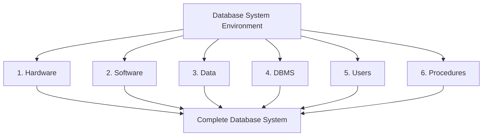
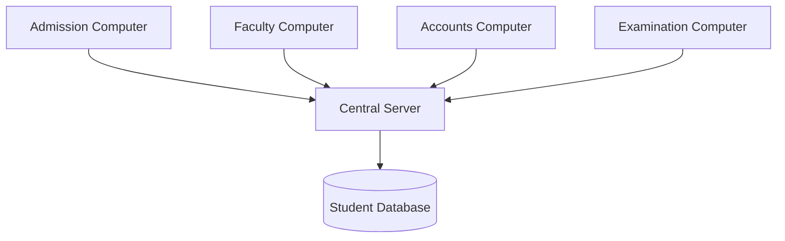
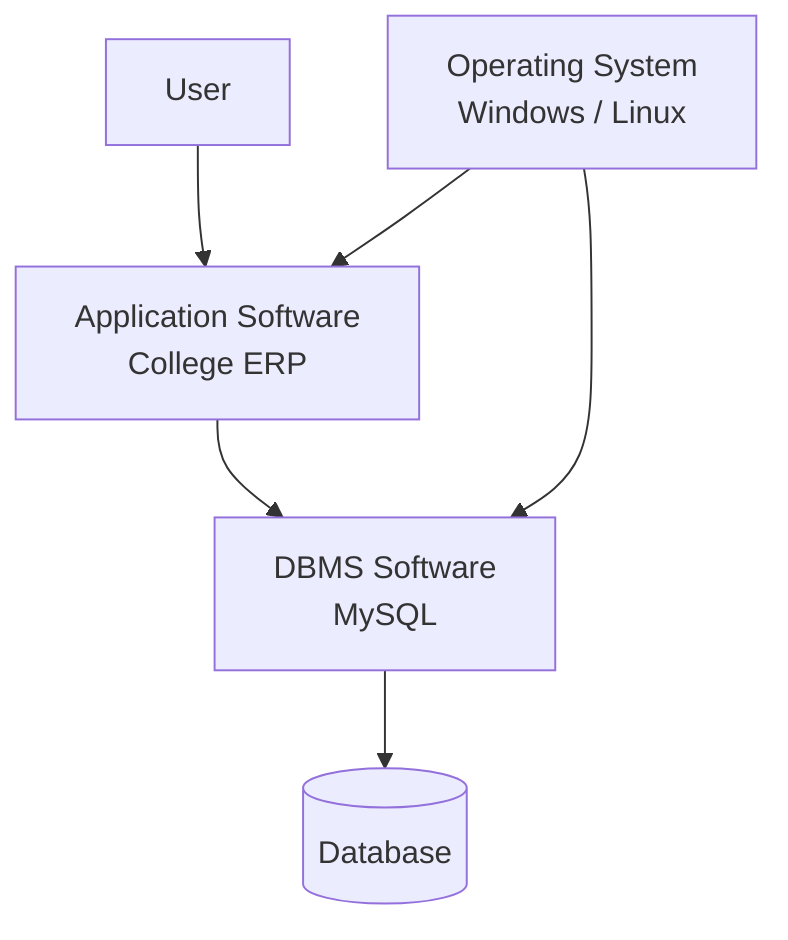
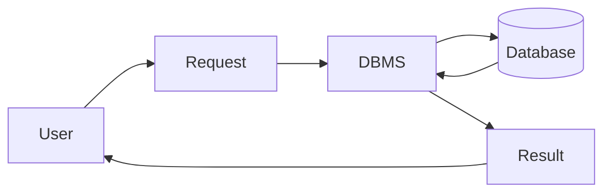
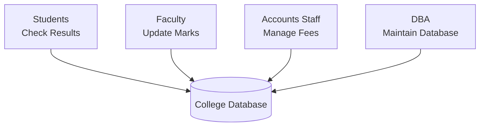
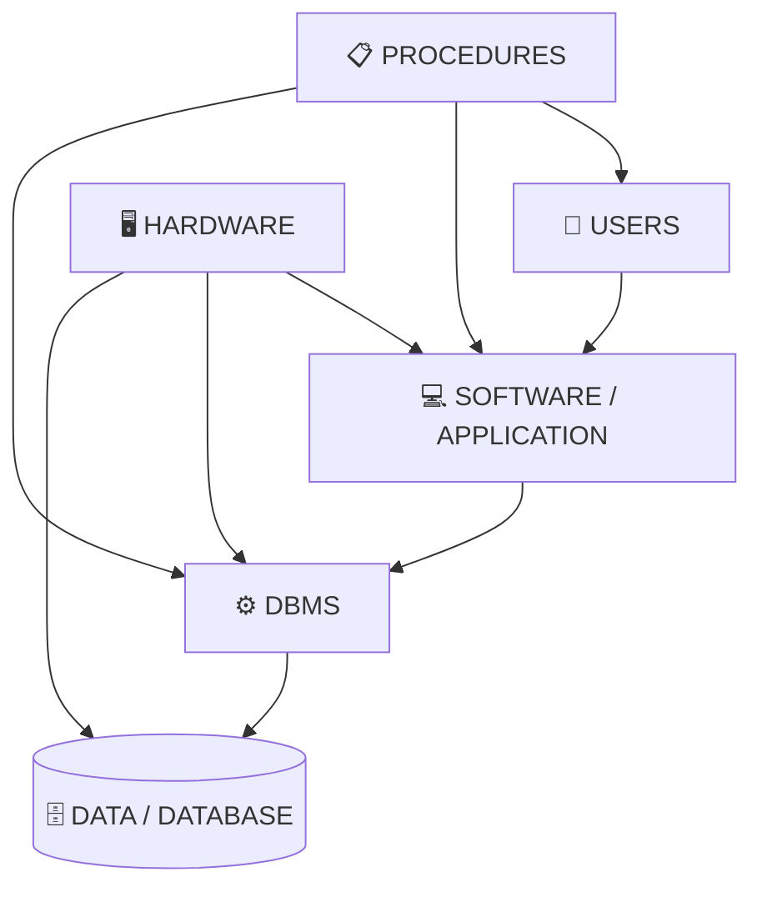
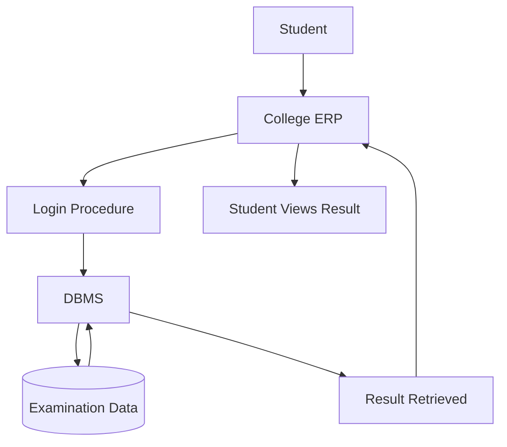

# Chapter 1 – Introduction to Database Systems

# Topic 7: Database System Environment

> **Exam Weightage:** ⭐⭐⭐⭐⭐  
> **Important Question:** *Define Database System Environment. Explain its components with a suitable example.*

---

# 1. Introduction

A database does not work alone.

For a complete database system to function properly, several components must work together:

```text
Hardware
   +
Software
   +
Data
   +
DBMS
   +
Users
   +
Procedures
   ↓
DATABASE SYSTEM ENVIRONMENT
```

A **Database System Environment** therefore represents the complete setup required to **store, manage, retrieve, access, and protect data**.

---

# 2. Definition of Database System Environment

> **A Database System Environment is the complete environment in which a Database Management System (DBMS) operates. It includes the hardware, software, data, procedures, database users, and the DBMS that work together to store, manage, retrieve, and protect data.**

This is the definition provided in the chapter. :contentReference[oaicite:0]{index=0}

---

# 3. Components of Database System Environment

The chapter explains **six major components**:

| No. | Component | Meaning |
|---:|---|---|
| 1 | **Hardware** | Physical devices |
| 2 | **Software** | Programs used by the system |
| 3 | **Data** | Facts and records stored |
| 4 | **DBMS** | Software that manages the database |
| 5 | **Users** | People who interact with the database |
| 6 | **Procedures** | Rules and instructions for operating the database |

### Complete Structure



---

# 4. Hardware

## Definition

> **Hardware refers to the physical devices used to store and access the database.**

Hardware provides the physical infrastructure required for running the database system.

The chapter gives examples such as:

- Computer
- Server
- Hard Disk / SSD
- Printer
- Network Devices

:contentReference[oaicite:1]{index=1}

---

## Examples of Hardware

```text
Hardware
│
├── Computer
├── Server
├── Hard Disk / SSD
├── Printer
└── Network Devices
```

### Purpose

| Hardware | Purpose |
|---|---|
| **Computer** | Allows users to interact with the system |
| **Server** | Stores or hosts database resources |
| **Hard Disk / SSD** | Stores database data |
| **Printer** | Prints reports and documents |
| **Network Devices** | Connect computers and database systems |

---

## College Example

The chapter gives the following example:

> A college stores all student records on a **central server connected through a campus network**. :contentReference[oaicite:2]{index=2}



### Key Idea

```text
Physical Equipment
       ↓
Hardware
       ↓
Supports Database Operations
```

---

# 5. Software

## Definition

> **Software includes the operating system, DBMS software, and application programs used to access the database.**

Software provides the programs required to operate and interact with the database system. :contentReference[oaicite:3]{index=3}

The chapter gives examples including:

```text
Operating System
→ Windows
→ Linux

DBMS Software
→ MySQL
→ Oracle
→ SQL Server

Application Software
→ College ERP Software
```

:contentReference[oaicite:4]{index=4}

---

## Software Structure

```text
Software
│
├── Operating System
│   ├── Windows
│   └── Linux
│
├── DBMS Software
│   ├── MySQL
│   ├── Oracle
│   └── SQL Server
│
└── Application Program
    └── College ERP Software
```

---

## How Software Components Work Together



### Example

A faculty member may use:

```text
College ERP
     ↓
DBMS Software
     ↓
Database
     ↓
Update Student Marks
```

---

# 6. Data

## Definition

> **Data is the most important component of the database system. It consists of all the facts and records stored in the database.**

:contentReference[oaicite:5]{index=5}

Examples given in the chapter include:

- Student records
- Employee details
- Railway ticket bookings
- Bank account information

---

## College Example

A college database may contain:

```text
College Data
│
├── Student Records
├── Faculty Records
├── Attendance Records
├── Fee Records
└── Examination Records
```

Example:

| Student_ID | Name | Course | Marks |
|---:|---|---|---:|
| 101 | Alka | BCA | 85 |
| 102 | Rahul | B.Com | 78 |

These individual facts and records represent **Data**.

---

## Key Idea

```text
Facts
   +
Records
   ↓
DATA
   ↓
Stored in Database
```

Without data, the database system has nothing meaningful to store or manage.

---

# 7. Database Management System (DBMS)

## Definition

> **The DBMS is software that manages the database by allowing users to create, retrieve, update, and delete data.**

The DBMS acts as the management layer of the database system. :contentReference[oaicite:6]{index=6}

---

## Functions of DBMS

According to the chapter, the major functions are:

```text
1. Data Storage
2. Data Retrieval
3. Security
4. Backup and Recovery
5. Transaction Management
```

---

## Explanation

| Function | Purpose |
|---|---|
| **Data Storage** | Stores data systematically |
| **Data Retrieval** | Retrieves required information |
| **Security** | Protects data |
| **Backup & Recovery** | Helps restore lost data |
| **Transaction Management** | Manages database transactions |

---

## DBMS Working



### Example

```text
Faculty
   ↓
Request to Update Marks
   ↓
DBMS
   ↓
Database
   ↓
Marks Updated
```

---

# 8. Users

## Definition

> **Users are the people who interact with the database.**

Different types of users perform different responsibilities within the database environment. :contentReference[oaicite:7]{index=7}

The chapter lists:

```text
Users
│
├── Database Administrator (DBA)
├── Application Programmers
├── End Users
└── Database Designers
```

---

# 9. Database Administrator (DBA)

The **Database Administrator** manages the database.

In the Database System Environment, the DBA is responsible for maintaining and controlling database operations.

### Example

```text
DBA
 ↓
Maintains College Database
```

---

# 10. Application Programmers

Application Programmers develop applications that interact with the database.

Example:

```text
Programmer
    ↓
Develops College ERP
    ↓
ERP Interacts with Database
```

---

# 11. End Users

End Users use applications to access data.

Examples from the chapter include:

```text
Students
   ↓
Check Results

Faculty
   ↓
Update Marks

Accounts Staff
   ↓
Manage Fees
```

---

# 12. Database Designers

Database Designers design:

```text
Database Tables
       +
Relationships
       ↓
Database Structure
```

They determine how data should be organized inside the database.

---

# 13. Users in a College Database



The chapter specifically uses these college-based user examples. :contentReference[oaicite:8]{index=8}

> **Note:** The detailed roles of DBA, Database Designer, Application Programmer, End Users, and Specialized Users are covered separately in the **next topic: DBMS Users and Roles**.

---

# 14. Procedures

## Definition

> **Procedures are the rules and instructions for operating and maintaining the database.**

Procedures ensure that users and administrators follow proper methods while working with the database. :contentReference[oaicite:9]{index=9}

---

## Examples of Procedures

The chapter lists:

```text
Procedures
│
├── User Login Procedures
├── Data Backup Procedures
├── Password Policy
└── Database Recovery Process
```

---

## Example 1 – User Login Procedure

```text
Enter Username
      ↓
Enter Password
      ↓
Verify User
      ↓
Access Granted / Denied
```

---

## Example 2 – Backup Procedure

```text
Database
    ↓
Follow Backup Rules
    ↓
Create Backup
    ↓
Store Backup Safely
```

---

## Example 3 – Recovery Procedure

```text
System Failure
      ↓
Start Recovery Process
      ↓
Use Backup
      ↓
Restore Database
```

---

# 15. Complete Database System Environment

All six components work together.



### Easy Flow

```text
USERS
  ↓
use
  ↓
SOFTWARE
  ↓
communicates with
  ↓
DBMS
  ↓
manages
  ↓
DATA

All run using
  ↓
HARDWARE

All operations follow
  ↓
PROCEDURES
```

---

# 16. College Database System Environment – Complete Example

The chapter provides a summary example of a **College Database System Environment**.

| Component | College Example |
|---|---|
| **Hardware** | Server, Computers, Network |
| **Software** | Windows, MySQL, College ERP |
| **Data** | Student, Faculty, Attendance, Fees, Examination Records |
| **DBMS** | MySQL |
| **Users** | Students, Faculty, Accounts Staff, DBA |
| **Procedures** | Login rules, Backup policy, Data entry guidelines |

This table follows the college example provided in the source. :contentReference[oaicite:10]{index=10}

---

# 17. Working of College Database System Environment

Consider a faculty member entering examination marks.

```text
Faculty
  ↓
Logs into College ERP
  ↓
Login Procedure Followed
  ↓
ERP Sends Request
  ↓
MySQL DBMS
  ↓
Student Database
  ↓
Marks Stored
```

Each component has a role:

| Component | Role in Example |
|---|---|
| **Hardware** | Computer and server run the system |
| **Software** | College ERP provides the application |
| **Data** | Student marks are stored |
| **DBMS** | MySQL manages the data |
| **User** | Faculty enters marks |
| **Procedure** | Login and data-entry rules are followed |

---

# 18. Another Example – Student Checks Result



### Components Used

```text
User
→ Student

Hardware
→ Computer

Software
→ College ERP

DBMS
→ MySQL

Data
→ Examination Record

Procedure
→ Login Rules
```

---

# 19. Advantages of Database System Environment

The chapter lists **8 advantages**:

1. Centralized data management.
2. Better security and access control.
3. Reduced data redundancy.
4. Improved data consistency.
5. Faster data retrieval.
6. Backup and recovery support.
7. Multi-user access.
8. Better decision-making through accurate information.

:contentReference[oaicite:11]{index=11}

---

# 20. Explanation of Advantages

| Advantage | Benefit |
|---|---|
| **Centralized Management** | Data can be managed systematically |
| **Better Security** | Access to data can be controlled |
| **Reduced Redundancy** | Duplicate data is minimized |
| **Improved Consistency** | Users access more consistent information |
| **Faster Retrieval** | Required information can be retrieved quickly |
| **Backup & Recovery** | Data can be protected and restored |
| **Multi-user Access** | Multiple users can use the system |
| **Better Decision-Making** | Accurate information supports management decisions |

---

# 21. Exam-Ready Answer

## Q. Define Database System Environment. Explain its components with a suitable example.

### Answer

A **Database System Environment** is the complete environment in which a Database Management System (DBMS) operates. It includes the **hardware, software, data, procedures, database users, and DBMS** that work together to store, manage, retrieve, and protect data. :contentReference[oaicite:12]{index=12}

The major components of a Database System Environment are:

### 1. Hardware

Hardware refers to the physical devices used to store and access the database.

Examples include:

- Computer
- Server
- Hard Disk / SSD
- Printer
- Network Devices

**Example:** A college stores student records on a central server connected through a campus network. :contentReference[oaicite:13]{index=13}

### 2. Software

Software includes the operating system, DBMS software and application programs used to access the database.

Examples:

- Windows
- Linux
- MySQL
- Oracle
- SQL Server
- College ERP Software

:contentReference[oaicite:14]{index=14}

### 3. Data

Data consists of the facts and records stored in the database.

Examples:

- Student records
- Employee details
- Railway ticket bookings
- Bank account information

:contentReference[oaicite:15]{index=15}

### 4. Database Management System (DBMS)

DBMS is software that manages the database by allowing users to create, retrieve, update and delete data.

Its functions include:

- Data storage
- Data retrieval
- Security
- Backup and recovery
- Transaction management

:contentReference[oaicite:16]{index=16}

### 5. Users

Users are people who interact with the database.

Types mentioned in this section include:

- Database Administrator
- Application Programmers
- End Users
- Database Designers

For example, students check results, faculty update marks, accounts staff manage fees, and the DBA maintains the college database. :contentReference[oaicite:17]{index=17}

### 6. Procedures

Procedures are rules and instructions for operating and maintaining the database.

Examples:

- User login procedures
- Data backup procedures
- Password policy
- Database recovery process

:contentReference[oaicite:18]{index=18}

### College Example

| Component | Example |
|---|---|
| Hardware | Server, Computers, Network |
| Software | Windows, MySQL, College ERP |
| Data | Student, Faculty, Attendance, Fees, Examination Records |
| DBMS | MySQL |
| Users | Students, Faculty, Accounts Staff, DBA |
| Procedures | Login rules, Backup policy, Data entry guidelines |

:contentReference[oaicite:19]{index=19}

### Conclusion

A Database System Environment is not limited to the database itself. It is a complete combination of **Hardware + Software + Data + DBMS + Users + Procedures**.

All these components work together to provide efficient storage, management, retrieval and protection of data.

---

# 22. Memory Trick 🧠

Remember the six components using:

> **H – S – D – D – U – P**

```text
H → Hardware
S → Software
D → Data
D → DBMS
U → Users
P → Procedures
```

### Easy Sentence

> **"Hardware & Software Deal with Data Using Procedures."**

Or visualize:

```text
HARDWARE
   ↓
SOFTWARE
   ↓
DBMS
   ↓
DATA
   ↑
USERS
   +
PROCEDURES
```

---

# 23. Quick Difference Between Components

| Component | One-Word Memory | Example |
|---|---|---|
| Hardware | **Physical** | Server |
| Software | **Programs** | College ERP |
| Data | **Records** | Student Details |
| DBMS | **Manager** | MySQL |
| Users | **People** | Faculty |
| Procedures | **Rules** | Backup Policy |

---

# 24. SQL Query and Output

> **Note:** The Database System Environment section of the source does **not provide specific SQL queries or table records**. The following is an illustrative example using the earlier Student table from the same chapter.

## Query – Retrieve Student Records

```sql
SELECT *
FROM Student;
```

### SQL Output

| Student_ID | Name | Course | Mobile |
|---:|---|---|---|
| 101 | Alka | BCA | 9876543210 |
| 102 | Rahul | B.Com | 9876501234 |

---

## Query – Retrieve Student 101

```sql
SELECT *
FROM Student
WHERE Student_ID = 101;
```

### SQL Output

| Student_ID | Name | Course | Mobile |
|---:|---|---|---|
| 101 | Alka | BCA | 9876543210 |

---

## Query – Retrieve Examination Record

```sql
SELECT *
FROM Examination
WHERE Student_ID = 101;
```

### SQL Output

| Student_ID | Subject | Marks |
|---:|---|---:|
| 101 | DBMS | 85 |

The output values above come from the Student and Examination tables provided earlier in the chapter. :contentReference[oaicite:20]{index=20}

---

# 25. Final 30-Second Revision

```text
       DATABASE SYSTEM ENVIRONMENT
                  │
      ┌───────────┼───────────┐
      │           │           │
      ▼           ▼           ▼
  HARDWARE     SOFTWARE      DATA
  Physical     Programs     Records

      │           │           │
      └───────────┼───────────┘
                  ▼
                 DBMS
               Manager
                  │
          ┌───────┴───────┐
          ▼               ▼
        USERS         PROCEDURES
        People           Rules
```

### One-Line Formula

```text
Database System Environment
=
Hardware
+ Software
+ Data
+ DBMS
+ Users
+ Procedures
```

> **Next Topic – Topic 8: DBMS Users and Roles**  
> Covers **Database Administrator (DBA), Database Designer, Application Programmer, End Users and their types, Specialized Users**, followed by the **College Management and Railway Reservation examples**, comparison table, exam-ready answer, and SQL outputs in table format.