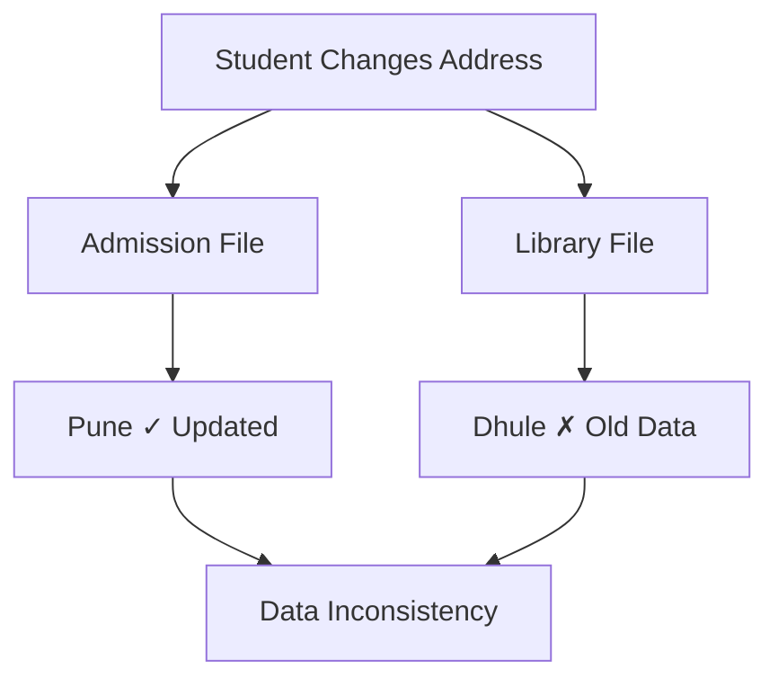
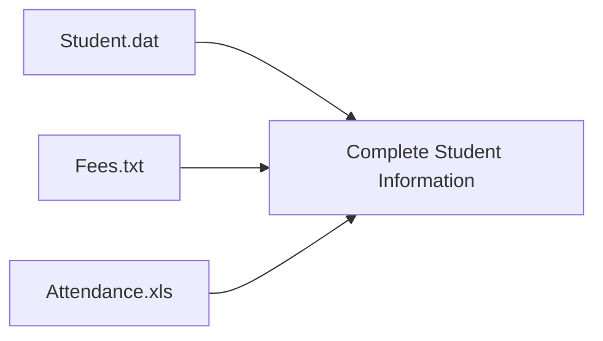
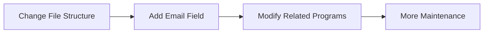
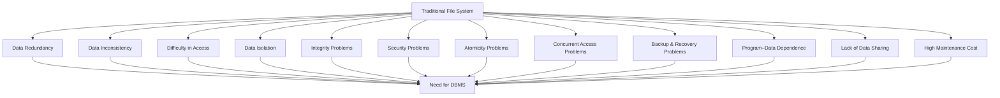

# Chapter 1 – Introduction to Database Systems

# Topic 3: Drawbacks of File System

> **Exam Weightage:** ⭐⭐⭐⭐⭐  
> **Important Question:** *Explain the drawbacks / limitations of the traditional File System with suitable examples.*

---

# 1. Introduction

A **File System** stores data in separate files, and each application or department may maintain its own files.

Although File Systems are **simple and easy to use**, they create many problems when the amount of data and number of users increase.

These limitations led to the development of the **Database Management System (DBMS)**. :contentReference[oaicite:0]{index=0}

The major drawbacks are:

```text
1. Data Redundancy
2. Data Inconsistency
3. Difficulty in Accessing Data
4. Data Isolation
5. Integrity Problems
6. Security Problems
7. Atomicity Problems
8. Concurrent Access Problems
9. Backup and Recovery Problems
10. Program–Data Dependence
11. Lack of Data Sharing
12. High Maintenance Cost
```

---

# 2. Data Redundancy

## Definition

> **Data Redundancy means storing the same data repeatedly in multiple files.**

When different departments maintain separate files, the same information may be duplicated many times.

### Example

Suppose a college stores student details in:

```text
Student: Rahul
Roll No: 101
Address: Dhule
```

The same information may appear in:

```text
Admission File
     │
     ├── Rahul | 101 | Dhule
     │
Library File
     │
     ├── Rahul | 101 | Dhule
     │
Examination File
     │
     └── Rahul | 101 | Dhule
```

The student's **name, roll number and address** are stored repeatedly.

### Result

- Storage space is wasted.
- Duplicate data must be maintained separately.
- Updating information becomes difficult.

The chapter uses exactly this college example to explain redundancy. :contentReference[oaicite:1]{index=1}

### Memory

```text
Same Data + Multiple Files
          ↓
     REDUNDANCY
```

---

# 3. Data Inconsistency

## Definition

> **Data Inconsistency occurs when the same data has different values in different files because one file is updated while another is not.**

### Example

Suppose a student changes her address:

```text
Old Address → Dhule
New Address → Pune
```

Only one file is updated:

```text
Admission File → Pune  ✓ Updated

Library File   → Dhule ✗ Not Updated
```

Now the same student has **two different addresses**.



### Result

- Incorrect reports
- Confusion
- Unreliable information

The document explains this exact address-change scenario. :contentReference[oaicite:2]{index=2}

### Key Difference

```text
REDUNDANCY
= Same data stored multiple times

INCONSISTENCY
= Same data has different values
```

---

# 4. Difficulty in Accessing Data

## Meaning

Finding specific or complex information from separate files is difficult because a **separate program may be required for each query or requirement**.

### Example

Suppose the principal asks:

> **"List all students whose fees are pending and attendance is below 75%."**

The required information exists in different files:

```text
Fees File
    │
    └── Fee Status
          +
Attendance File
    │
    └── Attendance %
          ↓
Need Combined Result
```

The programmer must manually combine information from multiple files.

### Result

- Time-consuming
- Difficult to retrieve complex information
- Less flexible

This example is directly used in the chapter. :contentReference[oaicite:3]{index=3}

---

# 5. Data Isolation

## Definition

> **Data Isolation occurs when related data is stored in different files, formats, and locations, making it difficult to combine and access.**

### Example

Student information may be stored as:

```text
Student.dat
Fees.txt
Attendance.xls
```

These files use different formats.



Combining them is difficult because the data is **isolated across separate files**.

### Result

> Retrieving complete student information becomes difficult.

The chapter uses these three file formats to demonstrate Data Isolation. :contentReference[oaicite:4]{index=4}

---

# 6. Integrity Problems

## Definition

> **Data Integrity means maintaining the accuracy and validity of data.**

In a traditional File System, it is difficult to automatically enforce rules and constraints on data.

### Example

Suppose a student's valid age should be:

```text
16 ≤ Age ≤ 30
```

But the File System may allow:

```text
Age = 5   ✗

Age = 100 ✗
```

There may be no automatic validation preventing these invalid values.

### Result

> Incorrect and invalid data may be stored.

The document uses the age range of **16 to 30 years** to explain this integrity problem. :contentReference[oaicite:5]{index=5}

### Memory

```text
Integrity
   =
Correct + Valid Data
```

---

# 7. Security Problems

## Meaning

Traditional File Systems provide **limited security**.

Unauthorized users may gain access to sensitive files and may:

- View data
- Modify data
- Delete data

### Example

Consider:

```text
Salary_Record.xlsx
```

If every employee who has access to this file can modify it:

```text
Employee
   ↓
Salary File
   ↓
Changes Salary
   ↓
Unauthorized Modification
```

### Result

> There is a risk of **data theft and misuse**.

The chapter gives the example of an employee changing salary records to demonstrate limited File System security. :contentReference[oaicite:6]{index=6}

---

# 8. Atomicity Problems

## Definition

> **Atomicity means that a transaction should be completed entirely or not at all.**

A File System cannot reliably guarantee atomicity.

### Example – Bank Transfer

Suppose:

```text
Transfer ₹5,000
Account A → Account B
```

Normal transaction:

```text
Account A
₹5,000 Deducted
      ↓
Account B
₹5,000 Added
      ↓
Transaction Complete ✓
```

But suppose the system crashes:

```text
Account A
₹5,000 Deducted ✓
      ↓
 SYSTEM CRASH 💥
      ↓
Account B
₹5,000 NOT Added ✗
```

### Result

```text
₹5,000 is lost.
```

The chapter uses this bank-transfer example to explain an Atomicity Problem. :contentReference[oaicite:7]{index=7}

### Golden Rule

```text
Atomicity = ALL or NOTHING

Either:
100% Transaction ✓

OR

0% Transaction ✓

Never:
50% Transaction ✗
```

---

# 9. Concurrent Access Problems

## Definition

> **Concurrent Access means multiple users accessing or modifying the same data at the same time.**

In a File System, simultaneous updates can cause conflicts.

### Example

Two clerks update the same student's fee record simultaneously.

```text
Original Fee Record
       │
       ├───────────────┐
       ▼               ▼
    Clerk A          Clerk B
   ₹5,000            ₹3,000
       │               │
       └───────┬───────┘
               ▼
       Update Conflict
```

One update may **overwrite the other**.

### Result

> The student's fee balance may become incorrect.

The source uses the same example of two clerks recording ₹5,000 and ₹3,000 simultaneously. :contentReference[oaicite:8]{index=8}

---

# 10. Backup and Recovery Problems

## Meaning

Traditional File Systems have **limited backup and recovery facilities**.

If hardware fails or a file is accidentally deleted, recovering the lost information may be difficult.

### Example

```text
Examination Result File
          ↓
Stored on Hard Disk
          ↓
     Hard Disk Crash 💥
          ↓
No Recent Backup
          ↓
Permanent Data Loss
```

### Result

> Important data cannot be recovered easily.

The chapter gives the example of an examination result file being permanently lost after a hard disk crash before backup. :contentReference[oaicite:9]{index=9}

---

# 11. Program–Data Dependence

## Definition

> **Program–Data Dependence means application programs are tightly connected to the structure or format of their data files.**

If the file structure changes, related application programs may also need modification.

### Example

Initially:

```text
Student File

Roll No
Name
Class
```

Later, a new field is added:

```text
Student File

Roll No
Name
Class
Email ← NEW FIELD
```

Now programs designed according to the old structure may require changes.



### Result

> Increased maintenance cost and time.

This is the example given in the chapter for Program–Data Dependence. :contentReference[oaicite:10]{index=10}

### Memory

```text
DATA STRUCTURE CHANGES
        ↓
PROGRAM CHANGES

= Program–Data Dependence
```

---

# 12. Lack of Data Sharing

## Meaning

Different departments may maintain their own separate files.

Therefore, sharing information between departments becomes difficult.

### Example

Suppose the **Accounts Department** needs student attendance data for scholarship processing.

```text
Accounts Department
        │
        │ Needs Attendance
        ▼
Attendance Department
        │
        ▼
Different File Format
        │
        ▼
Difficult Data Sharing
```

### Result

> Data cannot be shared easily between departments.

The chapter specifically uses Accounts and Attendance departments as the example. :contentReference[oaicite:11]{index=11}

---

# 13. High Maintenance Cost

## Meaning

A traditional File System may require separate programs for:

```text
Creating Data
Updating Data
Deleting Data
Retrieving Data
```

Different departments may also use separate software systems.

### College Example

```text
College
│
├── Admission Software
├── Library Software
├── Accounts Software
└── Examination Software
```

Each application:

```text
Separate Software
      +
Separate Files
      +
Separate Maintenance
      ↓
HIGH MAINTENANCE COST
```

### Result

> More development effort, maintenance time, and cost are required.

The document explains this using separate software for Admissions, Library, Accounts, and Examination. :contentReference[oaicite:12]{index=12}

---

# 14. Summary Table – Drawbacks of File System

| Drawback | Main Effect | Example |
|---|---|---|
| **Data Redundancy** | Duplicate data | Student details stored in multiple files |
| **Data Inconsistency** | Different values for same data | Address updated in only one file |
| **Difficulty in Access** | Hard to retrieve information | Complex student report |
| **Data Isolation** | Data separated across files | Student, Fees and Attendance in different formats |
| **Integrity Problems** | Invalid data | Age entered as 100 |
| **Security Problems** | Unauthorized access | Employee changes salary |
| **Atomicity Problems** | Partial transaction | Bank transfer interrupted |
| **Concurrent Access** | Conflicting updates | Two clerks update fees simultaneously |
| **Backup & Recovery** | Data loss | Hard disk failure |
| **Program–Data Dependence** | Programs require modification | Adding Email requires code changes |
| **Lack of Data Sharing** | Difficult departmental sharing | Accounts cannot directly access attendance |
| **High Maintenance Cost** | More time and expense | Separate software for each department |

This summary follows the chapter's consolidated drawback table. :contentReference[oaicite:13]{index=13}

---

# 15. Complete Concept Diagram



---

# 16. Exam-Ready Answer

## Q. Explain the drawbacks of the traditional File System.

### Answer

A **File System** stores data in separate files where each application may maintain its own data. Although it is simple and easy to use, it has several limitations that led to the development of **Database Management Systems (DBMS)**. :contentReference[oaicite:14]{index=14}

The major drawbacks are:

### 1. Data Redundancy

The same data may be stored repeatedly in multiple files.

**Example:** Student name, roll number and address may exist in Admission, Library and Examination files.

**Result:** Storage is wasted and duplicate data becomes difficult to maintain.

### 2. Data Inconsistency

When one copy of data is updated but another is not, different values exist for the same information.

**Example:** A student's address is updated in the Admission File but not in the Library File.

**Result:** Incorrect reports and confusion.

### 3. Difficulty in Accessing Data

Retrieving complex information from multiple files is difficult and may require separate programs.

**Example:** Finding students with pending fees and attendance below 75%.

### 4. Data Isolation

Related data may be stored in different files and formats.

**Example:** `Student.dat`, `Fees.txt`, and `Attendance.xls`.

**Result:** Combining information becomes difficult.

### 5. Integrity Problems

Validation rules are difficult to enforce.

**Example:** A system may accept an invalid student age such as `5` or `100`.

### 6. Security Problems

File Systems provide limited protection against unauthorized access.

**Example:** An employee with access to a salary file may modify salary records.

### 7. Atomicity Problems

A transaction may be partially completed.

**Example:** ₹5,000 is deducted from Account A, but the system crashes before adding it to Account B.

### 8. Concurrent Access Problems

Multiple users updating the same file simultaneously may cause conflicting results.

**Example:** Two clerks update the same student's fee record at the same time.

### 9. Backup and Recovery Problems

Recovering data after hardware or system failure is difficult.

**Example:** Examination records may be permanently lost after a hard disk crash.

### 10. Program–Data Dependence

Programs depend heavily on file structures.

**Example:** Adding an `Email` field may require modification of related application programs.

### 11. Lack of Data Sharing

Different departments maintain separate files, making sharing difficult.

**Example:** Accounts may find it difficult to obtain Attendance data.

### 12. High Maintenance Cost

Separate applications and files require independent development and maintenance.

**Example:** Separate systems for Admission, Library, Accounts and Examination increase cost and effort.

### Conclusion

Traditional File Systems are suitable for simple applications but suffer from serious problems such as **redundancy, inconsistency, security issues, poor data sharing, atomicity problems, concurrent access conflicts, and difficult backup and recovery**.

Therefore, these limitations created the need for a **Database Management System (DBMS)**.

---

# 17. Memory Trick 🧠

Remember the 12 drawbacks using this sequence:

```text
R → Redundancy
I → Inconsistency
A → Access Difficulty
I → Isolation
I → Integrity
S → Security
A → Atomicity
C → Concurrent Access
B → Backup & Recovery
P → Program–Data Dependence
S → Sharing Problems
M → Maintenance Cost
```

### Quick Revision Chain

```text
REDUNDANCY
    ↓
INCONSISTENCY
    ↓
ACCESS DIFFICULTY
    ↓
ISOLATION
    ↓
INTEGRITY
    ↓
SECURITY
    ↓
ATOMICITY
    ↓
CONCURRENCY
    ↓
BACKUP
    ↓
PROGRAM DEPENDENCE
    ↓
SHARING
    ↓
MAINTENANCE
```

---

# 18. Output

### Example Scenario

```text
Student: Rahul
Roll No: 101

Admission File:
101 | Rahul | Pune

Library File:
101 | Rahul | Dhule

Examination File:
101 | Rahul | Dhule
```

### Output / Result

```text
Problem Detected:

✓ Data Redundancy
  Rahul's data exists in multiple files.

✓ Data Inconsistency
  Admission File = Pune
  Library File   = Dhule
  Examination    = Dhule

Result:
Different files contain conflicting information
for the same student.
```

---

# 19. Query Result

> A traditional File System does **not provide SQL-based querying like a DBMS**, so the chapter does not provide an SQL query for this topic.

### Example Requirement

```text
Query / Request:

Find all students
WHERE:
Fee Status = Pending
AND
Attendance < 75%
```

### Required File Processing

```text
Fees File
   │
   ├── Find Pending Students
   │
   ▼
Attendance File
   │
   ├── Find Attendance < 75%
   │
   ▼
Manually Combine Both Results
   │
   ▼
Final Student List
```

### Result

```text
Complex request requires data
from multiple separate files.

Result:
Retrieval becomes difficult,
time-consuming and less flexible.
```

This directly reflects the chapter's example of retrieving students whose fees are pending and attendance is below 75%. :contentReference[oaicite:15]{index=15}

---

> **Next Topic — Topic 4: Database Management System (DBMS)**  
> Definition → Characteristics → Advantages → Disadvantages → College Database Example → Tables → SQL Query → Query Result.