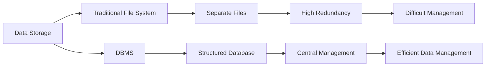
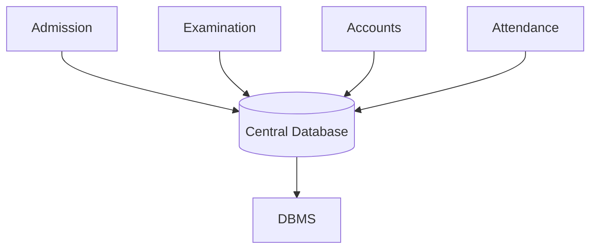
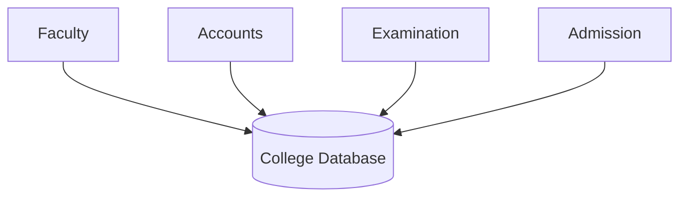
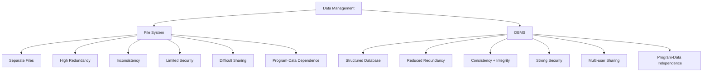

# Chapter 1 – Introduction to Database Systems

# Topic 5: File System vs Database Management System (DBMS)

> **Exam Weightage:** ⭐⭐⭐⭐⭐  
> **Important Question:** *Differentiate between File System and Database Management System (DBMS).*  
> **Exam Tip:** For a **5-mark answer**, write at least **6–8 differences**. For a **10-mark answer**, explain all **12 differences with examples**.

---

# 1. Introduction

A **File System** and a **Database Management System (DBMS)** are both used to store and manage data, but they work in very different ways.

In a traditional **File System**, data is stored in separate files such as:

```text
Student.xlsx
Marks.xlsx
Fees.xlsx
Attendance.xlsx
```

In a **DBMS**, related data is stored in a structured and centrally managed database.

```text
Student Table
Fees Table
Examination Table
Attendance Table
        │
        ▼
     Database
        │
        ▼
       DBMS
```

The major difference is:

> **File System → Data is stored and managed through separate files.**

> **DBMS → Data is stored in a structured database and centrally managed by database management software.**

The source compares the two systems across storage, control, redundancy, consistency, security, sharing, recovery, concurrency, data independence, querying, suitability, and examples. :contentReference[oaicite:0]{index=0}

---

# 2. Basic Concept



---

# 3. File System vs DBMS – Complete Comparison

| Basis | File System | Database System (DBMS) |
|---|---|---|
| **1. Data Storage** | Data is stored in separate files. | Data is stored in a structured database. |
| **2. Data Control** | No central control over data. | Data is centrally managed by the DBMS. |
| **3. Data Redundancy** | High data redundancy or duplicate data. | Reduces data redundancy through normalization. |
| **4. Data Consistency** | Data inconsistency is common. | Maintains data consistency and integrity. |
| **5. Security** | Provides limited data security. | Provides strong security using authentication and access control. |
| **6. Data Sharing** | Difficult to share data among multiple users. | Supports data sharing among multiple users simultaneously. |
| **7. Backup & Recovery** | No proper backup and recovery mechanism. | Provides backup and recovery features. |
| **8. Concurrent Access** | Does not effectively support concurrent access. | Supports concurrent access using transaction management. |
| **9. Program–Data Relationship** | Program–data dependence exists. | Provides program–data independence. |
| **10. Querying** | Querying is difficult and requires custom programs. | Uses SQL for easy data retrieval and manipulation. |
| **11. Suitability** | Suitable for small applications. | Suitable for large and complex applications. |
| **12. Examples** | Text files, Excel files, CSV files. | MySQL, Oracle Database, Microsoft SQL Server. |

This comparison follows the 12-point table provided in the chapter. :contentReference[oaicite:1]{index=1}

---

# 4. Detailed Explanation of Differences

## 1. Data Storage

### File System

Data is stored in **separate individual files**.

Example:

```text
College Records
│
├── Student.xlsx
├── Marks.xlsx
├── Fees.xlsx
└── Attendance.xlsx
```

Each file stores a particular type of information.

### DBMS

Data is stored in a **structured database**.

```text
College Database
│
├── Student Table
├── Examination Table
├── Fees Table
└── Attendance Table
```

### Key Difference

```text
File System → Separate Files

DBMS → Structured Database
```

---

# 5. Central Control Over Data

## File System

There is **no central control** over all data.

Different departments may maintain their own files.

```text
Admission → Student.xlsx

Examination → Marks.xlsx

Accounts → Fees.xlsx

Attendance → Attendance.xlsx
```

Each department manages its files separately.

---

## DBMS

Data is **centrally managed by the DBMS**.



This provides better control and management of data.

---

# 6. Data Redundancy

## File System

The same information may be stored repeatedly.

Example:

```text
Student File:
101 | Alka | BCA

Fees File:
101 | Alka | BCA | Paid

Marks File:
101 | Alka | BCA | 85
```

Here:

```text
101 | Alka | BCA
```

is repeated.

Therefore:

```text
Same Data
   +
Multiple Files
   ↓
High Data Redundancy
```

---

## DBMS

DBMS reduces redundancy by organizing related information into tables.

Example:

```text
Student Table

101 | Alka | BCA
```

Other tables can identify the student using:

```text
Student_ID = 101
```

```text
Student Table
101 | Alka | BCA
      │
      │ Student_ID
   ┌──┴─────────┐
   ▼            ▼
Fees Table    Exam Table
101 | Paid     101 | 85
```

### Key Difference

```text
File System → High Redundancy

DBMS → Reduced Redundancy
```

The chapter specifically states that DBMS reduces redundancy through **normalization**. :contentReference[oaicite:2]{index=2}

---

# 7. Data Consistency and Integrity

## File System

Data inconsistency is common.

Example:

```text
Student changes address:

Old Address → Dhule
New Address → Pune
```

Different files:

```text
Admission File → Pune ✓

Library File   → Dhule ✗

Fees File      → Dhule ✗
```

The same student now has different addresses.

---

## DBMS

DBMS maintains better **data consistency and integrity**.

```text
Student Record

Address:
Dhule
  ↓
UPDATE
  ↓
Pune
```

The database maintains the updated information in its structured records.

### Key Difference

```text
File System
     ↓
Data Inconsistency

DBMS
     ↓
Data Consistency + Integrity
```

---

# 8. Data Security

## File System

Security is limited.

A user who gets access to a file may potentially:

```text
READ
MODIFY
DELETE
```

Example:

```text
Salary_Record.xlsx
```

Unauthorized modification may be difficult to control.

---

## DBMS

DBMS provides stronger security through:

- User authentication
- Passwords
- User permissions
- Access control

Example:

```text
Student
   ↓
View Results ✓
Modify Marks ✗

Faculty
   ↓
View Results ✓
Update Marks ✓

Accounts Staff
   ↓
Update Fees ✓

DBA
   ↓
Database Management ✓
```

### Key Difference

```text
File System → Limited Security

DBMS → Authentication + Access Control
```

The chapter explicitly contrasts limited File System security with DBMS security based on authentication and access control. :contentReference[oaicite:3]{index=3}

---

# 9. Data Sharing

## File System

Sharing information between multiple users or departments is difficult.

Example:

```text
Accounts Department
       ↓
Needs Attendance Data
       ↓
Attendance Department
       ↓
Separate File
       ↓
Difficult Sharing
```

---

## DBMS

Multiple users can work with the same database.



### Key Difference

```text
File System
→ Difficult Data Sharing

DBMS
→ Multi-user Data Sharing
```

---

# 10. Backup and Recovery

## File System

The chapter states that the traditional File System does not provide a proper built-in backup and recovery mechanism.

```text
File
 ↓
Hard Disk Failure 💥
 ↓
Data Loss
```

---

## DBMS

DBMS provides backup and recovery facilities.

```text
Database
    ↓
  Backup
    ↓
System Failure 💥
    ↓
 Recovery
    ↓
Data Restored ✓
```

### Key Difference

```text
File System → Poor / No Proper Recovery Mechanism

DBMS → Backup + Recovery
```

The source makes this comparison directly. :contentReference[oaicite:4]{index=4}

---

# 11. Concurrent Access

## What is Concurrent Access?

> **Concurrent Access means multiple users accessing or updating data at the same time.**

---

## File System

Traditional File Systems do not effectively manage simultaneous updates.

Example:

```text
Student Fee Record
       │
   ┌───┴───┐
   ▼       ▼
Clerk A   Clerk B
₹5,000    ₹3,000
   │       │
   └───┬───┘
       ▼
Update Conflict
```

One update may overwrite another.

---

## DBMS

DBMS supports concurrent access using **transaction management**.

```text
Multiple Users
      ↓
Transaction Management
      ↓
Controlled Database Access
      ↓
Correct Data
```

### Key Difference

```text
File System
→ Poor Concurrent Access

DBMS
→ Controlled Concurrent Access
```

The chapter attributes effective DBMS concurrent access to transaction management. :contentReference[oaicite:5]{index=5}

---

# 12. Program–Data Dependence vs Independence

## File System – Program–Data Dependence

Programs are closely connected with file structures.

Suppose initially:

```text
Student File

Roll_No
Name
Class
```

Later:

```text
Student File

Roll_No
Name
Class
Email ← New Field
```

The related programs may require modification.

Therefore:

```text
File Structure Changes
        ↓
Program Changes
```

This is called:

> **Program–Data Dependence**

---

## DBMS – Program–Data Independence

The chapter describes DBMS as providing **program–data independence**, meaning programs are less tightly dependent on the physical/file structure of data.

```text
Database Structure
       ↕
      DBMS
       ↕
Application
```

### Key Difference

```text
FILE SYSTEM
Data Change → Program Change

DBMS
Provides Program–Data Independence
```

The chapter directly contrasts these two concepts. :contentReference[oaicite:6]{index=6}

---

# 13. Querying and Data Retrieval

## File System

Complex data retrieval may require custom programs.

Example requirement:

```text
Find all BCA students
with marks above 80.
```

In separate files:

```text
Student File
     +
Marks File
     ↓
Custom Processing
     ↓
Result
```

---

## DBMS

DBMS uses **SQL** for easier retrieval and manipulation.

Example:

```sql
SELECT *
FROM Student
WHERE Course = 'BCA';
```

### Key Difference

```text
File System
→ Custom Programs / Difficult Querying

DBMS
→ SQL Queries / Easier Retrieval
```

The chapter specifically identifies SQL as the DBMS mechanism for easy retrieval and manipulation. :contentReference[oaicite:7]{index=7}

---

# 14. Suitability

## File System

Best suited for:

- Small applications
- Simple storage requirements
- Limited users
- Small amounts of data

Example:

```text
Personal Student Record.xlsx
```

---

## DBMS

Best suited for:

- Large applications
- Complex data
- Multiple users
- Organizations
- Enterprise systems

Examples include:

```text
College Management System

Banking System

Railway Reservation System

Hospital Management System
```

### Key Difference

```text
File System → Small Applications

DBMS → Large and Complex Applications
```

---

# 15. Examples

## File System Examples

According to the chapter:

```text
Text Files
Excel Files
CSV Files
```

## DBMS Examples

According to the chapter:

```text
MySQL
Oracle Database
Microsoft SQL Server
```

:contentReference[oaicite:8]{index=8}

---

# 16. Complete Visual Comparison



---

# 17. Real-Life College Example

## Using File System

Suppose a college stores:

```text
College Records
│
├── Admission
│   └── Student.xlsx
│
├── Examination
│   └── Marks.xlsx
│
├── Accounts
│   └── Fees.xlsx
│
└── Attendance
    └── Attendance.xlsx
```

Problems may include:

```text
Duplicate Student Data
        ↓
Different Values
        ↓
Difficult Sharing
        ↓
Difficult Retrieval
        ↓
Maintenance Problems
```

---

## Using DBMS

The same college can use:

```text
College Database
│
├── Student Table
├── Fees Table
├── Examination Table
└── Attendance Table
```

These tables can use a common identifier such as:

```text
Student_ID
```

Example:

### Student Table

| Student_ID | Name | Course | Mobile |
|---:|---|---|---|
| 101 | Alka | BCA | 9876543210 |
| 102 | Rahul | B.Com | 9876501234 |

### Fees Table

| Student_ID | Fee_Status |
|---:|---|
| 101 | Paid |
| 102 | Pending |

### Examination Table

| Student_ID | Subject | Marks |
|---:|---|---:|
| 101 | DBMS | 85 |
| 102 | DBMS | 78 |

These records are the college DBMS example used immediately before the File System vs DBMS comparison in the chapter. :contentReference[oaicite:9]{index=9}

---

# 18. Exam-Ready Answer

## Q. Differentiate between File System and Database Management System (DBMS).

### Answer

A **File System** stores data in separate files and folders, whereas a **Database Management System (DBMS)** stores data in a structured database and provides centralized facilities for managing, retrieving, securing, updating, and sharing data.

The major differences are:

| File System | Database Management System (DBMS) |
|---|---|
| Data is stored in separate files. | Data is stored in a structured database. |
| No central control over data. | Data is centrally managed by DBMS. |
| High data redundancy. | Reduces redundancy through normalization. |
| Data inconsistency is common. | Maintains consistency and integrity. |
| Provides limited security. | Provides authentication and access control. |
| Data sharing is difficult. | Supports sharing among multiple users. |
| No proper built-in backup and recovery mechanism. | Provides backup and recovery features. |
| Does not effectively support concurrent access. | Supports concurrency through transaction management. |
| Has program–data dependence. | Provides program–data independence. |
| Querying requires custom programs. | Uses SQL for easy retrieval and manipulation. |
| Suitable for small applications. | Suitable for large and complex applications. |
| Examples: Text, Excel and CSV files. | Examples: MySQL, Oracle Database and Microsoft SQL Server. |

:contentReference[oaicite:10]{index=10}

### Conclusion

A **File System** is simple and suitable for small applications, but it suffers from limitations such as redundancy, inconsistency, limited security, difficult sharing, and program–data dependence.

A **DBMS** overcomes many of these limitations by providing structured and centralized data management, better security, consistency, multi-user access, backup and recovery, transaction management, and SQL-based querying.

Therefore:

```text
Small + Simple Data
        ↓
   File System

Large + Structured + Multi-user Data
        ↓
       DBMS
```

---

# 19. Memory Trick 🧠

Remember the comparison using:

> **S-C-R-C-S-S-B-C-P-Q-S-E**

```text
S → Storage
C → Central Control
R → Redundancy
C → Consistency
S → Security
S → Sharing
B → Backup
C → Concurrent Access
P → Program–Data Relationship
Q → Querying
S → Suitability
E → Examples
```

### One-Line Revision

```text
FILE SYSTEM
Separate → Duplicate → Inconsistent → Limited

                VS

DBMS
Structured → Centralized → Consistent → Secure
```

---

# 20. SQL Query and Output

> **Note:** SQL is a feature associated with the DBMS side of this comparison. The chapter states that File System querying requires custom programs, while DBMS uses SQL for easier data retrieval and manipulation. :contentReference[oaicite:11]{index=11}

The following queries are illustrative examples based on the chapter's Student, Fees, and Examination tables.

---

## Query 1 – Display All Students

```sql
SELECT * FROM Student;
```

### SQL Output

| Student_ID | Name | Course | Mobile |
|---:|---|---|---|
| 101 | Alka | BCA | 9876543210 |
| 102 | Rahul | B.Com | 9876501234 |

---

## Query 2 – Display Only BCA Students

```sql
SELECT *
FROM Student
WHERE Course = 'BCA';
```

### SQL Output

| Student_ID | Name | Course | Mobile |
|---:|---|---|---|
| 101 | Alka | BCA | 9876543210 |

---

## Query 3 – Find Students with Pending Fees

```sql
SELECT *
FROM Fees
WHERE Fee_Status = 'Pending';
```

### SQL Output

| Student_ID | Fee_Status |
|---:|---|
| 102 | Pending |

---

## Query 4 – Find Marks of Student 101

```sql
SELECT *
FROM Examination
WHERE Student_ID = 101;
```

### SQL Output

| Student_ID | Subject | Marks |
|---:|---|---:|
| 101 | DBMS | 85 |

---

# 21. Final 30-Second Revision

```text
┌──────────────────┬────────────────────────┐
│   FILE SYSTEM    │          DBMS          │
├──────────────────┼────────────────────────┤
│ Separate Files   │ Structured Database    │
│ No Central Ctrl  │ Central Management     │
│ High Redundancy  │ Reduced Redundancy     │
│ Inconsistency    │ Consistency + Integrity│
│ Limited Security │ Strong Security        │
│ Difficult Sharing│ Multi-user Sharing     │
│ Poor Recovery    │ Backup + Recovery      │
│ Weak Concurrency │ Transaction Management │
│ Data Dependent   │ Data Independent       │
│ Custom Programs  │ SQL Queries            │
│ Small Systems    │ Large Systems          │
└──────────────────┴────────────────────────┘
```

> **Next Topic – Topic 6: Advantages and Applications of DBMS**  
> Covers the **10 detailed advantages** from the document—Redundancy, Consistency, Security, Sharing, Backup & Recovery, Integrity, Faster Retrieval, Concurrent Access, Data Independence, Better Decision Making—followed by DBMS applications, SQL queries, and **all SQL outputs in table format**.