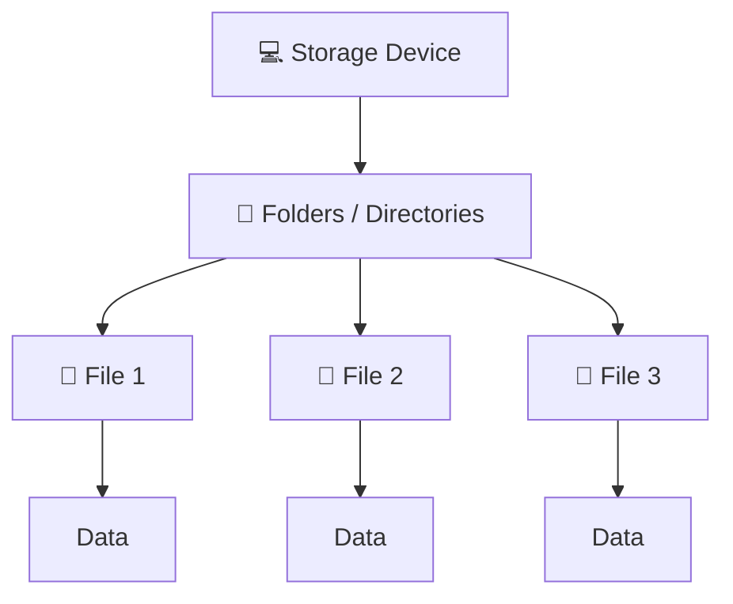
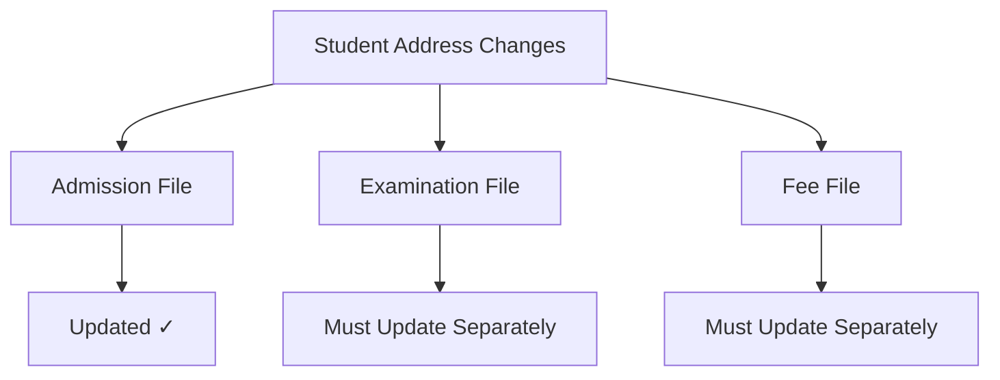
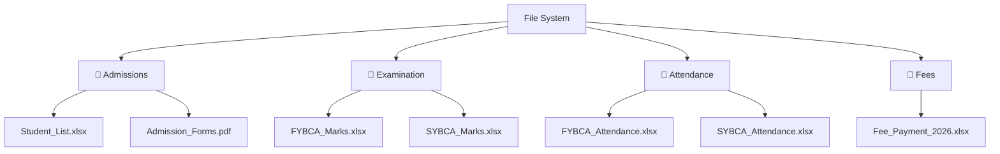

# Chapter 1 – Introduction to Database Systems

# Topic 2: File System

> **Exam Weightage:** ⭐⭐⭐⭐  
> **Important for:** Definition, characteristics, advantages, disadvantages, and college-based example.

---

# 1. Introduction

Before the development of **Database Management Systems (DBMS)**, organizations commonly stored their data using traditional **File Systems**.

In a File System, data is stored in the form of **separate files and folders** on a storage device.

For example, a college may separately maintain:

```text
Student_List.xlsx
FYBCA_Marks.xlsx
Attendance.xlsx
Fee_Payment.xlsx
Faculty_Details.docx
```

Each department manages its own files instead of storing all related data in a centralized database.

---

# 2. Definition of File System

> **A File System is a method of storing, organizing, and managing data in the form of files and folders on a storage device. It allows users to create, store, retrieve, update, and delete files.**

This is the definition given in the chapter. :contentReference[oaicite:0]{index=0}

### In Simple Words

A **File System** stores data in separate files and organizes those files into folders or directories.



---

# 3. Characteristics of File System

According to the chapter, the main characteristics are:

| Characteristic | Explanation |
|---|---|
| **Separate Files** | Data is stored in individual files. |
| **Folders / Directories** | Files are organized using folders and directories. |
| **Easy for Small Applications** | Suitable when the amount of data is limited. |
| **File-Based Access** | Data is accessed using file names and file paths. |
| **Small-Scale Usage** | Mainly suitable for single-user or small-scale systems. |

The document specifically states that a File System stores data in separate files, organizes them into directories, uses file names and paths for access, and is suitable for small-scale systems. :contentReference[oaicite:1]{index=1}

---

# 4. How a File System Works

The basic working of a File System can be understood as:

```text
User / Application
        │
        ▼
Select Folder / Directory
        │
        ▼
Access File
        │
        ▼
Read / Write / Update / Delete
        │
        ▼
Data Stored on Storage Device
```

### Example

Suppose a college wants to check the marks of FYBCA students.

The user may access:

```text
College Records
      │
      └── Examination
              │
              └── FYBCA_Marks.xlsx
```

The required data is found by locating the correct **folder and file**.

---

# 5. Operations Performed in a File System

A File System allows users to perform basic operations such as:

| Operation | Purpose |
|---|---|
| **Create** | Create a new file |
| **Store** | Save data inside files |
| **Retrieve** | Access previously stored files |
| **Update** | Modify existing file contents |
| **Delete** | Remove unwanted files |

Thus:

```text
CREATE
   ↓
STORE
   ↓
RETRIEVE
   ↓
UPDATE
   ↓
DELETE
```

These operations follow directly from the chapter's definition of a File System. :contentReference[oaicite:2]{index=2}

---

# 6. Advantages of File System

The traditional File System provides several advantages, particularly for small applications.

| No. | Advantage | Explanation |
|---|---|---|
| **1** | Simple and Easy to Use | Files and folders can be easily created and managed. |
| **2** | Low Implementation Cost | It does not require an expensive database system. |
| **3** | Suitable for Small Organizations | Useful when the amount of data and number of users are limited. |
| **4** | No Special Software Required | Basic files can be maintained without dedicated DBMS software. |
| **5** | Easy File Management | Creating and managing simple files is straightforward. |

These five advantages are listed in the source chapter. :contentReference[oaicite:3]{index=3}

---

# 7. Disadvantages of File System

Although a File System is simple, it has several limitations.

| No. | Disadvantage | Meaning |
|---|---|---|
| **1** | High Data Redundancy | The same data may be stored repeatedly in different files. |
| **2** | Data Inconsistency | Different files may contain different values for the same data. |
| **3** | Limited Security | Files may not have strong access control. |
| **4** | Difficult Data Sharing | Sharing data among multiple users is difficult. |
| **5** | Poor Backup and Recovery | Proper backup and recovery mechanisms may not be available. |
| **6** | Difficult for Large Data | Searching and managing large amounts of data becomes difficult. |

The chapter identifies these as the major disadvantages of the File System. :contentReference[oaicite:4]{index=4}

> **Note:** The next topic in the chapter explains the **Drawbacks of File System** in much greater detail. Here, these points are only the basic disadvantages included under the File System topic.

---

# 8. Example of File System in a College

The chapter gives a very useful **college example**.

Suppose a small college does not use a DBMS.

Instead, different departments maintain separate **Excel, Word, and PDF files**.

The folder structure may look like:

```text
College Records
│
├── Admissions
│   ├── Student_List.xlsx
│   └── Admission_Forms.pdf
│
├── Examination
│   ├── FYBCA_Marks.xlsx
│   └── SYBCA_Marks.xlsx
│
├── Attendance
│   ├── FYBCA_Attendance.xlsx
│   └── SYBCA_Attendance.xlsx
│
├── Fees
│   └── Fee_Payment_2026.xlsx
│
└── Staff
    ├── Faculty_Details.docx
    └── Salary_Record.xlsx
```

This exact college-based organization is used in the chapter to illustrate how separate departments can maintain their own files. :contentReference[oaicite:5]{index=5}

---

# 9. Explanation of the College Example

Different departments maintain different files:

| Department | File / Data Maintained |
|---|---|
| **Admission Office** | Student details |
| **Examination Department** | Student marks |
| **Attendance Department** | Attendance records |
| **Accounts Department** | Fee records |
| **Staff Department** | Faculty and salary records |

For example:

```text
Student: Alka
Address: Dhule
```

The student's address may appear in multiple departmental files.

Suppose Alka changes her address:

```text
Old Address → Dhule
New Address → Pune
```

Now every department may need to update its own file separately.



If one department forgets to update its file, different files may contain different addresses.

The document specifically explains that student details, examination records, and fee records are maintained separately; therefore, an address change must be updated in multiple files, creating the possibility of redundancy and inconsistency. :contentReference[oaicite:6]{index=6}

---

# 10. Simple Real-Life Example

Consider a teacher storing student information using files.

```text
D:\College\
│
├── Students.xlsx
├── Marks.xlsx
├── Attendance.xlsx
└── Fees.xlsx
```

Suppose student `101 - Rahul` exists in all four files.

```text
Students.xlsx
101 | Rahul | BCA

Marks.xlsx
101 | Rahul | 85

Attendance.xlsx
101 | Rahul | 82%

Fees.xlsx
101 | Rahul | Paid
```

The same student's basic information appears in several files.

This is a typical example of **file-based data management**.

---

# 11. File System Structure



The key idea is:

> **Different data → Different files → Different folders → Managed separately**

---

# 12. File System at a Glance

| Point | File System |
|---|---|
| **Storage Method** | Files and folders |
| **Data Location** | Separate files |
| **Organization** | Directories / folders |
| **Access** | File name and file path |
| **Best Suitable For** | Small applications |
| **Cost** | Low |
| **Complexity** | Simple |
| **Data Redundancy** | High |
| **Security** | Limited |
| **Data Sharing** | Difficult |
| **Large Data Management** | Difficult |

---

# 13. Exam-Ready Answer

## Q. What is a File System? Explain its characteristics, advantages and disadvantages with an example.

### Answer

A **File System** is a method of storing, organizing, and managing data in the form of files and folders on a storage device. It allows users to create, store, retrieve, update, and delete files. :contentReference[oaicite:7]{index=7}

In a File System, data is stored in **separate files**, which are organized into folders or directories. Files are accessed using their **file names and file paths**. File Systems are simple and suitable mainly for small-scale or single-user applications.

### Characteristics

1. Data is stored in separate files.
2. Files are organized into folders or directories.
3. It is easy to use for small applications.
4. Data is accessed using file names and file paths.
5. It is suitable for single-user or small-scale systems. :contentReference[oaicite:8]{index=8}

### Advantages

1. Simple and easy to use.
2. Low implementation cost.
3. Suitable for small organizations.
4. No special software is required.
5. Easy to create and manage files. :contentReference[oaicite:9]{index=9}

### Disadvantages

1. High data redundancy.
2. Data inconsistency.
3. Limited security.
4. Difficult data sharing among multiple users.
5. Lack of proper backup and recovery.
6. Difficult to search and manage large amounts of data. :contentReference[oaicite:10]{index=10}

### Example

A college may maintain separate files for different departments:

```text
College Records
│
├── Admissions
│   └── Student_List.xlsx
│
├── Examination
│   └── FYBCA_Marks.xlsx
│
├── Attendance
│   └── FYBCA_Attendance.xlsx
│
└── Fees
    └── Fee_Payment_2026.xlsx
```

If a student's address changes, the address may need to be updated separately in the admission, examination, and fee files. This can result in **duplicate and inconsistent data**. :contentReference[oaicite:11]{index=11}

### Conclusion

A File System is a **simple and inexpensive method of storing data in files and folders**. It is useful for small applications, but as the amount of data and number of users increase, problems such as **data redundancy, inconsistency, limited security, poor sharing, and difficult data management** arise. These limitations created the need for a **Database Management System (DBMS)**.

---

# 14. Memory Trick 🧠

## File System = **S-F-F**

```text
S → Storage Device
      ↓
F → Folders
      ↓
F → Files
      ↓
    Data
```

For disadvantages, remember:

> **R-I-S-S-B-L**

```text
R → Redundancy
I → Inconsistency
S → Security is limited
S → Sharing is difficult
B → Backup problems
L → Large data is difficult to manage
```

---

# 15. Output

```text
College Records
│
├── Admissions
│   └── Student_List.xlsx
│
├── Examination
│   └── FYBCA_Marks.xlsx
│
├── Attendance
│   └── FYBCA_Attendance.xlsx
│
└── Fees
    └── Fee_Payment_2026.xlsx

Result:
Data is stored in separate files and folders.
Each department manages its own files independently.
```

---

# 16. Query Result

> A traditional File System does **not normally use SQL queries** like a DBMS. Therefore, the source document provides **no SQL query for this topic**.

A conceptual search can be represented as:

```text
Request:
Find FYBCA student marks

Path:
College Records
→ Examination
→ FYBCA_Marks.xlsx

Result:
Required student marks are retrieved from the selected file.
```

| Request | File Accessed | Result |
|---|---|---|
| Student Details | `Student_List.xlsx` | Student records |
| FYBCA Marks | `FYBCA_Marks.xlsx` | Examination records |
| Attendance | `FYBCA_Attendance.xlsx` | Attendance records |
| Fee Status | `Fee_Payment_2026.xlsx` | Fee records |

---

> **Next Topic (Topic 3): Drawbacks of File System** — including **Data Redundancy, Data Inconsistency, Difficulty in Accessing Data, Data Isolation, Integrity Problems, Security Problems, Atomicity Problems, Concurrent Access, Backup & Recovery, Program–Data Dependence, Lack of Data Sharing, and High Maintenance Cost**.