# Chapter 1 – Introduction to Database Systems

# Topic 9: Schema and Instance in DBMS

> **Exam Weightage:** ⭐⭐⭐⭐⭐  
> **Important Question:** *Define Schema and Instance in DBMS. Explain them with suitable examples and differentiate between Schema and Instance.*

---

# 1. Introduction

Two important concepts used to understand the structure and current state of a database are:

```text
SCHEMA
   +
INSTANCE
```

The easiest way to understand them is:

```text
Schema   → Structure / Blueprint of Database

Instance → Actual Data Present at a Particular Time
```

For example:

```text
STUDENT TABLE

StudentID | Name | Age | Email
```

The definition of these columns, their data types and constraints represents the **Schema**.

The actual records:

```text
101 | Rahul | 20 | rahul@gmail.com
102 | Sneha | 19 | sneha@gmail.com
```

represent the **Instance**.

The chapter describes Schema as the database's logical blueprint and Instance as the actual data stored at a particular moment. :contentReference[oaicite:0]{index=0} :contentReference[oaicite:1]{index=1}

---

# 2. Schema in DBMS

## Definition

> **A Schema is the overall logical design or blueprint of a database. It defines how the database is organized, including the tables, columns, data types, constraints, and relationships between tables.**

It is also called the:

> **Structure of the Database**

:contentReference[oaicite:2]{index=2}

---

# 3. What Does a Schema Define?

A Schema defines:

```text
DATABASE STRUCTURE
        │
        ├── Tables
        ├── Columns
        ├── Data Types
        ├── Constraints
        └── Relationships
```

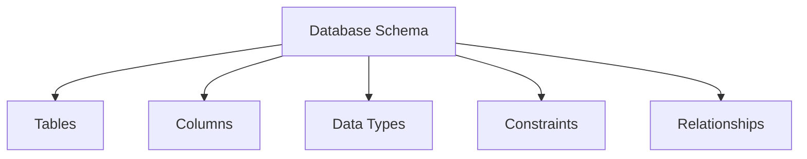

Therefore:

> **Schema tells us HOW the database is designed, not what actual records are currently stored in it.**

---

# 4. Example of Schema

Consider a table called:

```text
Student
```

Its structure is:

| StudentID | Name | Age | Email |
|---|---|---|---|
| `INT (PK)` | `VARCHAR(50)` | `INT` | `VARCHAR(100)` |

The chapter explains that this schema defines:

- **Table Name:** Student
- **Columns:** StudentID, Name, Age, Email
- **Data Types:**
  - StudentID → `INT`
  - Name → `VARCHAR(50)`
  - Age → `INT`
  - Email → `VARCHAR(100)`
- **Primary Key:** StudentID

:contentReference[oaicite:3]{index=3}

---

# 5. Understanding the Schema

```text
Student
│
├── StudentID
│      └── INT
│          └── PRIMARY KEY
│
├── Name
│      └── VARCHAR(50)
│
├── Age
│      └── INT
│
└── Email
       └── VARCHAR(100)
```

This is the **design or structure** of the Student table.

No actual student records are required to define the schema.

---

# 6. SQL Statement for Creating Schema

The chapter provides the following SQL statement:

```sql
CREATE TABLE Student
(
    StudentID INT PRIMARY KEY,
    Name VARCHAR(50),
    Age INT,
    Email VARCHAR(100)
);
```

This SQL statement creates the **Schema of the Student table**. :contentReference[oaicite:4]{index=4}

---

# 7. Explanation of CREATE TABLE Query

```sql
CREATE TABLE Student
```

Creates a new table named:

```text
Student
```

---

```sql
StudentID INT PRIMARY KEY
```

Defines:

```text
Column    → StudentID
Data Type → INT
Constraint → PRIMARY KEY
```

---

```sql
Name VARCHAR(50)
```

Defines:

```text
Column    → Name
Data Type → VARCHAR
Maximum   → 50 characters
```

---

```sql
Age INT
```

Defines:

```text
Column    → Age
Data Type → INT
```

---

```sql
Email VARCHAR(100)
```

Defines:

```text
Column    → Email
Data Type → VARCHAR(100)
```

---

# 8. Output After Creating the Schema

After executing:

```sql
CREATE TABLE Student
(
    StudentID INT PRIMARY KEY,
    Name VARCHAR(50),
    Age INT,
    Email VARCHAR(100)
);
```

the resulting table **structure** is:

| Field | Data Type | Constraint |
|---|---|---|
| StudentID | INT | PRIMARY KEY |
| Name | VARCHAR(50) | — |
| Age | INT | — |
| Email | VARCHAR(100) | — |

> This represents the **Schema**, because it describes the structure of the table rather than its actual records.

---

# 9. Characteristics of Schema

According to the chapter, Schema has the following characteristics:

1. It defines the structure of the database.
2. It is created by the **Database Administrator (DBA)** or **Database Designer**.
3. It changes very rarely.
4. It is independent of the data stored.
5. It is also called the **Intension** of the database.

:contentReference[oaicite:5]{index=5}

---

# 10. Schema at a Glance

| Characteristic | Schema |
|---|---|
| Represents | Database structure |
| Defines | Tables, columns, data types, constraints, relationships |
| Created By | DBA / Database Designer |
| Change Frequency | Very rarely |
| Depends on Actual Data? | No |
| Another Name | **Intension** |

---

# 11. Real-Life Example of Schema – House Blueprint

The chapter gives a very useful real-life analogy:

> Think of the **blueprint of a house**.

A blueprint defines:

```text
House Blueprint
│
├── Number of Rooms
├── Door Positions
├── Window Positions
└── Kitchen Location
```

The blueprint defines the **structure of the house**.

Even after people move into the house, the blueprint normally remains the same.

Similarly:

```text
HOUSE                     DATABASE

Blueprint       =         Schema

People / Items  =         Actual Data
```

The chapter states that the blueprint remains the same even after people move into the house; similarly, a schema defines database structure before data is stored. :contentReference[oaicite:6]{index=6}

---

# 12. Schema Memory Concept 🧠

```text
SCHEMA
   ↓
BLUEPRINT
   ↓
STRUCTURE
   ↓
TABLE + COLUMNS + DATA TYPES + CONSTRAINTS
```

Remember:

> **Schema = Design, not Data**

---

# 13. Instance in DBMS

## Definition

> **An Instance is the actual data stored in the database at a particular moment in time.**

It is also called:

- **Snapshot of the Database**
- **Current State of the Database**

Whenever data is:

```text
INSERTED
UPDATED
DELETED
```

the **Instance changes**.

:contentReference[oaicite:7]{index=7}

---

# 14. Example of Instance

Suppose the `Student` table currently contains:

| StudentID | Name | Age | Email |
|---:|---|---:|---|
| 101 | Rahul | 20 | rahul@gmail.com |
| 102 | Sneha | 19 | sneha@gmail.com |
| 103 | Amit | 21 | amit@gmail.com |

This actual data is called the:

> **Database Instance**

These are the exact records used in the chapter's example. :contentReference[oaicite:8]{index=8}

---

# 15. Understanding Instance

The structure:

```text
StudentID | Name | Age | Email
```

is the:

```text
SCHEMA
```

The records:

```text
101 | Rahul | 20 | rahul@gmail.com

102 | Sneha | 19 | sneha@gmail.com

103 | Amit | 21 | amit@gmail.com
```

are the:

```text
INSTANCE
```

Therefore:

```text
SCHEMA
= What columns exist?

INSTANCE
= What data currently exists?
```

---

# 16. Insert New Data

The chapter then inserts another student:

```sql
INSERT INTO Student
VALUES (104, 'Priya', 20, 'priya@gmail.com');
```

:contentReference[oaicite:9]{index=9}

---

# 17. SQL Output Before INSERT

Before inserting Priya, the current instance is:

| StudentID | Name | Age | Email |
|---:|---|---:|---|
| 101 | Rahul | 20 | rahul@gmail.com |
| 102 | Sneha | 19 | sneha@gmail.com |
| 103 | Amit | 21 | amit@gmail.com |

This is:

```text
INSTANCE 1
```

---

# 18. SQL Query

```sql
INSERT INTO Student
VALUES (104, 'Priya', 20, 'priya@gmail.com');
```

A new record is inserted.

---

# 19. SQL Output After INSERT

The new instance becomes:

| StudentID | Name | Age | Email |
|---:|---|---:|---|
| 101 | Rahul | 20 | rahul@gmail.com |
| 102 | Sneha | 19 | sneha@gmail.com |
| 103 | Amit | 21 | amit@gmail.com |
| 104 | Priya | 20 | priya@gmail.com |

The chapter shows this updated instance after inserting Priya. :contentReference[oaicite:10]{index=10}

---

# 20. What Changed?

Compare:

## Before INSERT

| StudentID | Name | Age | Email |
|---:|---|---:|---|
| 101 | Rahul | 20 | rahul@gmail.com |
| 102 | Sneha | 19 | sneha@gmail.com |
| 103 | Amit | 21 | amit@gmail.com |

## After INSERT

| StudentID | Name | Age | Email |
|---:|---|---:|---|
| 101 | Rahul | 20 | rahul@gmail.com |
| 102 | Sneha | 19 | sneha@gmail.com |
| 103 | Amit | 21 | amit@gmail.com |
| **104** | **Priya** | **20** | **priya@gmail.com** |

Notice:

```text
SCHEMA
StudentID | Name | Age | Email

        REMAINS SAME ✓
```

But:

```text
INSTANCE

3 Records
   ↓
4 Records

CHANGES ✓
```

The chapter explicitly emphasizes:

> **Schema remains the same, while Instance changes.** :contentReference[oaicite:11]{index=11}

---

# 21. Visual Understanding

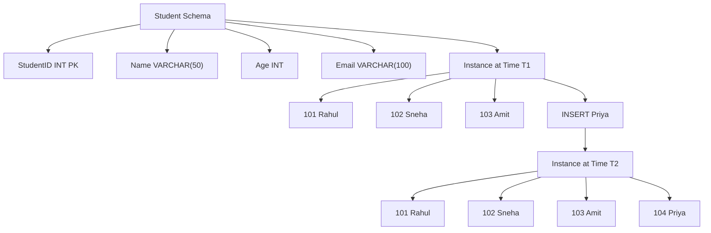

The important concept is:

```text
STRUCTURE DID NOT CHANGE

DATA DID CHANGE
```

---

# 22. Characteristics of Instance

According to the chapter:

1. It represents the current data stored in the database.
2. It changes frequently.
3. It depends on `INSERT`, `UPDATE`, and `DELETE` operations.
4. It is also called the **Extension** of the database.

:contentReference[oaicite:12]{index=12}

---

# 23. Instance at a Glance

| Characteristic | Instance |
|---|---|
| Represents | Actual data |
| Time | Particular moment |
| Change Frequency | Frequently |
| Changes Due To | INSERT, UPDATE, DELETE |
| Another Name | **Extension** |
| Also Called | Snapshot / Current State |

---

# 24. How Instance Changes

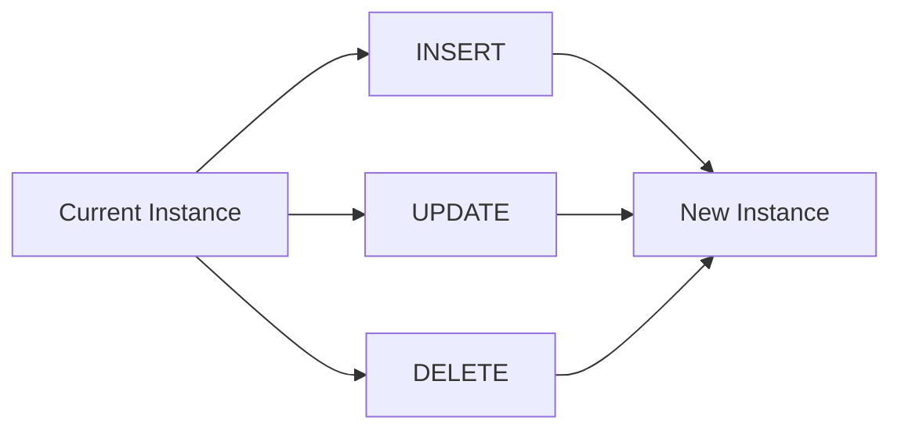

### INSERT

```text
Adds New Record
      ↓
Instance Changes
```

### UPDATE

```text
Modifies Existing Record
      ↓
Instance Changes
```

### DELETE

```text
Removes Existing Record
      ↓
Instance Changes
```

---

# 25. Schema vs Instance

This is the most important comparison to remember.

| Basis | Schema | Instance |
|---|---|---|
| **Meaning** | Overall logical design or blueprint | Actual data stored at a particular moment |
| **Represents** | Structure | Current data |
| **Contains** | Tables, columns, data types, constraints, relationships | Actual records |
| **Changes** | Very rarely | Frequently |
| **Affected by INSERT/UPDATE/DELETE** | No structural change | Yes |
| **Created By** | DBA / Database Designer | Changes as data operations occur |
| **Another Name** | **Intension** | **Extension** |
| **Real-Life Analogy** | House blueprint | People/items currently inside the house |
| **Example** | `StudentID INT PRIMARY KEY` | `101, Rahul, 20, rahul@gmail.com` |

---

# 26. Most Important Difference

```text
SCHEMA
   ↓
STRUCTURE
   ↓
Stable / Rarely Changes

        VS

INSTANCE
   ↓
ACTUAL DATA
   ↓
Changes Frequently
```

---

# 27. Real-Life Analogy

Imagine a classroom.

## Schema

The classroom design defines:

```text
Room Number
Number of Benches
Door Position
Board Position
```

This is like:

```text
SCHEMA
```

## Instance

The students currently sitting in the classroom represent:

```text
INSTANCE
```

Students may:

```text
Enter
Leave
Change Seats
```

The classroom structure remains mostly unchanged.

Similarly:

```text
Database Schema → Remains Stable

Database Instance → Changes with Data
```

> **Note:** The source specifically uses the **house-blueprint analogy**. The classroom analogy above is only an additional memory aid.

---

# 28. Schema and Instance Relationship

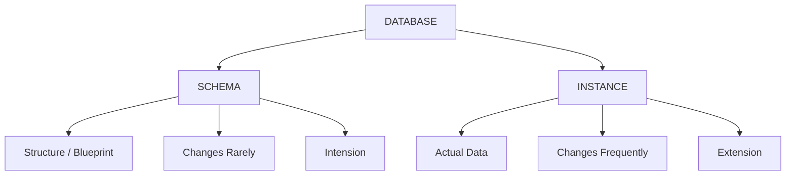

---

# 29. Complete SQL Example from the Chapter

## Step 1 – Create Schema

```sql
CREATE TABLE Student
(
    StudentID INT PRIMARY KEY,
    Name VARCHAR(50),
    Age INT,
    Email VARCHAR(100)
);
```

### Schema Output

| Field | Data Type | Constraint |
|---|---|---|
| StudentID | INT | PRIMARY KEY |
| Name | VARCHAR(50) | — |
| Age | INT | — |
| Email | VARCHAR(100) | — |

This represents:

```text
SCHEMA
```

---

## Step 2 – Existing Instance

| StudentID | Name | Age | Email |
|---:|---|---:|---|
| 101 | Rahul | 20 | rahul@gmail.com |
| 102 | Sneha | 19 | sneha@gmail.com |
| 103 | Amit | 21 | amit@gmail.com |

This represents:

```text
INSTANCE AT TIME T1
```

---

## Step 3 – Insert New Record

```sql
INSERT INTO Student
VALUES (104, 'Priya', 20, 'priya@gmail.com');
```

---

## Step 4 – Updated Instance

| StudentID | Name | Age | Email |
|---:|---|---:|---|
| 101 | Rahul | 20 | rahul@gmail.com |
| 102 | Sneha | 19 | sneha@gmail.com |
| 103 | Amit | 21 | amit@gmail.com |
| 104 | Priya | 20 | priya@gmail.com |

This represents:

```text
INSTANCE AT TIME T2
```

The schema and instance examples above are taken directly from the chapter. :contentReference[oaicite:13]{index=13} :contentReference[oaicite:14]{index=14}

---

# 30. Exam-Ready Answer

## Q. Explain Schema and Instance in DBMS with suitable examples.

### Answer

**Schema and Instance** are two important concepts in DBMS used to represent the structure and current data of a database.

## 1. Schema

A **Schema** is the overall logical design or blueprint of a database. It defines how the database is organized, including its **tables, columns, data types, constraints, and relationships**.

It is also called the **structure of the database**. :contentReference[oaicite:15]{index=15}

### Example

Consider the Student table:

| StudentID | Name | Age | Email |
|---|---|---|---|
| INT (PK) | VARCHAR(50) | INT | VARCHAR(100) |

Its schema can be created using:

```sql
CREATE TABLE Student
(
    StudentID INT PRIMARY KEY,
    Name VARCHAR(50),
    Age INT,
    Email VARCHAR(100)
);
```

This SQL statement defines the structure of the Student table. :contentReference[oaicite:16]{index=16}

### Characteristics of Schema

1. Defines the structure of the database.
2. Created by the DBA or Database Designer.
3. Changes very rarely.
4. Independent of the actual data stored.
5. Also called **Intension**. :contentReference[oaicite:17]{index=17}

## 2. Instance

An **Instance** is the actual data stored in the database at a particular moment in time.

It is also called the **snapshot or current state of the database**.

Whenever data is inserted, updated, or deleted, the instance changes. :contentReference[oaicite:18]{index=18}

### Example

| StudentID | Name | Age | Email |
|---:|---|---:|---|
| 101 | Rahul | 20 | rahul@gmail.com |
| 102 | Sneha | 19 | sneha@gmail.com |
| 103 | Amit | 21 | amit@gmail.com |

After executing:

```sql
INSERT INTO Student
VALUES (104, 'Priya', 20, 'priya@gmail.com');
```

the instance becomes:

| StudentID | Name | Age | Email |
|---:|---|---:|---|
| 101 | Rahul | 20 | rahul@gmail.com |
| 102 | Sneha | 19 | sneha@gmail.com |
| 103 | Amit | 21 | amit@gmail.com |
| 104 | Priya | 20 | priya@gmail.com |

Here:

```text
Schema → Remains Same

Instance → Changes
```

:contentReference[oaicite:19]{index=19}

### Conclusion

A **Schema defines the structure or blueprint of a database**, whereas an **Instance represents the actual data stored at a particular moment**.

The schema changes very rarely, while the instance changes frequently whenever records are inserted, updated, or deleted.

---

# 31. Memory Trick 🧠

Remember:

> **S = Structure**

```text
SCHEMA
↓
STRUCTURE
↓
STABLE
```

And:

> **I = Information Inside**

```text
INSTANCE
↓
INFORMATION / ACTUAL DATA
↓
INSTANT STATE
```

### Ultimate Memory Formula

```text
SCHEMA = BLUEPRINT

INSTANCE = SNAPSHOT
```

Or:

```text
Schema
= Empty Table Design

Instance
= Data Inside That Table
```

---

# 32. Query and SQL Output

## Query 1 – Create Student Schema

```sql
CREATE TABLE Student
(
    StudentID INT PRIMARY KEY,
    Name VARCHAR(50),
    Age INT,
    Email VARCHAR(100)
);
```

### Output – Table Structure

| Field | Data Type | Constraint |
|---|---|---|
| StudentID | INT | PRIMARY KEY |
| Name | VARCHAR(50) | — |
| Age | INT | — |
| Email | VARCHAR(100) | — |

---

## Query 2 – Insert New Student

```sql
INSERT INTO Student
VALUES (104, 'Priya', 20, 'priya@gmail.com');
```

### Output

| Result |
|---|
| 1 new student record inserted |

---

## Query 3 – Display Current Instance

```sql
SELECT *
FROM Student;
```

### SQL Output

| StudentID | Name | Age | Email |
|---:|---|---:|---|
| 101 | Rahul | 20 | rahul@gmail.com |
| 102 | Sneha | 19 | sneha@gmail.com |
| 103 | Amit | 21 | amit@gmail.com |
| 104 | Priya | 20 | priya@gmail.com |

---

# 33. Final 30-Second Revision

| Schema | Instance |
|---|---|
| Blueprint | Snapshot |
| Structure | Actual Data |
| Changes Rarely | Changes Frequently |
| Tables + Columns + Types + Constraints | Actual Records |
| Intension | Extension |
| Created using structure definition | Changes through INSERT, UPDATE, DELETE |

```text
DATABASE
   │
   ├── SCHEMA
   │      ↓
   │   "How is it designed?"
   │      ↓
   │   STRUCTURE
   │
   └── INSTANCE
          ↓
       "What data is inside now?"
          ↓
       ACTUAL RECORDS
```

> **Next Topic – Topic 10: Types of DBMS Architecture**  
> Covers **1-Tier, 2-Tier, and 3-Tier Architecture** one by one with definitions, working, diagrams, examples, advantages, disadvantages, real-life examples, and finally their complete comparison.

<!-- atlas:note-break -->

---
id: mryw65hlwyuvl
title: Markdown
source: chatgpt
sourceUrl: https://chatgpt.com/c/6a60b85b-1cf4-83ee-8b26-d4698fbc4372
createdAt: 2026-07-24T12:03:37.929Z
updatedAt: 2026-07-24T12:03:37.929Z
---

Markdown
# Chapter 1 – Introduction to Database Systems

# Topic 10: Types of DBMS Architecture

> **Exam Weightage:** ⭐⭐⭐⭐⭐  
> **Important Question:** *What is DBMS Architecture? Explain One-Tier, Two-Tier, and Three-Tier Architecture with suitable diagrams, examples, advantages, and disadvantages.*

---

# 1. Introduction

A database system can be organized in different ways depending on:

- Where the **database** is stored
- Where the **application** runs
- How the **user** accesses the database
- How different components communicate with each other

This organization is known as **DBMS Architecture**.

---

# 2. Definition of DBMS Architecture

> **DBMS Architecture refers to the design of a database system based on how the database, application, and users are connected and communicate with each other.**

The architecture determines:

```text
Where Database is Stored
          +
Where Application Runs
          +
How Users Access Database
          ↓
     DBMS ARCHITECTURE
```

The chapter classifies DBMS architecture into three main types:

1. **One-Tier Architecture (1-Tier)**
2. **Two-Tier Architecture (2-Tier)**
3. **Three-Tier Architecture (3-Tier)**

:contentReference[oaicite:0]{index=0}

---

# 3. Overview of DBMS Architectures

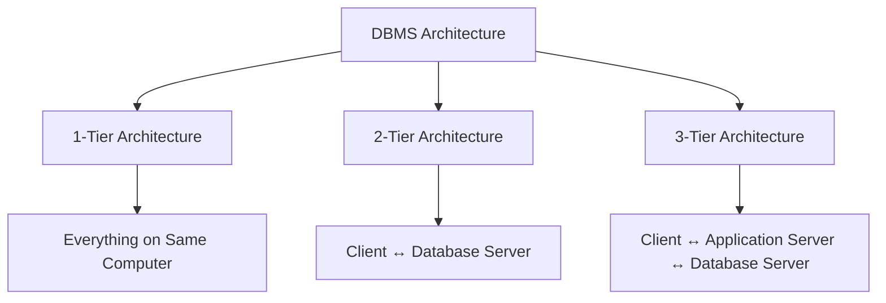

### Easy Formula

```text
1-TIER
User + Application + DBMS + Database
            ↓
       Same Computer


2-TIER
Client Application
       ↕
Database Server


3-TIER
Client
   ↕
Application Server
   ↕
Database Server
```

---

# 4. One-Tier Architecture

## Definition

> **In One-Tier Architecture, the user, application, and database are present on the same computer. The user directly interacts with the database without using a network.**

It is also called:

> **Single-Tier Architecture**

This architecture is mainly used for:

- Learning
- Development
- Testing
- Small standalone applications

:contentReference[oaicite:1]{index=1}

---

# 5. Structure of One-Tier Architecture

In 1-Tier Architecture, everything exists on a **single machine**.

```text
+--------------------------------------+
|           SAME COMPUTER              |
|                                      |
|              User                    |
|                ↓                     |
|       Application Program            |
|                ↓                     |
| Database Management System           |
|                ↓                     |
|            Database                  |
|                                      |
+--------------------------------------+
```

### Diagram

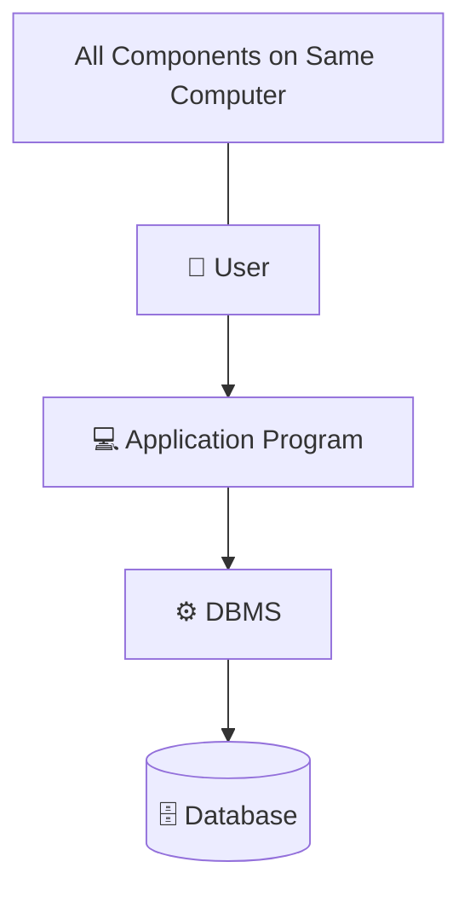

---

# 6. Working of One-Tier Architecture

The chapter explains the working as:

```text
Step 1
User enters a query
      ↓
Step 2
Application processes the request
      ↓
Step 3
DBMS accesses the database
      ↓
Step 4
Result is displayed to the user
```

Everything happens on a **single machine**. :contentReference[oaicite:2]{index=2}

---

# 7. Example of One-Tier Architecture

The chapter gives the following example:

> A student installs **MySQL** on a laptop and creates a College Database using MySQL Workbench. The user writes SQL queries directly on the same system. :contentReference[oaicite:3]{index=3}

Conceptually:

```text
Student's Laptop
│
├── User
├── MySQL Workbench
├── MySQL DBMS
└── College Database
```

Everything is available on:

```text
ONE COMPUTER
```

Therefore, it is:

```text
1-TIER ARCHITECTURE
```

---

# 8. Working Example

Suppose a student executes:

```sql
SELECT *
FROM Student;
```

The flow is:

```text
Student
   ↓
Enters SQL Query
   ↓
MySQL / Application
   ↓
DBMS Processes Query
   ↓
Local Database
   ↓
Result Displayed
```

No separate database server or network is required.

---

# 9. Advantages of One-Tier Architecture

According to the chapter:

1. Simple to install and use.
2. No network required.
3. Fast because all components are on one computer.
4. Low cost.
5. Suitable for testing and learning.

:contentReference[oaicite:4]{index=4}

### Summary

| Advantage | Explanation |
|---|---|
| **Simple** | Easy to install and operate |
| **No Network** | Works locally |
| **Fast** | All components are on one machine |
| **Low Cost** | No separate servers required |
| **Good for Learning** | Useful for SQL practice and testing |

---

# 10. Disadvantages of One-Tier Architecture

According to the chapter:

1. Not suitable for multiple users.
2. Poor security.
3. Difficult to share data.
4. Limited scalability.
5. Data loss if the system crashes.

:contentReference[oaicite:5]{index=5}

### Summary

| Disadvantage | Explanation |
|---|---|
| **Limited Users** | Mainly suitable for standalone use |
| **Poor Security** | Database exists directly on the same system |
| **Difficult Sharing** | No centralized multi-user setup |
| **Low Scalability** | Difficult to expand for large systems |
| **Risk of Data Loss** | Local system failure can affect data |

---

# 11. Real-Life Example of One-Tier

The chapter gives:

> **A personal expense management application running entirely on one computer.** :contentReference[oaicite:6]{index=6}

```text
Personal Computer
      │
      ├── Expense Application
      ├── DBMS
      └── Expense Database
```

---

# 12. One-Tier in One Line

```text
USER
  ↓
APPLICATION
  ↓
DBMS
  ↓
DATABASE

Everything on ONE COMPUTER
```

> **Memory Trick:**  
> **1 Tier = 1 Machine**

---

# 13. Two-Tier Architecture

## Definition

> **In Two-Tier Architecture, the application runs on the client computer, while the database is stored on a database server. The client communicates directly with the database server over a network.**

It is also called:

> **Client-Server Architecture**

This architecture is commonly used in **small and medium-sized organizations**. :contentReference[oaicite:7]{index=7}

---

# 14. Structure of Two-Tier Architecture

Two-Tier Architecture contains two major parts:

```text
TIER 1
CLIENT
│
├── User Interface
└── Application Program

        ↕ Network

TIER 2
DATABASE SERVER
│
├── DBMS
└── Database
```

---

# 15. Two-Tier Architecture Diagram

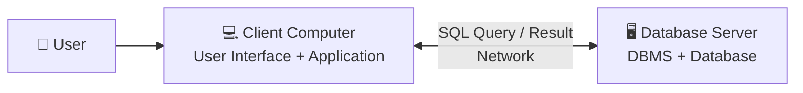

The key point is:

> **The Client Application communicates DIRECTLY with the Database Server.**

```text
CLIENT
   ↕
DIRECT CONNECTION
   ↕
DATABASE SERVER
```

There is **no separate Application Server** between them.

---

# 16. Working of Two-Tier Architecture

According to the chapter:

```text
1. User enters a request
        ↓
2. Client application sends SQL query
   directly to database server
        ↓
3. Database server processes query
        ↓
4. Result is returned to client
```

:contentReference[oaicite:8]{index=8}

### Visual Flow

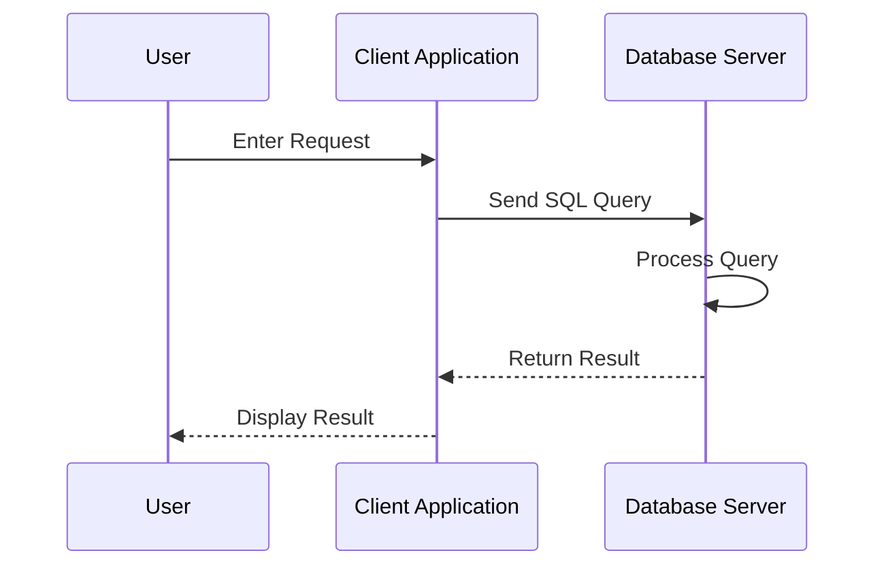

---

# 17. Example of Two-Tier Architecture

The chapter gives:

> A college office application where the Accounts Department uses a desktop application connected to a central MySQL or Oracle database server. :contentReference[oaicite:9]{index=9}

Example:

```text
Accounts Staff Computer
        │
        │ Desktop Application
        │
        ▼
     Network
        │
        ▼
Central Database Server
        │
        ├── DBMS
        └── College Database
```

---

# 18. Multiple Clients in Two-Tier Architecture

Several client computers can connect directly to one central database server.

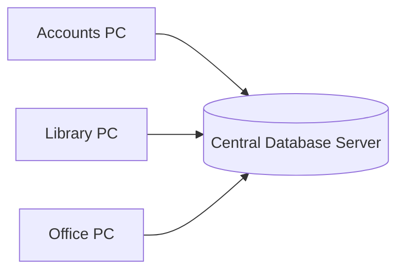

This allows centralized storage.

However:

```text
Client 1 ──┐
Client 2 ──┼──→ Database Server
Client 3 ──┘
```

Each client communicates **directly** with the database server.

---

# 19. Advantages of Two-Tier Architecture

According to the chapter:

1. Faster than Three-Tier for small systems.
2. Easy to develop.
3. Supports multiple users.
4. Better data sharing.
5. Centralized database management.

:contentReference[oaicite:10]{index=10}

### Summary

| Advantage | Explanation |
|---|---|
| **Fast for Small Systems** | Direct client-server communication |
| **Easy Development** | Simpler than Three-Tier |
| **Multi-User Support** | Multiple clients can connect |
| **Better Sharing** | Users share centralized data |
| **Centralized Database** | Database is managed on a server |

---

# 20. Disadvantages of Two-Tier Architecture

According to the chapter:

1. Business logic resides on the client, making updates harder.
2. Less secure than Three-Tier Architecture.
3. Heavy load on the database server.
4. Not suitable for large-scale web applications.

:contentReference[oaicite:11]{index=11}

### Why?

```text
Many Clients
     │
     ├──────────┐
     ▼          ▼
Direct Queries Direct Queries
     │          │
     └────┬─────┘
          ▼
   DATABASE SERVER
          ↓
       Heavy Load
```

---

# 21. Real-Life Example of Two-Tier

The chapter gives:

> **A Library Management System where several staff computers connect directly to a central database server.** :contentReference[oaicite:12]{index=12}

```text
Library Staff PC 1 ───┐
                      │
Library Staff PC 2 ───┼──→ Central Database Server
                      │
Library Staff PC 3 ───┘
```

---

# 22. Two-Tier in One Line

```text
CLIENT
   ↕
NETWORK
   ↕
DATABASE SERVER
```

> **Memory Trick:**  
> **2 Tier = Client + Database Server**

---

# 23. Three-Tier Architecture

## Definition

> **In Three-Tier Architecture, the database system is divided into three separate layers: Presentation Layer, Application Layer, and Database Layer.**

The three layers are:

```text
1. Presentation Layer
   → Client

2. Application Layer
   → Application Server

3. Database Layer
   → Database Server
```

The client **never communicates directly with the database**.

All requests pass through the:

```text
APPLICATION SERVER
```

The chapter identifies Three-Tier Architecture as the most widely used architecture for **modern web and enterprise applications**. :contentReference[oaicite:13]{index=13}

---

# 24. Structure of Three-Tier Architecture

```text
TIER 1
PRESENTATION LAYER
Client / Browser / Mobile App

          ↕
       Internet

TIER 2
APPLICATION LAYER
Application Server
Business Logic

          ↕

TIER 3
DATABASE LAYER
Database Server
DBMS + Database
```

---

# 25. Three-Tier Architecture Diagram

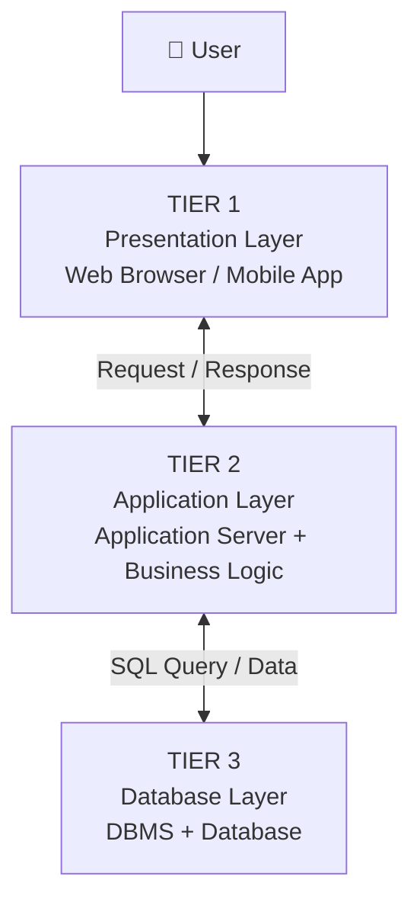

### Most Important Concept

```text
Client
  ↓
Application Server
  ↓
Database Server
```

NOT:

```text
Client ─────────────→ Database ✗
```

The client cannot directly access the database.

---

# 26. Layer 1 – Presentation Layer

The **Presentation Layer** is the user-facing layer.

Examples from the architecture described in the chapter include:

```text
Web Browser
Mobile Application
```

Its main purpose is to allow users to:

```text
View Interface
     ↓
Enter Request
     ↓
Receive Response
```

Example:

```text
Passenger
    ↓
Railway Website
    ↓
Search Train
```

---

# 27. Layer 2 – Application Layer

The **Application Layer** contains:

```text
Application Server
       +
Business Logic
```

It acts as the middle layer between:

```text
Client
  ↕
APPLICATION SERVER
  ↕
Database
```

The chapter explains that this layer:

- Validates requests
- Applies business rules
- Sends SQL queries to the database
- Formats responses

:contentReference[oaicite:14]{index=14}

---

# 28. Layer 3 – Database Layer

The **Database Layer** contains:

```text
Database Server
       +
DBMS
       +
Database
```

It is responsible for storing and retrieving the actual data.

Example in a Railway Reservation System:

```text
Passenger Data
Train Data
Ticket Data
Reservation Data
```

---

# 29. Working of Three-Tier Architecture

According to the chapter:

```text
STEP 1
User sends request through
Web Browser / Mobile App
        ↓
STEP 2
Application Server validates request
and applies business rules
        ↓
STEP 3
Application Server sends SQL query
to Database Server
        ↓
STEP 4
Database returns requested data
        ↓
STEP 5
Application Server formats response
and sends it to Client
```

:contentReference[oaicite:15]{index=15}

---

# 30. Three-Tier Request Flow

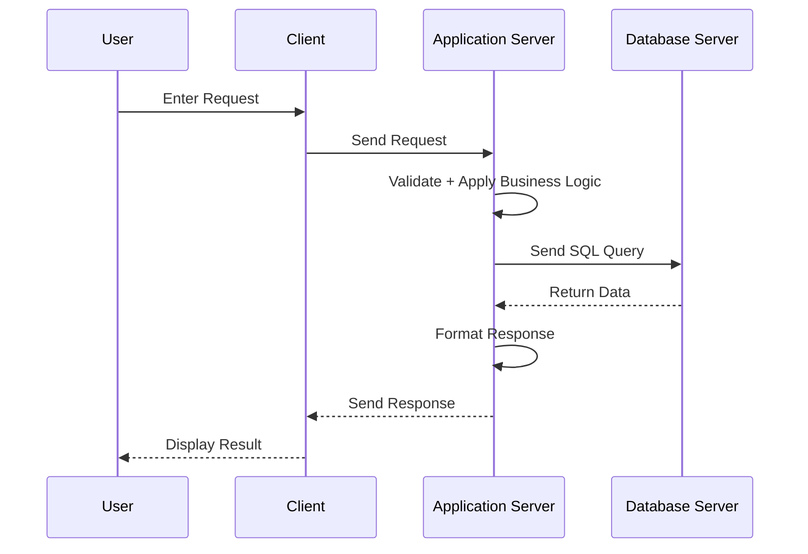

---

# 31. Example – Online Railway Reservation System

The chapter uses an **Online Railway Reservation System** as the main example.

### Tier 1 – Client

```text
Passenger
    ↓
Web Browser / Mobile App
```

### Tier 2 – Application Server

Processes:

```text
Ticket Booking
Fare Calculation
Seat Availability
```

### Tier 3 – Database Server

Stores:

```text
Passenger Details
Train Details
Ticket Details
Reservation Details
```

:contentReference[oaicite:16]{index=16}

---

# 32. Railway Reservation Flow

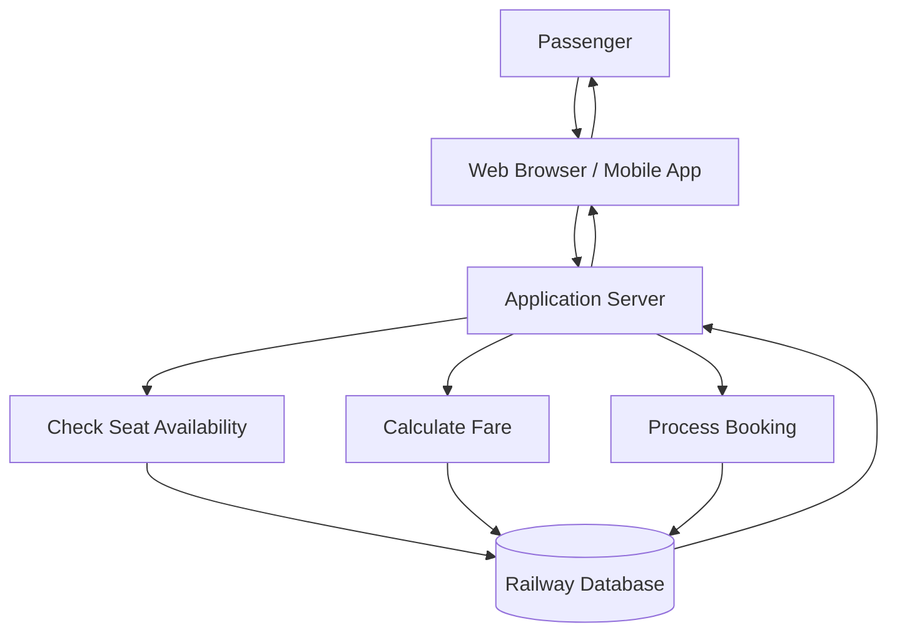

---

# 33. Advantages of Three-Tier Architecture

According to the chapter:

1. High security because the database is not directly accessible.
2. Better performance for large systems.
3. Easy maintenance and updates.
4. Highly scalable.
5. Supports thousands of users simultaneously.
6. Business logic is centralized.

:contentReference[oaicite:17]{index=17}

---

# 34. Why Three-Tier Is More Secure

```text
User
  ↓
Client
  ↓
Application Server
  ↓
Security + Validation + Business Rules
  ↓
Database
```

The user does not directly access:

```text
DATABASE SERVER
```

Therefore:

```text
Direct Database Access
        ✗
        ↓
Better Protection
        ↓
Higher Security
```

---

# 35. Why Three-Tier Is Easier to Maintain

Business logic is centralized on the:

```text
APPLICATION SERVER
```

Conceptually:

```text
Client 1 ─┐
Client 2 ─┼──→ Application Server → Database
Client 3 ─┘
```

Instead of placing business logic separately on every client, it is maintained centrally.

This supports easier updates and maintenance.

---

# 36. Disadvantages of Three-Tier Architecture

According to the chapter:

1. More complex to develop.
2. Higher implementation cost.
3. Requires application servers and network infrastructure.

:contentReference[oaicite:18]{index=18}

### Summary

| Disadvantage | Meaning |
|---|---|
| **Complex Development** | More layers must be developed |
| **Higher Cost** | Additional infrastructure is needed |
| **More Infrastructure** | Requires application server and network |

---

# 37. Real-Life Examples of Three-Tier Architecture

The chapter lists:

- Internet Banking
- Amazon
- Flipkart
- Railway Reservation System
- University ERP
- Hospital Management System

:contentReference[oaicite:19]{index=19}

All follow the general pattern:

```text
USER INTERFACE
      ↓
APPLICATION / BUSINESS LOGIC
      ↓
DATABASE
```

---

# 38. Three-Tier in One Line

```text
CLIENT
   ↕
APPLICATION SERVER
   ↕
DATABASE SERVER
```

> **Memory Trick:**  
> **3 Tier = Client + Application Server + Database Server**

---

# 39. 1-Tier vs 2-Tier vs 3-Tier – Visual Difference

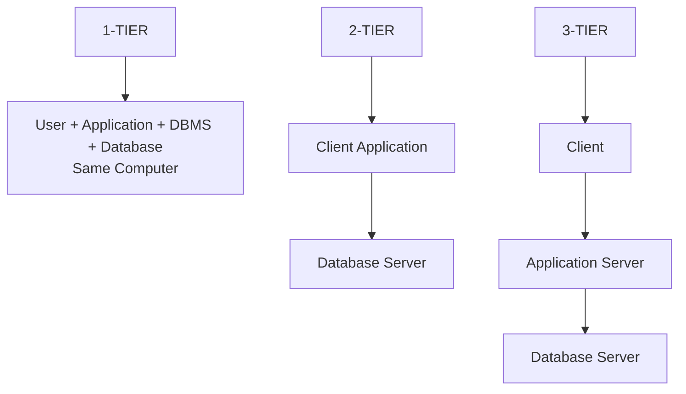

---

# 40. Complete Comparison of DBMS Architectures

| Feature | One-Tier | Two-Tier | Three-Tier |
|---|---|---|---|
| **Number of Layers** | 1 | 2 | 3 |
| **Database Location** | Same computer | Database server | Database server |
| **Application Location** | Same computer | Client | Application server |
| **Network Required** | No | Yes | Yes |
| **Security** | Low | Medium | High |
| **Performance** | Good for single user | Good for small systems | Excellent for large systems |
| **Scalability** | Low | Medium | High |
| **Cost** | Low | Medium | High |
| **Maintenance** | Easy | Moderate | Easy due to centralized logic |
| **Suitable For** | Learning and testing | Small organizations | Large enterprises and web applications |

This comparison follows the architecture comparison given in the chapter. :contentReference[oaicite:20]{index=20}

---

# 41. Real-Life Examples Comparison

| Architecture | Example |
|---|---|
| **One-Tier** | MS Access or MySQL installed on a personal computer for learning |
| **Two-Tier** | College fee management system where staff computers connect directly to a central database server |
| **Three-Tier** | Railway Reservation System, Online Banking, E-commerce websites, University ERP |

These examples are given in the chapter's final architecture summary. :contentReference[oaicite:21]{index=21}

---

# 42. Most Important Difference

## One-Tier

```text
┌──────────────────────────┐
│ ONE COMPUTER             │
│                          │
│ User                     │
│   ↓                      │
│ Application              │
│   ↓                      │
│ DBMS                     │
│   ↓                      │
│ Database                 │
└──────────────────────────┘
```

## Two-Tier

```text
┌─────────────┐           ┌──────────────┐
│   CLIENT    │  Network  │   DATABASE   │
│ Application│ ←────────→ │    SERVER    │
└─────────────┘           └──────────────┘
```

## Three-Tier

```text
┌──────────┐     ┌──────────────┐     ┌──────────────┐
│  CLIENT  │ ──→ │ APPLICATION  │ ──→ │   DATABASE   │
│          │ ←── │    SERVER    │ ←── │    SERVER    │
└──────────┘     └──────────────┘     └──────────────┘
```

---

# 43. How to Identify Architecture in Exam Questions

Use this shortcut:

```text
Everything on one PC?
        ↓ YES
      1-TIER


Client directly connects to Database?
        ↓ YES
      2-TIER


Application Server exists between
Client and Database?
        ↓ YES
      3-TIER
```

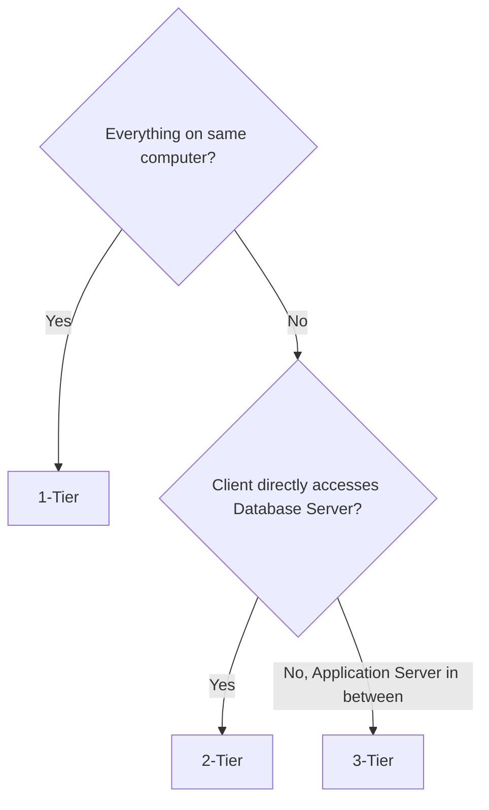

---

# 44. Exam-Ready Answer

## Q. Explain the types of DBMS Architecture with suitable examples.

### Answer

**DBMS Architecture** refers to the design of a database system based on how the database, application, and users are connected and communicate with each other.

It determines where the database is stored, where the application runs, and how users access the database.

The three main types are:

1. One-Tier Architecture
2. Two-Tier Architecture
3. Three-Tier Architecture

:contentReference[oaicite:22]{index=22}

## 1. One-Tier Architecture

In **One-Tier Architecture**, the user, application, DBMS, and database are present on the same computer.

The user directly interacts with the database without using a network.

```text
User
 ↓
Application
 ↓
DBMS
 ↓
Database

(All on Same Computer)
```

### Example

A student installs MySQL on a laptop and creates a College Database using MySQL Workbench.

### Advantages

- Simple to install and use
- No network required
- Fast on a single computer
- Low cost
- Suitable for testing and learning

### Disadvantages

- Not suitable for multiple users
- Poor security
- Difficult data sharing
- Limited scalability
- Risk of data loss if the system crashes

:contentReference[oaicite:23]{index=23}

---

## 2. Two-Tier Architecture

In **Two-Tier Architecture**, the application runs on the client computer while the database is stored on a database server.

The client communicates **directly** with the database server over a network.

```text
Client Application
       ↕
     Network
       ↕
Database Server
```

### Example

A college office application where the Accounts Department uses a desktop application connected to a central database server.

### Advantages

- Fast for small systems
- Easy to develop
- Supports multiple users
- Better data sharing
- Centralized database management

### Disadvantages

- Business logic resides on the client
- Less secure than Three-Tier
- Heavy load on database server
- Not suitable for large-scale web applications

:contentReference[oaicite:24]{index=24} :contentReference[oaicite:25]{index=25}

---

## 3. Three-Tier Architecture

In **Three-Tier Architecture**, the system contains three separate layers:

1. **Presentation Layer** – Client
2. **Application Layer** – Application Server
3. **Database Layer** – Database Server

The client does not directly communicate with the database.

```text
Client
   ↓
Application Server
   ↓
Database Server
```

### Example

In an Online Railway Reservation System:

```text
Passenger
   ↓
Web Browser / Mobile App
   ↓
Application Server
   ↓
Railway Database
```

### Advantages

- High security
- Better performance for large systems
- Easy maintenance and updates
- Highly scalable
- Supports thousands of users
- Centralized business logic

### Disadvantages

- More complex to develop
- Higher implementation cost
- Requires application servers and network infrastructure

:contentReference[oaicite:26]{index=26} :contentReference[oaicite:27]{index=27}

### Conclusion

The selection of DBMS architecture depends on the size and requirements of the system.

```text
Learning / Testing
       ↓
     1-TIER

Small / Medium Organization
       ↓
     2-TIER

Large Web / Enterprise System
       ↓
     3-TIER
```

---

# 45. Memory Trick 🧠

## Remember the Number of Locations

```text
1-TIER
= ONE PLACE

Everything together
🏠


2-TIER
= TWO SIDES

Client ↔ Database
💻 ↔ 🗄️


3-TIER
= THREE LAYERS

Client ↔ Application ↔ Database
💻 ↔ ⚙️ ↔ 🗄️
```

### Ultimate Memory Formula

> **1 = SAME**

> **2 = DIRECT**

> **3 = MIDDLE**

```text
1-Tier
→ Same Computer

2-Tier
→ Direct Client-to-Database Connection

3-Tier
→ Middle Application Server
```

---

# 46. SQL Query and Output

> **Important:** The architecture section in the source explains how queries flow through each architecture, but it does **not provide a specific SQL dataset/output example**. The following uses the Student table from the earlier Schema and Instance section only to demonstrate how the same query conceptually travels through each architecture.

## SQL Query

```sql
SELECT *
FROM Student;
```

### SQL Output

| StudentID | Name | Age | Email |
|---:|---|---:|---|
| 101 | Rahul | 20 | rahul@gmail.com |
| 102 | Sneha | 19 | sneha@gmail.com |
| 103 | Amit | 21 | amit@gmail.com |
| 104 | Priya | 20 | priya@gmail.com |

---

# 47. How the Same SQL Query Works in Each Architecture

## In 1-Tier

```text
User
 ↓
SELECT * FROM Student;
 ↓
Local DBMS
 ↓
Local Database
 ↓
Result
```

### Output

| StudentID | Name | Age | Email |
|---:|---|---:|---|
| 101 | Rahul | 20 | rahul@gmail.com |
| 102 | Sneha | 19 | sneha@gmail.com |
| 103 | Amit | 21 | amit@gmail.com |
| 104 | Priya | 20 | priya@gmail.com |

---

## In 2-Tier

```text
Client Application
       ↓
SELECT * FROM Student;
       ↓
Database Server
       ↓
Result Returned to Client
```

### Output

| StudentID | Name | Age | Email |
|---:|---|---:|---|
| 101 | Rahul | 20 | rahul@gmail.com |
| 102 | Sneha | 19 | sneha@gmail.com |
| 103 | Amit | 21 | amit@gmail.com |
| 104 | Priya | 20 | priya@gmail.com |

---

## In 3-Tier

```text
Client
  ↓
Request
  ↓
Application Server
  ↓
SELECT * FROM Student;
  ↓
Database Server
  ↓
Data
  ↓
Application Server
  ↓
Formatted Response
  ↓
Client
```

### Output

| StudentID | Name | Age | Email |
|---:|---|---:|---|
| 101 | Rahul | 20 | rahul@gmail.com |
| 102 | Sneha | 19 | sneha@gmail.com |
| 103 | Amit | 21 | amit@gmail.com |
| 104 | Priya | 20 | priya@gmail.com |

> The **result can be the same**; what changes is the **architecture through which the request reaches the database**.

---

# 48. Final 30-Second Revision

| Feature | 1-Tier | 2-Tier | 3-Tier |
|---|---|---|---|
| **Remember As** | Same Machine | Direct Connection | Middle Server |
| **Layers** | 1 | 2 | 3 |
| **Flow** | User → DB | Client → DB | Client → App → DB |
| **Network** | No | Yes | Yes |
| **Security** | Low | Medium | High |
| **Scalability** | Low | Medium | High |
| **Best For** | Learning | Small Systems | Large Systems |
| **Example** | MySQL on personal PC | College Fee System | Railway Reservation |

```text
                    DBMS ARCHITECTURE
                           │
           ┌───────────────┼───────────────┐
           ▼               ▼               ▼
        1-TIER          2-TIER          3-TIER
           │               │               │
      SAME MACHINE     CLIENT ↔ DB    CLIENT ↔ APP ↔ DB
           │               │               │
        SIMPLE           MEDIUM          ADVANCED
           │               │               │
      LOW SCALE       MEDIUM SCALE      HIGH SCALE
```

> **Golden Rule for Exams:**  
> **1-Tier = Everything together**  
> **2-Tier = Client directly talks to Database Server**  
> **3-Tier = Client talks to Application Server, which talks to Database Server**

<!-- atlas:note-break -->

---
id: mryw67sb4zl5q
title: # Chapter 1 – Introduction to Database Systems
source: chatgpt
sourceUrl: https://chatgpt.com/c/6a60b85b-1cf4-83ee-8b26-d4698fbc4372
createdAt: 2026-07-24T12:03:40.907Z
updatedAt: 2026-07-24T12:03:40.907Z
---

```
# Chapter 1 – Introduction to Database Systems

# Topic 10: Types of DBMS Architecture

> **Exam Weightage:** ⭐⭐⭐⭐⭐  
> **Important Question:** *What is DBMS Architecture? Explain One-Tier, Two-Tier, and Three-Tier Architecture with suitable diagrams, examples, advantages, and disadvantages.*

---

# 1. Introduction

A database system can be organized in different ways depending on:

- Where the **database** is stored
- Where the **application** runs
- How the **user** accesses the database
- How different components communicate with each other

This organization is known as **DBMS Architecture**.

---

# 2. Definition of DBMS Architecture

> **DBMS Architecture refers to the design of a database system based on how the database, application, and users are connected and communicate with each other.**

The architecture determines:

```text
Where Database is Stored
          +
Where Application Runs
          +
How Users Access Database
          ↓
     DBMS ARCHITECTURE
```

The chapter classifies DBMS architecture into three main types:

1. **One-Tier Architecture (1-Tier)**
2. **Two-Tier Architecture (2-Tier)**
3. **Three-Tier Architecture (3-Tier)**

:contentReference[oaicite:0]{index=0}

---

# 3. Overview of DBMS Architectures


### Easy Formula

```text
1-TIER
User + Application + DBMS + Database
            ↓
       Same Computer


2-TIER
Client Application
       ↕
Database Server


3-TIER
Client
   ↕
Application Server
   ↕
Database Server
```

---

# 4. One-Tier Architecture

## Definition

> **In One-Tier Architecture, the user, application, and database are present on the same computer. The user directly interacts with the database without using a network.**

It is also called:

> **Single-Tier Architecture**

This architecture is mainly used for:

- Learning
- Development
- Testing
- Small standalone applications

:contentReference[oaicite:1]{index=1}

---

# 5. Structure of One-Tier Architecture

In 1-Tier Architecture, everything exists on a **single machine**.

```text
+--------------------------------------+
|           SAME COMPUTER              |
|                                      |
|              User                    |
|                ↓                     |
|       Application Program            |
|                ↓                     |
| Database Management System           |
|                ↓                     |
|            Database                  |
|                                      |
+--------------------------------------+
```

### Diagram


---

# 6. Working of One-Tier Architecture

The chapter explains the working as:

```text
Step 1
User enters a query
      ↓
Step 2
Application processes the request
      ↓
Step 3
DBMS accesses the database
      ↓
Step 4
Result is displayed to the user
```

Everything happens on a **single machine**. :contentReference[oaicite:2]{index=2}

---

# 7. Example of One-Tier Architecture

The chapter gives the following example:

> A student installs **MySQL** on a laptop and creates a College Database using MySQL Workbench. The user writes SQL queries directly on the same system. :contentReference[oaicite:3]{index=3}

Conceptually:

```text
Student's Laptop
│
├── User
├── MySQL Workbench
├── MySQL DBMS
└── College Database
```

Everything is available on:

```text
ONE COMPUTER
```

Therefore, it is:

```text
1-TIER ARCHITECTURE
```

---

# 8. Working Example

Suppose a student executes:

```sql
SELECT *
FROM Student;
```

The flow is:

```text
Student
   ↓
Enters SQL Query
   ↓
MySQL / Application
   ↓
DBMS Processes Query
   ↓
Local Database
   ↓
Result Displayed
```

No separate database server or network is required.

---

# 9. Advantages of One-Tier Architecture

According to the chapter:

1. Simple to install and use.
2. No network required.
3. Fast because all components are on one computer.
4. Low cost.
5. Suitable for testing and learning.

:contentReference[oaicite:4]{index=4}

### Summary

| Advantage | Explanation |
|---|---|
| **Simple** | Easy to install and operate |
| **No Network** | Works locally |
| **Fast** | All components are on one machine |
| **Low Cost** | No separate servers required |
| **Good for Learning** | Useful for SQL practice and testing |

---

# 10. Disadvantages of One-Tier Architecture

According to the chapter:

1. Not suitable for multiple users.
2. Poor security.
3. Difficult to share data.
4. Limited scalability.
5. Data loss if the system crashes.

:contentReference[oaicite:5]{index=5}

### Summary

| Disadvantage | Explanation |
|---|---|
| **Limited Users** | Mainly suitable for standalone use |
| **Poor Security** | Database exists directly on the same system |
| **Difficult Sharing** | No centralized multi-user setup |
| **Low Scalability** | Difficult to expand for large systems |
| **Risk of Data Loss** | Local system failure can affect data |

---

# 11. Real-Life Example of One-Tier

The chapter gives:

> **A personal expense management application running entirely on one computer.** :contentReference[oaicite:6]{index=6}

```text
Personal Computer
      │
      ├── Expense Application
      ├── DBMS
      └── Expense Database
```

---

# 12. One-Tier in One Line

```text
USER
  ↓
APPLICATION
  ↓
DBMS
  ↓
DATABASE

Everything on ONE COMPUTER
```

> **Memory Trick:**  
> **1 Tier = 1 Machine**

---

# 13. Two-Tier Architecture

## Definition

> **In Two-Tier Architecture, the application runs on the client computer, while the database is stored on a database server. The client communicates directly with the database server over a network.**

It is also called:

> **Client-Server Architecture**

This architecture is commonly used in **small and medium-sized organizations**. :contentReference[oaicite:7]{index=7}

---

# 14. Structure of Two-Tier Architecture

Two-Tier Architecture contains two major parts:

```text
TIER 1
CLIENT
│
├── User Interface
└── Application Program

        ↕ Network

TIER 2
DATABASE SERVER
│
├── DBMS
└── Database
```

---

# 15. Two-Tier Architecture Diagram


The key point is:

> **The Client Application communicates DIRECTLY with the Database Server.**

```text
CLIENT
   ↕
DIRECT CONNECTION
   ↕
DATABASE SERVER
```

There is **no separate Application Server** between them.

---

# 16. Working of Two-Tier Architecture

According to the chapter:

```text
1. User enters a request
        ↓
2. Client application sends SQL query
   directly to database server
        ↓
3. Database server processes query
        ↓
4. Result is returned to client
```

:contentReference[oaicite:8]{index=8}

### Visual Flow


---

# 17. Example of Two-Tier Architecture

The chapter gives:

> A college office application where the Accounts Department uses a desktop application connected to a central MySQL or Oracle database server. :contentReference[oaicite:9]{index=9}

Example:

```text
Accounts Staff Computer
        │
        │ Desktop Application
        │
        ▼
     Network
        │
        ▼
Central Database Server
        │
        ├── DBMS
        └── College Database
```

---

# 18. Multiple Clients in Two-Tier Architecture

Several client computers can connect directly to one central database server.


This allows centralized storage.

However:

```text
Client 1 ──┐
Client 2 ──┼──→ Database Server
Client 3 ──┘
```

Each client communicates **directly** with the database server.

---

# 19. Advantages of Two-Tier Architecture

According to the chapter:

1. Faster than Three-Tier for small systems.
2. Easy to develop.
3. Supports multiple users.
4. Better data sharing.
5. Centralized database management.

:contentReference[oaicite:10]{index=10}

### Summary

| Advantage | Explanation |
|---|---|
| **Fast for Small Systems** | Direct client-server communication |
| **Easy Development** | Simpler than Three-Tier |
| **Multi-User Support** | Multiple clients can connect |
| **Better Sharing** | Users share centralized data |
| **Centralized Database** | Database is managed on a server |

---

# 20. Disadvantages of Two-Tier Architecture

According to the chapter:

1. Business logic resides on the client, making updates harder.
2. Less secure than Three-Tier Architecture.
3. Heavy load on the database server.
4. Not suitable for large-scale web applications.

:contentReference[oaicite:11]{index=11}

### Why?

```text
Many Clients
     │
     ├──────────┐
     ▼          ▼
Direct Queries Direct Queries
     │          │
     └────┬─────┘
          ▼
   DATABASE SERVER
          ↓
       Heavy Load
```

---

# 21. Real-Life Example of Two-Tier

The chapter gives:

> **A Library Management System where several staff computers connect directly to a central database server.** :contentReference[oaicite:12]{index=12}

```text
Library Staff PC 1 ───┐
                      │
Library Staff PC 2 ───┼──→ Central Database Server
                      │
Library Staff PC 3 ───┘
```

---

# 22. Two-Tier in One Line

```text
CLIENT
   ↕
NETWORK
   ↕
DATABASE SERVER
```

> **Memory Trick:**  
> **2 Tier = Client + Database Server**

---

# 23. Three-Tier Architecture

## Definition

> **In Three-Tier Architecture, the database system is divided into three separate layers: Presentation Layer, Application Layer, and Database Layer.**

The three layers are:

```text
1. Presentation Layer
   → Client

2. Application Layer
   → Application Server

3. Database Layer
   → Database Server
```

The client **never communicates directly with the database**.

All requests pass through the:

```text
APPLICATION SERVER
```

The chapter identifies Three-Tier Architecture as the most widely used architecture for **modern web and enterprise applications**. :contentReference[oaicite:13]{index=13}

---

# 24. Structure of Three-Tier Architecture

```text
TIER 1
PRESENTATION LAYER
Client / Browser / Mobile App

          ↕
       Internet

TIER 2
APPLICATION LAYER
Application Server
Business Logic

          ↕

TIER 3
DATABASE LAYER
Database Server
DBMS + Database
```

---

# 25. Three-Tier Architecture Diagram


### Most Important Concept

```text
Client
  ↓
Application Server
  ↓
Database Server
```

NOT:

```text
Client ─────────────→ Database ✗
```

The client cannot directly access the database.

---

# 26. Layer 1 – Presentation Layer

The **Presentation Layer** is the user-facing layer.

Examples from the architecture described in the chapter include:

```text
Web Browser
Mobile Application
```

Its main purpose is to allow users to:

```text
View Interface
     ↓
Enter Request
     ↓
Receive Response
```

Example:

```text
Passenger
    ↓
Railway Website
    ↓
Search Train
```

---

# 27. Layer 2 – Application Layer

The **Application Layer** contains:

```text
Application Server
       +
Business Logic
```

It acts as the middle layer between:

```text
Client
  ↕
APPLICATION SERVER
  ↕
Database
```

The chapter explains that this layer:

- Validates requests
- Applies business rules
- Sends SQL queries to the database
- Formats responses

:contentReference[oaicite:14]{index=14}

---

# 28. Layer 3 – Database Layer

The **Database Layer** contains:

```text
Database Server
       +
DBMS
       +
Database
```

It is responsible for storing and retrieving the actual data.

Example in a Railway Reservation System:

```text
Passenger Data
Train Data
Ticket Data
Reservation Data
```

---

# 29. Working of Three-Tier Architecture

According to the chapter:

```text
STEP 1
User sends request through
Web Browser / Mobile App
        ↓
STEP 2
Application Server validates request
and applies business rules
        ↓
STEP 3
Application Server sends SQL query
to Database Server
        ↓
STEP 4
Database returns requested data
        ↓
STEP 5
Application Server formats response
and sends it to Client
```

:contentReference[oaicite:15]{index=15}

---

# 30. Three-Tier Request Flow

```mermaid
sequenceDiagram
    participant U as User
    participant C as Client
    participant A as Application Server
    participant D as Database Server

    U->>C: Enter Request
    C->>A: Send Request
    A->>A: Validate + Apply Business Logic
    A->>D: Send SQL Query
    D-->>A: Return Data
    A->>A: Format Response
    A-->>C: Send Response
    C-->>U: Display Result
```

---

# 31. Example – Online Railway Reservation System

The chapter uses an **Online Railway Reservation System** as the main example.

### Tier 1 – Client

```text
Passenger
    ↓
Web Browser / Mobile App
```

### Tier 2 – Application Server

Processes:

```text
Ticket Booking
Fare Calculation
Seat Availability
```

### Tier 3 – Database Server

Stores:

```text
Passenger Details
Train Details
Ticket Details
Reservation Details
```

:contentReference[oaicite:16]{index=16}

---

# 32. Railway Reservation Flow

```mermaid
flowchart TD
    A["Passenger"] --> B["Web Browser / Mobile App"]
    B --> C["Application Server"]

    C --> D["Check Seat Availability"]
    C --> E["Calculate Fare"]
    C --> F["Process Booking"]

    D --> G[("Railway Database")]
    E --> G
    F --> G

    G --> C
    C --> B
    B --> A
```

---

# 33. Advantages of Three-Tier Architecture

According to the chapter:

1. High security because the database is not directly accessible.
2. Better performance for large systems.
3. Easy maintenance and updates.
4. Highly scalable.
5. Supports thousands of users simultaneously.
6. Business logic is centralized.

:contentReference[oaicite:17]{index=17}

---

# 34. Why Three-Tier Is More Secure

```text
User
  ↓
Client
  ↓
Application Server
  ↓
Security + Validation + Business Rules
  ↓
Database
```

The user does not directly access:

```text
DATABASE SERVER
```

Therefore:

```text
Direct Database Access
        ✗
        ↓
Better Protection
        ↓
Higher Security
```

---

# 35. Why Three-Tier Is Easier to Maintain

Business logic is centralized on the:

```text
APPLICATION SERVER
```

Conceptually:

```text
Client 1 ─┐
Client 2 ─┼──→ Application Server → Database
Client 3 ─┘
```

Instead of placing business logic separately on every client, it is maintained centrally.

This supports easier updates and maintenance.

---

# 36. Disadvantages of Three-Tier Architecture

According to the chapter:

1. More complex to develop.
2. Higher implementation cost.
3. Requires application servers and network infrastructure.

:contentReference[oaicite:18]{index=18}

### Summary

| Disadvantage | Meaning |
|---|---|
| **Complex Development** | More layers must be developed |
| **Higher Cost** | Additional infrastructure is needed |
| **More Infrastructure** | Requires application server and network |

---

# 37. Real-Life Examples of Three-Tier Architecture

The chapter lists:

- Internet Banking
- Amazon
- Flipkart
- Railway Reservation System
- University ERP
- Hospital Management System

:contentReference[oaicite:19]{index=19}

All follow the general pattern:

```text
USER INTERFACE
      ↓
APPLICATION / BUSINESS LOGIC
      ↓
DATABASE
```

---

# 38. Three-Tier in One Line

```text
CLIENT
   ↕
APPLICATION SERVER
   ↕
DATABASE SERVER
```

> **Memory Trick:**  
> **3 Tier = Client + Application Server + Database Server**

---

# 39. 1-Tier vs 2-Tier vs 3-Tier – Visual Difference

```mermaid
flowchart TD
    A["1-TIER"] --> A1["User + Application + DBMS + Database<br/>Same Computer"]

    B["2-TIER"] --> B1["Client Application"]
    B1 --> B2["Database Server"]

    C["3-TIER"] --> C1["Client"]
    C1 --> C2["Application Server"]
    C2 --> C3["Database Server"]
```

---

# 40. Complete Comparison of DBMS Architectures

| Feature | One-Tier | Two-Tier | Three-Tier |
|---|---|---|---|
| **Number of Layers** | 1 | 2 | 3 |
| **Database Location** | Same computer | Database server | Database server |
| **Application Location** | Same computer | Client | Application server |
| **Network Required** | No | Yes | Yes |
| **Security** | Low | Medium | High |
| **Performance** | Good for single user | Good for small systems | Excellent for large systems |
| **Scalability** | Low | Medium | High |
| **Cost** | Low | Medium | High |
| **Maintenance** | Easy | Moderate | Easy due to centralized logic |
| **Suitable For** | Learning and testing | Small organizations | Large enterprises and web applications |

This comparison follows the architecture comparison given in the chapter. :contentReference[oaicite:20]{index=20}

---

# 41. Real-Life Examples Comparison

| Architecture | Example |
|---|---|
| **One-Tier** | MS Access or MySQL installed on a personal computer for learning |
| **Two-Tier** | College fee management system where staff computers connect directly to a central database server |
| **Three-Tier** | Railway Reservation System, Online Banking, E-commerce websites, University ERP |

These examples are given in the chapter's final architecture summary. :contentReference[oaicite:21]{index=21}

---

# 42. Most Important Difference

## One-Tier

```text
┌──────────────────────────┐
│ ONE COMPUTER             │
│                          │
│ User                     │
│   ↓                      │
│ Application              │
│   ↓                      │
│ DBMS                     │
│   ↓                      │
│ Database                 │
└──────────────────────────┘
```

## Two-Tier

```text
┌─────────────┐           ┌──────────────┐
│   CLIENT    │  Network  │   DATABASE   │
│ Application│ ←────────→ │    SERVER    │
└─────────────┘           └──────────────┘
```

## Three-Tier

```text
┌──────────┐     ┌──────────────┐     ┌──────────────┐
│  CLIENT  │ ──→ │ APPLICATION  │ ──→ │   DATABASE   │
│          │ ←── │    SERVER    │ ←── │    SERVER    │
└──────────┘     └──────────────┘     └──────────────┘
```

---

# 43. How to Identify Architecture in Exam Questions

Use this shortcut:

```text
Everything on one PC?
        ↓ YES
      1-TIER


Client directly connects to Database?
        ↓ YES
      2-TIER


Application Server exists between
Client and Database?
        ↓ YES
      3-TIER
```

```mermaid
flowchart TD
    A{"Everything on same computer?"}

    A -->|"Yes"| B["1-Tier"]
    A -->|"No"| C{"Client directly accesses Database Server?"}

    C -->|"Yes"| D["2-Tier"]
    C -->|"No, Application Server in between"| E["3-Tier"]
```

---

# 44. Exam-Ready Answer

## Q. Explain the types of DBMS Architecture with suitable examples.

### Answer

**DBMS Architecture** refers to the design of a database system based on how the database, application, and users are connected and communicate with each other.

It determines where the database is stored, where the application runs, and how users access the database.

The three main types are:

1. One-Tier Architecture
2. Two-Tier Architecture
3. Three-Tier Architecture

:contentReference[oaicite:22]{index=22}

## 1. One-Tier Architecture

In **One-Tier Architecture**, the user, application, DBMS, and database are present on the same computer.

The user directly interacts with the database without using a network.

```text
User
 ↓
Application
 ↓
DBMS
 ↓
Database

(All on Same Computer)
```

### Example

A student installs MySQL on a laptop and creates a College Database using MySQL Workbench.

### Advantages

- Simple to install and use
- No network required
- Fast on a single computer
- Low cost
- Suitable for testing and learning

### Disadvantages

- Not suitable for multiple users
- Poor security
- Difficult data sharing
- Limited scalability
- Risk of data loss if the system crashes

:contentReference[oaicite:23]{index=23}

---

## 2. Two-Tier Architecture

In **Two-Tier Architecture**, the application runs on the client computer while the database is stored on a database server.

The client communicates **directly** with the database server over a network.

```text
Client Application
       ↕
     Network
       ↕
Database Server
```

### Example

A college office application where the Accounts Department uses a desktop application connected to a central database server.

### Advantages

- Fast for small systems
- Easy to develop
- Supports multiple users
- Better data sharing
- Centralized database management

### Disadvantages

- Business logic resides on the client
- Less secure than Three-Tier
- Heavy load on database server
- Not suitable for large-scale web applications

:contentReference[oaicite:24]{index=24} :contentReference[oaicite:25]{index=25}

---

## 3. Three-Tier Architecture

In **Three-Tier Architecture**, the system contains three separate layers:

1. **Presentation Layer** – Client
2. **Application Layer** – Application Server
3. **Database Layer** – Database Server

The client does not directly communicate with the database.

```text
Client
   ↓
Application Server
   ↓
Database Server
```

### Example

In an Online Railway Reservation System:

```text
Passenger
   ↓
Web Browser / Mobile App
   ↓
Application Server
   ↓
Railway Database
```

### Advantages

- High security
- Better performance for large systems
- Easy maintenance and updates
- Highly scalable
- Supports thousands of users
- Centralized business logic

### Disadvantages

- More complex to develop
- Higher implementation cost
- Requires application servers and network infrastructure

:contentReference[oaicite:26]{index=26} :contentReference[oaicite:27]{index=27}

### Conclusion

The selection of DBMS architecture depends on the size and requirements of the system.

```text
Learning / Testing
       ↓
     1-TIER

Small / Medium Organization
       ↓
     2-TIER

Large Web / Enterprise System
       ↓
     3-TIER
```

---

# 45. Memory Trick 🧠

## Remember the Number of Locations

```text
1-TIER
= ONE PLACE

Everything together
🏠


2-TIER
= TWO SIDES

Client ↔ Database
💻 ↔ 🗄️


3-TIER
= THREE LAYERS

Client ↔ Application ↔ Database
💻 ↔ ⚙️ ↔ 🗄️
```

### Ultimate Memory Formula

> **1 = SAME**

> **2 = DIRECT**

> **3 = MIDDLE**

```text
1-Tier
→ Same Computer

2-Tier
→ Direct Client-to-Database Connection

3-Tier
→ Middle Application Server
```

---

# 46. SQL Query and Output

> **Important:** The architecture section in the source explains how queries flow through each architecture, but it does **not provide a specific SQL dataset/output example**. The following uses the Student table from the earlier Schema and Instance section only to demonstrate how the same query conceptually travels through each architecture.

## SQL Query

```sql
SELECT *
FROM Student;
```

### SQL Output

| StudentID | Name | Age | Email |
|---:|---|---:|---|
| 101 | Rahul | 20 | rahul@gmail.com |
| 102 | Sneha | 19 | sneha@gmail.com |
| 103 | Amit | 21 | amit@gmail.com |
| 104 | Priya | 20 | priya@gmail.com |

---

# 47. How the Same SQL Query Works in Each Architecture

## In 1-Tier

```text
User
 ↓
SELECT * FROM Student;
 ↓
Local DBMS
 ↓
Local Database
 ↓
Result
```

### Output

| StudentID | Name | Age | Email |
|---:|---|---:|---|
| 101 | Rahul | 20 | rahul@gmail.com |
| 102 | Sneha | 19 | sneha@gmail.com |
| 103 | Amit | 21 | amit@gmail.com |
| 104 | Priya | 20 | priya@gmail.com |

---

## In 2-Tier

```text
Client Application
       ↓
SELECT * FROM Student;
       ↓
Database Server
       ↓
Result Returned to Client
```

### Output

| StudentID | Name | Age | Email |
|---:|---|---:|---|
| 101 | Rahul | 20 | rahul@gmail.com |
| 102 | Sneha | 19 | sneha@gmail.com |
| 103 | Amit | 21 | amit@gmail.com |
| 104 | Priya | 20 | priya@gmail.com |

---

## In 3-Tier

```text
Client
  ↓
Request
  ↓
Application Server
  ↓
SELECT * FROM Student;
  ↓
Database Server
  ↓
Data
  ↓
Application Server
  ↓
Formatted Response
  ↓
Client
```

### Output

| StudentID | Name | Age | Email |
|---:|---|---:|---|
| 101 | Rahul | 20 | rahul@gmail.com |
| 102 | Sneha | 19 | sneha@gmail.com |
| 103 | Amit | 21 | amit@gmail.com |
| 104 | Priya | 20 | priya@gmail.com |

> The **result can be the same**; what changes is the **architecture through which the request reaches the database**.

---

# 48. Final 30-Second Revision

| Feature | 1-Tier | 2-Tier | 3-Tier |
|---|---|---|---|
| **Remember As** | Same Machine | Direct Connection | Middle Server |
| **Layers** | 1 | 2 | 3 |
| **Flow** | User → DB | Client → DB | Client → App → DB |
| **Network** | No | Yes | Yes |
| **Security** | Low | Medium | High |
| **Scalability** | Low | Medium | High |
| **Best For** | Learning | Small Systems | Large Systems |
| **Example** | MySQL on personal PC | College Fee System | Railway Reservation |

```text
                    DBMS ARCHITECTURE
                           │
           ┌───────────────┼───────────────┐
           ▼               ▼               ▼
        1-TIER          2-TIER          3-TIER
           │               │               │
      SAME MACHINE     CLIENT ↔ DB    CLIENT ↔ APP ↔ DB
           │               │               │
        SIMPLE           MEDIUM          ADVANCED
           │               │               │
      LOW SCALE       MEDIUM SCALE      HIGH SCALE
```

> **Golden Rule for Exams:**  
> **1-Tier = Everything together**  
> **2-Tier = Client directly talks to Database Server**  
> **3-Tier = Client talks to Application Server, which talks to Database Server**
```